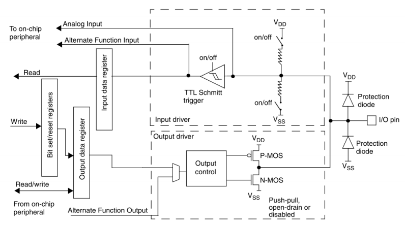

## 요약
> 해당 문서는 "GPIO를 코드로 쓰기 전에,   GPIO가 무엇이고 왜 그렇게 설계되었는지"를 설명하는 문서다.

## 1. GPIO란 무엇인가
GPIO는 **General Purpose Input/Output**의 약자로,
MCU가 외부와 신호를 주고받기 위해 제공하는 범용 디지털 입출력 인터페이스다.

"범용"이라는 표현은 다음음 의미한다.
- 특정 기능에 고정되지 않음.
- 입력 또는 출력으로 동작 가능.
- 설정에 따라 다양한 역할 수행 가능.
즉, GPIO는
> **하나의 핀이 상황과 설정에 따라 여러 역할을 수행할 수 있도록 설계된 인터페이스**라고 볼 수 있다.

---

## 2. MCU 핀과 GPIO의 관계
MCU에는 많은 핀(pin)이 존재하지만,
모든 핀이 항상 GPIO로 동작하는 것은 아니다.
- 핀(Pin)
  → 물리적으로 외부와 연결되는 단자
- GPIO
  → 핀이 범용 입출력 기능으로 동작할 때의 논리적 역할
> 모든 GPIO는 핀이지만, 모든 핀이 GPIO는 아니다.

일부 핀은:
- 전원
- 클럭
- 디버그
- 부트 설정 

과 같이 **시스템 동작에 필수적인 역할을 가지며**, 이 경우 GPIO로 사용하기에 적합하지 않다.

---

## 3. GPIO 모드 분류 개요
GPIO는 설정에 따라 크게 다음과 같은 모드로 나뉜다.
- 입력(Input)
- 출력(Output)
- 대체 기능(Alternate Function)

---

## 4. 출력(Output) 모드의 전기적 의미
출력 모드는 MCU가 **외부 회로를 구동**하는 경우에 해당한다.
이때 중요한 것은 "논리 1/0"이 아니라 **어떻게 전압을 만들어내는가**이다.

### 4.1 Push-Pull
왼쪽 그림과 같이 상단의 PMOS와 하단의 NMOS가 한 쌍으로 구성되어,  
전압을 능동적으로 밀고(Push) 당기는(Pull) 구조이다.
- **Internal Siganal에 따른 변화**:
  - **Signal = LOW**: 상단의 **PMOS가 ON**되고 하단의 NMOS가 OFF된다.   이때 VDD의 전원이 `Output pin`으로 연결되어 전류를 **밀어내며(Push)** 출력은 **HIGH**가 된다.
  - **Signal = HIGH**: 상단의 PMOS가 OFF되고 하단의 **NMOS가 ON**된다.   이때 `Output pin`이 GND와 연결되어 전류를 **잡아당기며(Pull)** 출력은 **LOW**가 된다.
- 특징 : 외부 장치 없이도 스스로 HIGH와 LOW를 모두 출력할 수 있어 신호 전환이 빠르고 강력하다.
---
### 4.2 Open-Drain
오른쪽 그림과 같이 상단의 PMOS가 존재하지 않고(또는 사용되지 않고) 하단의 **NMOS만 존재**하는 구조이다.
- **Internal Signal에 따른 변화**:
  - **Signal = LOW**: NMOS가 OFF된다.이때 `Output pin`은 내부적으로 어디에도 연결되지 않은 **Floating** 상태가 되며,   오직 **External Pull-up Resistor**에 의해 전압이 VDD 레벨로 유지된다.
  - **Signal = HIGH**: **NMOS가 ON**되어 `Output pin`을 GND로 연결한다. 따라서 출력은 **LOW**가 된다.
- 특징 : LOW는 스스로 만들 수 있지만, HIGH를 만들려면 반드지 외부 저항이 필요하다.
> **External Pull-up Resistor(외부 풀업 저항)의 역할과 변화**
> - Open-Drain 모드에서 외부 풀업 저항은 출력의 성격을 결정짓는 요소이다.
> > - **HIGH 상태 결정** : NMOS가 꺼졌을 때 전류가 저항을 타고 흘러 `Output pin`의 전압을 올려준다.   저항값이 작으면(강한 풀업) 전압이 빠르게 올라가 통신 속도에 유리하지만 전력 소모가 크다.
> > - **Wired-AND 구현**: 여러개의 Open-Drain 핀을 하나의 풀업 저항에 공통으로 연결하면,   어느 한 핀이라도 NMOS를 켜서(LOW) 신호를 당기면 전체 선이 LOW가 되는 논리 회로를 구성할 수 있다.

---

## 5. 입력(Input) 모드의 전기적 의미
입력 모드는 외부 신호를 MCU 내부로 읽어들이는 방식에 따라 크게 4가지로 나뉜다.
공통 특징으로는 Output Driver가 비활성화 된다.

### 5.1 AIN(Analog Input)
핀에 인가된 전압을 디지털(0 또는 1)로 변환하지 않고, 있는 그대로 ADC 주변장치로 전달하는 모드이다.
- **동작원리**: 전력 소모를 줄이고 디지털 노이즈 간섭을 막기 위해 **Input Driver의 Pull-Up/Pull-Down 저항** 그리고 **슈미트 트리거(Schmitt Trigger)**를 비활성화한다.
- **특징**:
  - 외부의 미세한 전압 변화를 측정할 때 사용한다.
  - **입력 데이터 레지스터(IDR, Input Data Register)**를 통해 값을 읽을 수 없으며, 반드시 ADC 주변장치를 거쳐야 한다.

### 5.2 Floating Input
Input Driver의 Pull-Up/Pull-Down 저항을 모두 비활성화 하고 핀을 공중에 띄워둔(Floating) 상태이다.
- **동작원리**: 외부 회로에서 오는 신호를 그대로 슈미트 트리거를 거쳐 **IDR**로 전달한다.
- **특징**:
  - 외부 신호가 연결되지 않으면 전위가 불안정하여 노이즈에 매우 취약하다.
  - 외부에 명확한 Pull-Up/Pull-Down 회로가 이미 구성되어 있는 경우(예: 버튼 회로)에 주로 사용한다.
  
---
### 5.3 Pull-Up / Pull-Down
Input Driver의 Pull-Up/Pull-Down 저항을 사용하여 핀의 기본 전압 상태를 강제로 HIGH 또는 LOW로 고정하는 모드이다.
- **동작원리**:
  - **Pull-Up** : 내부 저항을 VDD에 연결하여 외부 입력이 없을 때 **1**로 읽히게 한다.
  - **Pull-Down** : 내부 저항을 VSS에 연결하여 외부 입력이 없을 때 **0**으로 읽히게 한다.
- **특징**:
  - 신호가 끊겼을 때의 오동작을 방지하여 입력 상태를 안정화한다.
  - 스위치 입력을 받을 때 별도의 외부 저항 없이도 간단하게 회로를 구성할 수 있다.

---

## 6. **General Purpose Output** vs **Alternate Function Output**
### 1. 범용 출력 (General Purpose Output)
이 모드는 CPU가 메모리에 데이터를 쓰듯이, 특정 레지스터의 비트 값을 핀으로 밀어내는 방식이다.
- **동작 원리** : CPU가 코드를 통해 출력 데이터 레지스터(`Output Data Register, ODR`)에 '0'또는 '1'을 쓴다.   이 레지스터의 비트 상태가 `Output Control` 블록을 거쳐 핀의 전기적 신호(전압)로 변환된다.
- **특징** : 신호의 변화 시점이 프로그램의 실행속도에 종속된다.
- **핵심** : 핀의 상태는 **레지스터의 비트값과 1:1로 매칭**된다.
    
### 2. 대체 기능 출력 (Alternate Function Output)
이 모드는 `Output Data Register`를 거치지 않고, **주변장치(Timer, UART 등)의 신호선이 핀의 제어로직에 직접 연결되는 방식이다.**
- **동작 원리** : `Output Control` 블록이 `Output Data Register` 대신 **`Alternate Function Output`** 이라는 별도의 신호선을 선택한다.   타이머나 통신 모듈 내부에서 생성된 디지털 신호가 이 전용 통로를 타고 출력 드라이버로 바로 전달된다.
- **특징** : 신호의 변화가 CPU의 개입 없이 하드웨어 로직에 의해 발생하므로, 통신 규격에 맞는 정밀한 타이밍이나 초고속 신호 생성이 가능하다.
- **핵심** : 핀의 상태는 **주변장치 내부 하드웨어 엔진의 상태**를 실시간으로 반영한다.

### 3. 요약
|구분|범용 출력(General Purpose Output)|대체 기능 출력(Alternate Function Output)|
|----|---------------------------------|-----------------------------------------|
|신호의 출발점|Output Data Register(ODR)|Internal Peripheral(Timer, UART 등)|
|데이터 경로|CPU→ODR→Output Control→Pin|Peripheral→AF Output→Output Control→Pin|
|제어 단위|코드 실행 단위|하드웨어 클럭 단위(매우 정밀함)|
|사용 예시|단순 ON/OFF 제어, 상태 표시 LED|PWM, 직렬 통신 데이터 전송|
---

## 7. GPIO 속도(2MHz/10MHz/50MHz)의 의미
GPIO 속도 설정은 클럭 주파수가 아니다.
이 값은:
- 핀 출력 드라이버의 전기적 전환 속도
- 상승/하강 시간 특성

을 의미한다.

속도가 높을수록:
- 신호 전환은 빠르지만
- 전력 소모, 전자기장 간섭(Electromagnetic Interference, EMI) 증가 가능

아래 이미지는 GPIO Speed 설정이 핀의 전기적 출력 특성에 미치는 영향을 보여준다. 

|GPIO Speed|Rise Time|특성 및 비유|
|----------|---------|------------|
|2MHz|약 9.5ns|신호의 기울기가 완만함. 전력 소모와 노이즈가 적어 저속 제어에 유리.|
|50MHz|약 2.4ns|신호가 매우 가파르게 상승함. 고속 통신에 필수적이나 전력 소모와 노이즈가 증가함.|

`출처: https://github.com/hampussandberg/HexConnect/wiki/STM32-GPIO-Speed`
---

## 8. GPIO와 시스템 클럭의 관계
GPIO는 시스템 클럭을 기반으로 동작하지만,
GPIO 속도 설정과 시스템 클럭은 서로 다른 개념이다.
- 시스템 클럭
  → 내부 로직, CPU, 버스 동작 기준
- GPIO 속도
  → 핀의 전기적 출력 특성
> 시스템 클럭이 8MHz이든, PLL을 통해 72MHz를 사용하든, GPIO 속도 설정은 독립적으로 선택된다.
