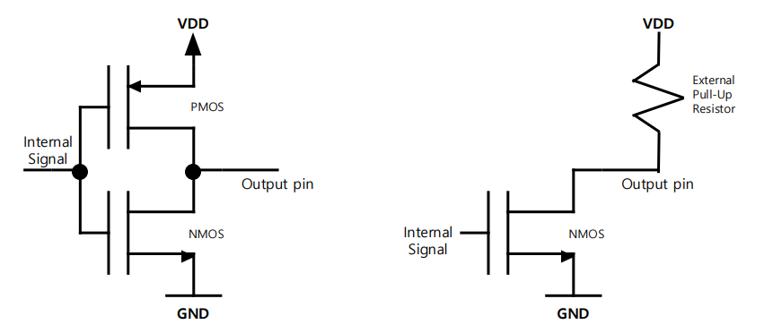

## 요약
> 해당 문서는 "GPIO를 코드로 쓰기 전에,   GPIO가 무엇이고 왜 그렇게 설계되었는지"를 설명하는 문서다.

## 1. GPIO란 무엇인가
GPIO는 **General Purpose Input/Output**의 약자로,
MCU가 외부와 신호를 주고받기 위해 제공하는 범용 디지털 입출력 인터페이스다.

"범용"이라는 표현은 다음음 의미한다.
- 특정 기능에 고정되지 않음.
- 입력 또는 출력으로 동작 가능.
- 설정에 따라 다양한 역할 수행 가능.
즉, GPIO는
> **하나의 핀이 상황과 설정에 따라 여러 역할을 수행할 수 있도록 설계된 인터페이스**라고 볼 수 있다.

---

## 2. MCU 핀과 GPIO의 관계
MCU에는 많은 핀(pin)이 존재하지만,
모든 핀이 항상 GPIO로 동작하는 것은 아니다.
- 핀(Pin)
  → 물리적으로 외부와 연결되는 단자
- GPIO
  → 핀이 범용 입출력 기능으로 동작할 때의 논리적 역할
> 모든 GPIO는 핀이지만, 모든 핀이 GPIO는 아니다.

일부 핀은:
- 전원
- 클럭
- 디버그
- 부트 설정 

과 같이 **시스템 동작에 필수적인 역할을 가지며**, 이 경우 GPIO로 사용하기에 적합하지 않다.

---

## 3. GPIO 모드 분류 개요
GPIO는 설정에 따라 크게 다음과 같은 모드로 나뉜다.
- 입력(Input)
- 출력(Output)
- 대체 기능(Alternate Function)

---

## 4. 출력(Output) 모드의 전기적 의미
출력 모드는 MCU가 **외부 회로를 구동**하는 경우에 해당한다.
이때 중요한 것은 "논리 1/0"이 아니라 **어떻게 전압을 만들어내는가**이다.

### 4.1 Push-Pull
왼쪽 그림과 같이 상단의 PMOS와 하단의 NMOS가 한 쌍으로 구성되어,  
전압을 능동적으로 밀고(Push) 당기는(Pull) 구조이다.
- **Internal Siganal에 따른 변화**:
  - **Signal = LOW**: 상단의 **PMOS가 ON**되고 하단의 NMOS가 OFF된다.   이때 VDD의 전원이 `Output pin`으로 연결되어 전류를 **밀어내며(Push)** 출력은 **HIGH**가 된다.
  - **Signal = HIGH**: 상단의 PMOS가 OFF되고 하단의 **NMOS가 ON**된다.   이때 `Output pin`이 GND와 연결되어 전류를 **잡아당기며(Pull)** 출력은 **LOW**가 된다.
- 특징 : 외부 장치 없이도 스스로 HIGH와 LOW를 모두 출력할 수 있어 신호 전환이 빠르고 강력하다.
---
### 4.2 Open-Drain
오른쪽 그림과 같이 상단의 PMOS가 존재하지 않고(또는 사용되지 않고) 하단의 **NMOS만 존재**하는 구조이다.
- **Internal Signal에 따른 변화**:
  - **Signal = LOW**: NMOS가 OFF된다.이때 `Output pin`은 내부적으로 어디에도 연결되지 않은 **Floating** 상태가 되며,   오직 **External Pull-up Resistor**에 의해 전압이 VDD 레벨로 유지된다.
  - **Signal = HIGH**: **NMOS가 ON**되어 `Output pin`을 GND로 연결한다. 따라서 출력은 **LOW**가 된다.
- 특징 : LOW는 스스로 만들 수 있지만, HIGH를 만들려면 반드지 외부 저항이 필요하다.
> **External Pull-up Resistor(외부 풀업 저항)의 역할과 변화**
> - Open-Drain 모드에서 외부 풀업 저항은 출력의 성격을 결정짓는 요소이다.
> > - **HIGH 상태 결정** : NMOS가 꺼졌을 때 전류가 저항을 타고 흘러 `Output pin`의 전압을 올려준다.   저항값이 작으면(강한 풀업) 전압이 빠르게 올라가 통신 속도에 유리하지만 전력 소모가 크다.
> > - **Wired-AND 구현**: 여러개의 Open-Drain 핀을 하나의 풀업 저항에 공통으로 연결하면,   어느 한 핀이라도 NMOS를 켜서(LOW) 신호를 당기면 전체 선이 LOW가 되는 논리 회로를 구성할 수 있다.

---

## 5. 입력(Input) 모드의 전기적 의미
입력 모드는 외부 신호를 MCU 내부로 읽어들이는 경우다.
이때 가장 중요한 개념은 입력 핀이 떠 있는지 여부다.

### 5.1 Floating Input
Floating 입력은:
- 내부적으로 어떠한 기준 전압도 연결되지 않은 상태
  
특징:
- 외부가 연결되지 않으면 값이 불안정
- 노이즈에 매우 민감
---
### 5.2 Pull-Up / Pull-Down
Pull-Up / Pull-Down 입력은:
- 내부 저항을 통해 High 또는 Low 기준을 제공
  
목적:
- 입력 상태 안정화
- 미연결 상태에서의 오동작 방지

---

## 6. **General Purpose** vs **Alternate Function**
General Purpose(GPIO) 모드는:
- 소프트웨어가 직접 핀의 상태를 제어

Alternate Function(AF) 모드는:
- 핀이 주변장치(UART, SPI, TIMER 등)의 신호선으로 동작
> 즉, AF 모드는 GPIO가 "사라지는 것"이 아니라 **GPIO 제어권을 주변장치가 가져가는 것**이다.

---

## 7. GPIO 속도(2MHz/10MHz/50MHz)의 의미
GPIO 속도 설정은 클럭 주파수가 아니다.
이 값은:
- 핀 출력 드라이버의 전기적 전환 속도
- 상승/하강 시간 특성

을 의미한다.

속도가 높을수록:
- 신호 전환은 빠르지만
- 전력 소모, 전자기장 간섭(Electromagnetic Interference, EMI) 증가 가능

아래 이미지는 GPIO Speed 설정이 핀의 전기적 출력 특성에 미치는 영향을 보여준다. 

|GPIO Speed|Rise Time|특성 및 비유|
|----------|---------|------------|
|2MHz|약 9.5ns|신호의 기울기가 완만함. 전력 소모와 노이즈가 적어 저속 제어에 유리.|
|50MHz|약 2.4ns|신호가 매우 가파르게 상승함. 고속 통신에 필수적이나 전력 소모와 노이즈가 증가함.|

`출처: https://github.com/hampussandberg/HexConnect/wiki/STM32-GPIO-Speed`
---

## 8. GPIO와 시스템 클럭의 관계
GPIO는 시스템 클럭을 기반으로 동작하지만,
GPIO 속도 설정과 시스템 클럭은 서로 다른 개념이다.
- 시스템 클럭
  → 내부 로직, CPU, 버스 동작 기준
- GPIO 속도
  → 핀의 전기적 출력 특성
> 시스템 클럭이 8MHz이든, PLL을 통해 72MHz를 사용하든, GPIO 속도 설정은 독립적으로 선택된다.
