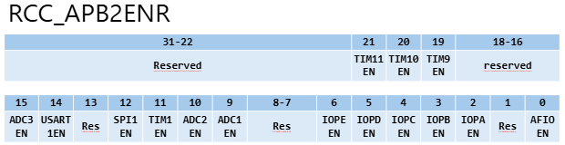
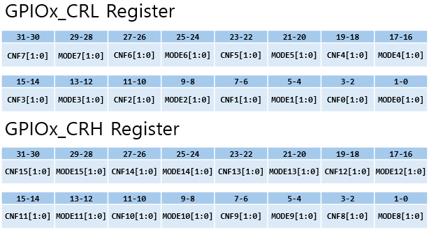
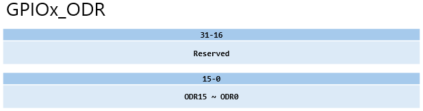
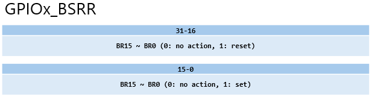
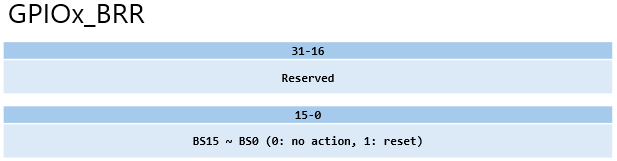
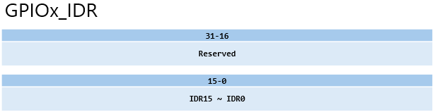
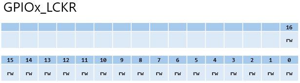

# GPIO_Registers.md

## 요약
해당 문서는 STM32F103의 GPIO 레지스터 구조를 정리하고, 강의 자료 및 `gpio.c / gpio.h / main.c` 코드가 **어떤 레지스터를 어떻게 제어하는지**를 연결해 설명한다.

---

## 1. GPIO 레지스터와 포트 구조
STM32F103에서 각 GPIO 포트(GPIOA, GPIOB, ...)는 동일한 **레지스터 레이아웃**을 가진다.
- 각 포트는 독립적인 레지스터 세트를 가짐
- PA0과 PB0은 번호는 같아도 **완전히 다른 레지스터**로 제어됨
주요 레지스터는 다음과 같다.

|레지스터|역할|
|--------|----|
|GPIOx_CRL|핀 0~7 설정|
|GPIOx_CRH|핀 8~15 설정|
|GPIOx_IDR|입력 데이터|
|GPIOx_ODR|출력 데이터|
|GPIOx_BSRR|비트 Set/Reset|
|GPIOx_BRR|비트 Reset|
|GPIOx_LCKR|설정 잠금|

---

## 2. GPIO 클럭과 RCC의 관계
GPIO 레지스터는 존재하지만, 클럭이 활성화되지 않으면 동작하지 않는다.



```c
// main.c
RCC_APB2PeriphClockCmd(RCC_APB2Periph_GPIOA, ENABLE);

```
의미
- GPIOA 레지스터에 접근 가능하도록 **APB2 버스 클럭을 공급**
- 해당 코드가 없으면 CRL/CRH 설정은 무시됨

아래 코드들은 `RCC_APB2PeriphClockCmd()` 함수가 어떤 정의와 로직을 거쳐 **최종적으로 레지스터를 어떻게 수정**하게 되는지 그 흐름을 추적해 보았다.

```c
// conf.h
#define _RCC

// map.h
typedef struct
{
  vu32 CR;
  vu32 CFGR;
  vu32 CIR;
  vu32 APB2RSTR;
  vu32 APB1RSTR;
  vu32 AHBENR;
  vu32 APB2ENR;
  vu32 APB1ENR;
  vu32 BDCR;
  vu32 CSR;
} RCC_TypeDef; // RCC 주변장치 레지스터 관리 구조체

#ifdef _RCC
  /* RCC_BASE(시작 주소)를 RCC_TypeDef 구조체 포인터로 변환 */
  #define RCC                 ((RCC_TypeDef *) RCC_BASE)
#endif

// type.h
typedef enum {DISABLE = 0, ENABLE = !DISABLE} FunctionalState;
/* 유효성 검사 매크로 : 전달된 값이 ENABLE/DISABLE 중 하나인지 확인 */
#define IS_FUNCTIONAL_STATE(STATE) ((STATE == DISABLE) || (STATE == ENABLE))

// rcc.h
#define RCC_APB2Periph_GPIOA             ((u32)0x00000004)
/* 유효성 검사 매크로 : 전달된 값이 Reserved(Res)비트와
   현재 칩에 물리적으로 존재하지 않는 주변장치를 활성화 하는 것을 방지하는 안정장치
   0xFFFFA182 → 1,7,8,13,15,16~31 bit */
#define IS_RCC_APB2_PERIPH(PERIPH) (((PERIPH & 0xFFFFA182) == 0x00) && (PERIPH != 0x00))

// rcc.c
void RCC_APB2PeriphClockCmd(u32 RCC_APB2Periph, FunctionalState NewState)
{
  /* 입력 파라미터 체크 */
  assert_param(IS_RCC_APB2_PERIPH(RCC_APB2Periph));
  assert_param(IS_FUNCTIONAL_STATE(NewState));

  if (NewState != DISABLE)
  {
    /* OR 연산을 통한 특정 비트 Set: 기존 켜져 있던 다른 장치들의 상태를 보존 */
    RCC->APB2ENR |= RCC_APB2Periph;
  }
  else
  {
    /* AND-NOT 연산을 통한 특정 비트 Clear: 선택한 장치만 클럭 차단 */
    RCC->APB2ENR &= ~RCC_APB2Periph;
  }
}
```

---

## 3. CRL / CRH : GPIO 모드 설정 레지스터

### 3.1 핀당 4비트 구조

- 각 핀은 4비트(CNF[1:0], MODE[1:0])로 설정
- CRL : 핀 0~7
- CRH : 핀 8~15

### 3.2 MODE 비트 (출력 속도)
|MODE|의미|
|----|----|
|00|입력 모드|
|01|출력, 최대 10MHz|
|10|출력, 최대 2MHz|
|11|출력, 최대 50MHz|
> 이 값은 시스템 클럭이 아니라 **출력 드라이버의 전기적 특성**을 의미한다.

### 3.3 CNF(Configuration) 비트 (입력/출력 타입)
**입력 모드(MODE=00)**
|CNF|의미|
|---|----|
|00|Analog Input|
|01|Floating Input|
|10|Pull-up / Pull-down|
|11|Reserved|

**출력 모드(MODE≠00)**
|CNF|의미|
|---|----|
|00|General purpose Push-Pull|
|01|General purpose Open-Drain|
|10|Alternate Function Push-Pull|
|11|Alternate Function Open-Drain|

---

## 4. gpio.h : 레지스터 설정을 추상화한 열거형

### 4.1 GPIO_Speed_TypeDef
```c
typedef enum
{ 
  GPIO_Speed_10MHz = 1,
  GPIO_Speed_2MHz, 
  GPIO_Speed_50MHz
}GPIOSpeed_TypeDef;
```
→ MODE 비트 값에 직접 대응

### 4.2 GPIOMode_TypeDef
```c
typedef enum
{ GPIO_Mode_AIN = 0x0,
  GPIO_Mode_IN_FLOATING = 0x04,
  GPIO_Mode_IPD = 0x28,
  GPIO_Mode_IPU = 0x48,
  GPIO_Mode_Out_OD = 0x14,
  GPIO_Mode_Out_PP = 0x10,
  GPIO_Mode_AF_OD = 0x1C,
  GPIO_Mode_AF_PP = 0x18
}GPIOMode_TypeDef;
```

위 비트 필드를 분석하면 설정값은 크게 4개의 영역으로 나뉜다.

|비트 위치|역할|설명|
|---------|----|----|
|Bit[3:0]|레지스터 직접 값|실제 하드웨어 레지스터의 **CNF[1:0]**과 **MODE[1:0]** 비트에 해당|
|Bit[4]|Output 여부|1이면 출력모드, 0이면 입력 모드를 의미|
|Bit[5]|Pull-Down 플래그|1이면 내부 풀다운 저항 활성화|
|Bit[6]|Pull-Up 플래그|1이면 내부 풀업 저항 활성화|

---

## 5. ODR, BSRR, BRR : 출력 제어 레지스터

### 5.1 ODR(Output Data Register)

- 포트 전체 출력 상태 저장
- Pull-Up / Pull-Down 입력에서도 사용됨

### 5.2 BSRR(Bit Set Reset Register)


|비트 영역|기능|
|---------|----|
|[15:0]|Set|
|[31:16]|Reset|

### 5.3 BRR(Bit Reset Register)

- Reset 전용
- BSRR보다 직관적이고 사용하기 편함

---

## 6. IDR : 입력 데이터 레지스터

- 읽기 전용으로 입력 핀의 실제 상태를 읽음

---

## 7. LCKR : 설정 잠금 레지스터

- 각 Bit를 Set 하면 GPIOx_CRL/CRH 내용은 **Reset 전까지 고정**.

---

## 8. GPIO_Init() 함수와 레지스터 동작

```c
//main.c
GPIO_Init(GPIOA, &GPIO_InitStructure);
```

`GPIO_Init()`함수는 우리가 구조체에 설정한 값 `GPIO_InitStructure`에 설정한 값을 실제 레지스터 형식으로 변환하는 로직을 담고 있다.

`GPIO_Init()`함수는 다음과 같이 크게 4개 구성으로 이루어져 있다.

```c
//gpio.c
void GPIO_Init(GPIO_TypeDef* GPIOx, GPIO_InitTypeDef* GPIO_InitStruct)
{
  /* 변수 설정 및 파라미터 검사 */
  /* GPIO 모드 및 속도 정의 */
  /* 하위 핀 설정 */
  /* 상위 핀 설정 */
}
```
### 8.1 변수 설정 및 파라미터 검사
```c
u32 currentmode = 0x00, currentpin = 0x00, pinpos = 0x00, pos = 0x00;
u32 tmpreg = 0x00, pinmask = 0x00;

/* 설정하려는 모드와 핀 번호 체크, IS_MPIO_MODE(), IS_GPIO_PIN()은 gpio.h에 정의되어 있음 */
assert_param(IS_GPIO_MODE(GPIO_InitStruct->GPIO_Mode));
assert_param(IS_GPIO_PIN(GPIO_InitStruct->GPIO_Pin));
```
> `tmpreg`는 레지스터에 값을 쓰기 전, 계산 결과를 임시로 저장하는 역할을 한다.

### 8.2 GPIO 모드 및 속도 정의
```c
/* 8비트 모드 설정값에서 하위 4비트(CNF + MODE)만 추출 */
currentmode = ((u32)GPIO_InitStruct->GPIO_Mode) & ((u32)0x0F); 

/* 모드 설정값의 Bit[4]가 1이면 출력 모드로 판단 */
if ((((u32)GPIO_InitStruct->GPIO_Mode) & ((u32)0x10)) != 0x00)
{ 
  /* GPIO 체크, IS_GPIO_SPEED()는 gpio.h에 정의되어 있음 */
  assert_param(IS_GPIO_SPEED(GPIO_InitStruct->GPIO_Speed));
  /* 출력 모드인 경우 사용자가 설정한 Speed 비트를 결합 */
  currentmode |= (u32)GPIO_InitStruct->GPIO_Speed;
}
```
> 이 과정이 끝나면 `currentmode`변수에는 실제 `CRL/CRH`레지스터의 한 개 핀에 해당하는 4비트(CNF 2bit+ MODE 2bit) 값이 완성된다.

### 8.3 하위 핀 설정
```c
if (((u32)GPIO_InitStruct->GPIO_Pin & ((u32)0x00FF)) != 0x00)
{
  /* CRL 레지스터 상태를 복사 */
  tmpreg = GPIOx->CRL; 

  /* 8개 핀을 순차적으로 검사 */
  for (pinpos = 0x00; pinpos < 0x08; pinpos++) 
  {
    pos = ((u32)0x01) << pinpos;
    currentpin = (GPIO_InitStruct->GPIO_Pin) & pos;

    /* 현재 순서의 핀이 설정 대상이라면 */
    if (currentpin == pos) 
    {
      /* 핀 번호에 4를 곱해 비트 시작 위치 계산 (핀당 4비트 할당) */
      pos = pinpos << 2;
      
      /* 해당 핀의 4비트 영역을 0으로 지움 */
      pinmask = ((u32)0x0F) << pos;
      tmpreg &= ~pinmask;

      /* 계산된 currentmode 값을 해당 위치에 삽입 */
      tmpreg |= (currentmode << pos);

      /* 입력 모드에서 저항 방향을 ODR 레지스터로 결정 */
      if (GPIO_InitStruct->GPIO_Mode == GPIO_Mode_IPD) {
        /* Pull-Down: 0V로 당김 */
        GPIOx->BRR = (((u32)0x01) << pinpos);
      }
      if (GPIO_InitStruct->GPIO_Mode == GPIO_Mode_IPU) {
        /* Pull-Up: 3.3V로 당김 */
        GPIOx->BSRR = (((u32)0x01) << pinpos);
      }
    }
  }
  /* 최종 계산된 값을 레지스터에 한 번에 기록 */
  GPIOx->CRL = tmpreg;
}
```
예를 들어 1번 핀과 7번 핀이 Push-Pull 출력 모드에 속도가 50MHz로 설정 대상인 경우
#### 1. currentmode 계산
`currentmode = 0x03`이다. 이는 CNF: 00(Push-Pull), MODE: 11(50MHz 출력)을 반영한 값이다.

#### 2. 1번 핀 설정
- `pos` = 0x04
- `pinmask` = 0x000000F0
- `tmpreg` = 0x00000030

#### 3. 7번 핀 설정
- `pos` = 0x1C
- `pinmask` = 0xF0000000
- `tmpreg` = 0x30000030
으로 설정된다.

### 8.4 상위 핀 설정
```c
if (GPIO_InitStruct->GPIO_Pin > 0x00FF)
{
  /* CRH 레지스터 상태 복사 */
  tmpreg = GPIOx->CRH;

  /* 8개 핀을 순차적으로 검사 */
  for (pinpos = 0x00; pinpos < 0x08; pinpos++)
  {
    /* 핀 8~15를 검사하기 위해 8비트만큼 시프트하여 위치 확인 */
    pos = (((u32)0x01) << (pinpos + 0x08));
    currentpin = ((GPIO_InitStruct->GPIO_Pin) & pos);

    /* 현재 순서의 핀이 설정 대상이라면 */
    if (currentpin == pos)
    {
      // 핀 번호에 4를 곱해 비트 시작 위치 계산 (핀당 4비트 할당)
      pos = pinpos << 2;

      /* 해당 핀의 4비트 영역을 0으로 지움 */ */
      pinmask = ((u32)0x0F) << pos;
      tmpreg &= ~pinmask;

      /* 계산된 currentmode 값을 해당 위치에 삽입 */
      tmpreg |= (currentmode << pos);

      /* 입력 모드에서 저항 방향을 ODR 레지스터로 결정(Pin 8~15 범위에 맞게 BSRR/BRR 조작) */
      if (GPIO_InitStruct->GPIO_Mode == GPIO_Mode_IPD) {
        /* Pull-Down: 0V로 당김 */
        GPIOx->BRR = (((u32)0x01) << (pinpos + 0x08));
      }
      if (GPIO_InitStruct->GPIO_Mode == GPIO_Mode_IPU) {
        /* Pull-Up: 3.3V로 당김 */
        GPIOx->BSRR = (((u32)0x01) << (pinpos + 0x08));
      }
    }
  }
  /* 최종 계산된 값을 레지스터에 한 번에 기록 */
  GPIOx->CRH = tmpreg; 
}
```

---

## 9. main.c와 레지스터 흐름 연결
**main.c 설정 코드**
```c
GPIO_InitStructure.GPIO_Pin = GPIO_Pin_0 | GPIO_Pin_1 | GPIO_Pin_2 | GPIO_Pin_3 |
                              GPIO_Pin_4 | GPIO_Pin_5 | GPIO_Pin_6 | GPIO_Pin_7;
GPIO_InitStructure.GPIO_Speed = GPIO_Speed_50MHz;
GPIO_InitStructure.GPIO_Mode = GPIO_Mode_Out_PP;
GPIO_Init(GPIOA, &GPIO_InitStructure);
```
**실제 하드웨어 의미**
- GPIOA_CRL의 핀 0~7
- MODE=11 (50MHz)
- CNF=00 (Push-Pull)
→ **PA0~PA7**이 고속(50MHz) **Push-Pull** 출력으로 설정됨

---

## 10. GPIO 제어 함수

`gpio.c` 라이브러리에서 제공하는 함수들은 크게 **출력(Write)**과 **입력(Read)**으로 나뉜다. 

### 10.1 출력 함수
핀에 전압을 인가하거나 차단하여 외부 장치를 구동할 때 사용
- GPIO_SetBits(GPIO_TypeDef* GPIOx, u16 GPIO_Pin)
```c
void GPIO_SetBits(GPIO_TypeDef* GPIOx, u16 GPIO_Pin)
{
  /* Check the parameters */
  assert_param(IS_GPIO_PIN(GPIO_Pin));
  GPIOx->BSRR = GPIO_Pin;
}
```
> 지정한 핀의 출력을 **High(1)**로 설정
> BSRR의 해당 비트에 '1'을 기록하여 핀을 Set
  
- GPIO_ResetBits(GPIO_TypeDef* GPIOx, u16 GPIO_Pin)
```c
void GPIO_ResetBits(GPIO_TypeDef* GPIOx, u16 GPIO_Pin)
{
  assert_param(IS_GPIO_PIN(GPIO_Pin));
  GPIOx->BRR = GPIO_Pin;
}
```
> 지정한 핀의 출력을 **Low(0)**로 설정
> BRR의 해당 비트에 '1'을 기록하여 핀을 Reset
  
- GPIO_WriteBit(GPIO_TypeDef* GPIOx, u16 GPIO_Pin, BitAction BitVal)
```c
void GPIO_WriteBit(GPIO_TypeDef* GPIOx, u16 GPIO_Pin, BitAction BitVal)
{
  assert_param(IS_GET_GPIO_PIN(GPIO_Pin));
  assert_param(IS_GPIO_BIT_ACTION(BitVal)); 
  
  if (BitVal != Bit_RESET)
  {
    GPIOx->BSRR = GPIO_Pin;
  }
  else
  {
    GPIOx->BRR = GPIO_Pin;
  }
}
```
> 특정 핀 하나에 원하는 값(`Bit_SET` 또는 `Bit RESET`)을 기록
> 매개변수 `BitVal`의 값에 따라 내부적으로 `GPIO_SetBits()` 또는 `GPIO_ResetBits()`와 같은 동작을 선택적으로 호출

- GPIO_Write(GPIO_TypeDef* GPIOx, u16 PortVal)
```c
void GPIO_Write(GPIO_TypeDef* GPIOx, u16 PortVal)
{
  GPIOx->ODR = PortVal;
}
```
> 해당 포트의 16개 핀 상태를 동시에 제어
> 기존의 상태와 무관하게 **ODR** 전체에 `PortVal` 값을 직접 덮어 씌움

### 10.2 입력 및 상태 읽기 함수
외부 신호를 감지하거나 현재 출력 설정 상태를 확인할 때 사용
- GPIO_ReadInputDataBit(GPIO_TypeDef* GPIOx, u16 GPIO_Pin)
```c
u8 GPIO_ReadInputDataBit(GPIO_TypeDef* GPIOx, u16 GPIO_Pin)
{
  u8 bitstatus = 0x00;
  
  assert_param(IS_GET_GPIO_PIN(GPIO_Pin)); 
  
  if ((GPIOx->IDR & GPIO_Pin) != (u32)Bit_RESET)
  {
    bitstatus = (u8)Bit_SET;
  }
  else
  {
    bitstatus = (u8)Bit_RESET;
  }
  return bitstatus;
}
```
> 특정 핀에 인가된 실제 물리적인 전압 상태를 읽음
> **IDR** 레지스터의 해당 비트 값을 반환
  
- GPIO_ReadInputData(GPIO_TypeDef* GPIOx)
```c
u16 GPIO_ReadInputData(GPIO_TypeDef* GPIOx)
{
  return ((u16)GPIOx->IDR);
}
```
> 해당 포트 전체(16비트)의 입력 상태를 한 번에 읽음
   
- GPIO_ReadOutputDataBit(GPIO_TypeDef* GPIOx, u16 GPIO_Pin)
```c
u8 GPIO_ReadOutputDataBit(GPIO_TypeDef* GPIOx, u16 GPIO_Pin)
{
  u8 bitstatus = 0x00;

  assert_param(IS_GET_GPIO_PIN(GPIO_Pin)); 
  
  if ((GPIOx->ODR & GPIO_Pin) != (u32)Bit_RESET)
  {
    bitstatus = (u8)Bit_SET;
  }
  else
  {
    bitstatus = (u8)Bit_RESET;
  }
  return bitstatus;
}
```
> 사용자가 마지막으로 출력하도록 설정한(ODR에 쓴) 값을 확인
> 핀의 실제 전압이 아닌, 내부 **ODR**의 기록된 값을 읽음

- GPIO_ReadOutputData(GPIO_TypeDef* GPIOx)
```c
u16 GPIO_ReadOutputData(GPIO_TypeDef* GPIOx)
{
  return ((u16)GPIOx->ODR);
}
```
> 해당 포트 전체의 마지막 출력 설정 상태를 읽음
