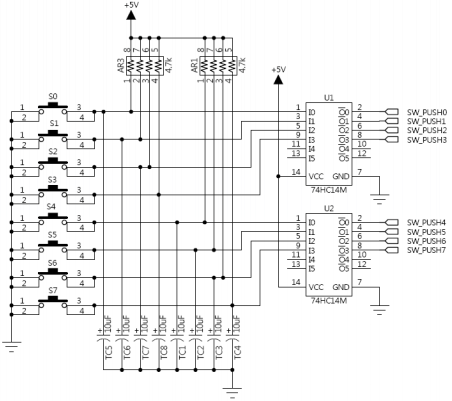
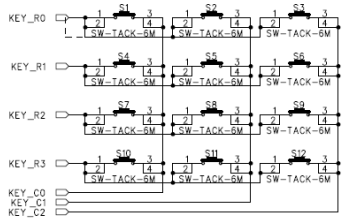
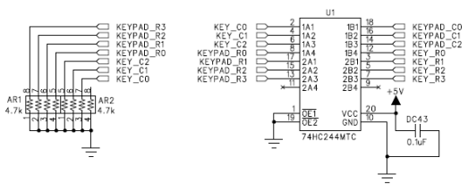

# 1. Switch Module(Button)

## 1. 저항(AR1/3): 풀업 저항
- +5V 전원과 신호선 사이에 연결
- 스위치가 열려 있을 때(OFF), 신호선을 5V로 끌어올려 **High(1)** 상태를 안정적으로 유지하여 플로팅 현상 방지

## 2. 스위치(S0~7)
- 스위치를 누르는 순간 신호선이 GND와 직접 연결되어 전압이 0V로 떨어짐
- 누르면 **Low(0)**, 떼면 **High(1)**가 입력되는 **Active Low** 방식

---

# 2. Keypad

## 1. 저항(AR1/2) : 풀다운 저항
- GND와 신호선 사이에 연결
- 스위치가 눌리지 않았을 때, 모든 행/열 라인의 전압을 0V로 묶어 **Low(0)**상태를 유지

 ## 2. 스위치
- 동작 원리:
   1. MCU가 특정 행에 High 신호를 보냄
   2. 이때 사용자가 버튼을 누르면, 해당 행의 High 신호가 연결된 열로 전달
   3. 풀다운 상태였던 열 라인이 **High**로 변하면서 MCU가 버튼 눌림을 감지

- 누를 때만 신호가 발생하는 **Active High** 스캔 방식을 사용

---

# 3. 두 회로 비교
|항목|스위치 회로|키패드 회로|
|----|-----------|------------|
|저항 종류|풀업|풀다운|
|기본 상태|High(1)|Low(0)|
|스위치 동작|핀을 GND로 연결(Active Low)|행과 열을 연결(Active High 스캔)|
|입력 값|누르면 Low, 떼면 High|누르면 High, 떼면 Low (스캔시)|
