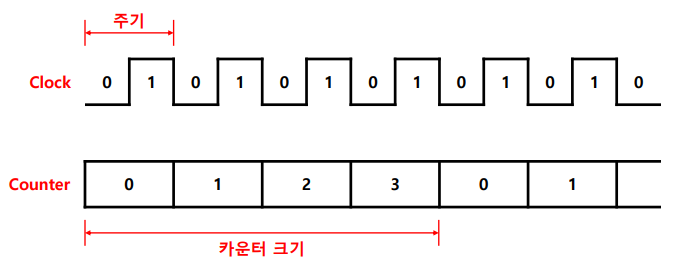
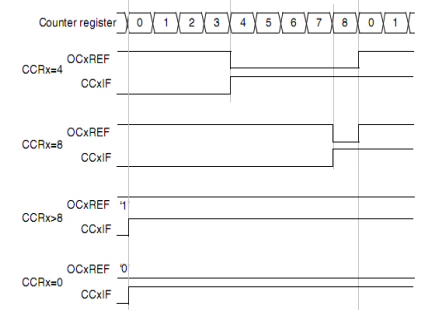

## 요약
> 해당 문서는 "Timer를 코드로 쓰기 전에,   Timer가 무엇이고 왜 그렇게 설계되었는지"를 설명하는 문서다.  

---

## 1. Timer/Counter란 무엇인가

- **Timer(타이머)** : 내부 클럭(시스템 클럭을 분주한 클럭)을 이용하여 일정 시간 간격의 펄스를 만든다.

- **Counter(카운터)** : 외부 입력 신호(펄스)를 계수한다.  

- **Clock(클럭)** : 일정한 시간 간격으로 0과 1의 값이 번갈아 나타남

- **Timer/Counter** : 클럭을 세는 장치

---

## 2. Timer가 시간을 만드는 방식: CNT, PSC, ARR
STM32 타이머는 기본적으로 다음 3요소로 시간을 만든다.

- **CNT (Counter)**: 실제로 증가/감소하는 카운터 값
- **PSC (Prescaler)**: 입력 클럭을 나눠서 CNT에 들어가는 카운트 속도를 조절
- **ARR (Auto-Reload Register)**: 카운터 값이 ARR 값보다 커지게 되는 순 카운터가 0이 되면서 오버플로우 발생

일반적인 **주기 타이머**의 동작은 다음과 같다.

1) 타이머 입력 클럭 `f_TIM`이 존재  
2) PSC로 분주되어 카운터 클럭 `f_CNT = f_TIM / (PSC+1)` 생성  
3) CNT가 `0 → ARR` 까지 증가(Up-count 기준)  
4) CNT가 ARR에 도달하면 **Update Event(갱신 이벤트)** 발생 및 CNT 리로드(0으로)

따라서 주기는:

- 카운트 주기: `t_CNT = 1 / f_CNT`
- 타이머 주기(업카운트 기준):  
  `t = (ARR+1) * t_CNT = (ARR+1) * (PSC+1) / f_TIM`

예를 들어, 72MHz의 내부 클럭을 이용해서 1ms의 타이머를 만들겠다.
- `f_TIM` = 72MHz
- `PSC` = 7200-1
- `f_CNT` = 10kHz
- `t_CNT` = 100μs
- `ARR` = 10-1
- `t` = 1ms
  
---

## 3. 카운팅 모드(Up/Down/Center-aligned)의 의미
STM32 타이머는 단순 증가(Up)뿐 아니라 감소(Down), 중앙정렬(Center-aligned) 모드를 지원한다.

- **Up-count**: 0 → ARR → 0 …  
  0에서 시작하여 ARR까지 증가한 후, 다음 클럭에서 **오버플로우**와 함께 다시 0으로 돌아가는 방식
  
- **Down-count**: ARR → 0 → ARR …  
  ARR에서 시작하여 0까지 감소한 후, 다음 클럭에서 **오버플로우**와 함께 다시 ARR로 돌아가는 방식
  
- **Center-aligned**: 0 → ARR → 0 (왕복)  
  0에서 ARR까지 증가(Up-count)한 다음, 다시 0까지 감소(Down-count)를 반복하며 주로 대칭인 PWM 제어에 활용. 

---

## 4. Update Event(갱신 이벤트)의 의미
Update Event는 **카운터의 한 사이클이 종료되는 시점**을 알리는 신호다.

**발생 조건**
- CNT가 ARR에 도달하여 오버플로우가 발생할 때  
- EGR(이벤트 생성 레지스터)를 통해 강제로 즉시 발생시킬 때(`TIM_GenerateEvent()` 함수 호출 시)

**역할** 
> 타이머 동작 중 **PSC**나 **ARR** 값이 변경되는 경우 해당 값들은 즉시 바뀌지 않고 대기하다가, **Update Event가 발생하는 순간 실제 하드웨어에 한꺼번에 반영** 된다.
> 이는 설정 변경 시 발생할 수 있는 타이밍 오류를 방지하기 위함이다.

---

## 5. Output Compare(OC)와 Pulse Width Modulation(PWM)
Output Compare는 **타이머의 카운터(`CNT`) 값**과 사용자가 설정한 **비교 레지스터(`CCR`) 값**을 실시간으로 비교하여 특정 동작을 수행하는 기능이다.

- **CCR(Capture/Compare Register)** : 출력 상태를 바꿀 **임계값** 역할을 한다.
- **OC Mode** : `CNT`와 `CCR`이 일치하는 순간, 출력 핀을 어떻게 만들지(High/Low/Toggle/PWM) 결정한다.

PWM은 아래 비교 기능을 반복하여 일정한 주기를 가진 펄스를 만드는 것이다.
  1. 주기 설정(ARR) : 카운터가 0부터 다시 시작하는 지점을 정하여 전체 **주기**를 결정한다.
  2. 듀티 설정(CCR) : 한 주기 내에서 신호가 뒤집히는 **스위칭 시점**을 결정한다.
  3. 출력 로직 (Up-count 시):
     - `CNT < CCR` **구간(신호 활성화)** : 카운터가 시작되어 임계값(CCR)에 도달하기 전까지는 **Active(활성)** 상태를 유지한다.
     - `CNT ≥ CCR` **구간(신호 비활성화)** : 카운터가 문턱값과 같아지거나 커지는 순간부터 주기(ARR)가 끝날 때까지는 Inactivate(비활성) 상태가 된다.

PWM 동작은 아래 표와 같이 크게 두 가지 모드로 나뉜다.
|구분|PWM Mode 1|PWM Mode 2|
|----|----------|----------|
|CNT < CCR|Active (주로 High)|Inactive (주로 Low)|
|CNT ≥ CCR|Inactive (주로 Low)|Active (주로 High)|
|특징|듀티비와 CCR 값이 비례|듀티비와 CCR 값이 반비례|

> 위 PWM 동작 예시는 `TIM_OCPolarity_High`로 설정할 때이다. 만약 `TIM_OCPolarity_Low`로 설정하면 로직은 반대가 된다.

---

## 6. PWM의 수식
PWM의 성능은 얼마나 정밀하게 주기와 듀티를 쪼갤 수 있느냐에 달려 있다.

- **PWM 주파수 계산** : 타이머 전체 주기와 동일

$$f_{PWM} = \frac{f_{TIM}}{(PSC + 1) \times (ARR + 1)}$$

- **듀티비(Duty Cycle) 계산** : 한 주기($ARR+1$) 중 CCR이 차지하는 비율

$$\text{Duty (}\%\text{)} = \frac{CCR}{ARR + 1} \times 100$$

---

## 7. Input Capture(IC): 외부 입력의 시간/주기 측정
Input Capture는 외부 입력 핀의 에지(상승/하강)가 들어오는 순간의 CNT 값을 CCR에 **캡처**한다.

- 예) 상승 에지마다 CCR1에 CNT 저장
- 연속 두 번 캡처된 CNT 차이를 통해 **주기/주파수/펄스폭**을 계산 가능

인터럽트를 쓰면 즉시 처리할 수 있지만,
문서 목표상 개념만 정리하면 다음으로 충분하다.

> IC는 “외부 신호가 들어온 시점의 시간 스탬프를 하드웨어가 찍어주는 기능”이다.

---

## 8. 타이머 클럭 소스 개요(내부/외부)
TIM이 CNT를 증가시키는 클럭은 크게 다음으로 나뉜다.

- 내부 클럭: 시스템 클럭 기반(버스 클럭 → 타이머 클럭)
- 외부 클럭: 외부 입력 핀(TIx) 또는 ETR 입력
- 내부 트리거(다른 TIM의 TRGO 등): 타이머 동기화/연쇄 동작 가능

입문 단계에서는 “내부 클럭 기반 주기 타이머 + PWM”만으로도 대부분의 실습이 가능하다.

---

## 9. (STM32F103) 타이머 종류 개요
STM32F103 계열에서는 일반적으로 다음 분류로 이해하면 편하다.

- **Basic Timer**: 간단한 주기 생성 중심(TIM6/7 계열에 해당)  
- **General-purpose Timer**: OC/PWM/IC 등 범용 기능(TIM2~TIM5 등)  
- **Advanced-control Timer**: PWM 기능이 더 확장됨(TIM1/TIM8 등)  
  (브레이크/데드타임 등 고급 기능 포함)

*실습/학습에서는 “General-purpose + TIM1” 정도만 알아도 충분하다.*

---

## 10. 인터럽트는 “이벤트를 CPU가 받아 처리하는 방식”
타이머는 다양한 이벤트(Update, CCx match 등)를 만들 수 있고,  
이를 CPU가 처리하는 대표 메커니즘이 **인터럽트**다.

하지만 타이머의 본질은
> “CPU 개입 없이도 정확한 시간/파형/측정이 가능하다”는 점이므로,  
초반에는 **레지스터/모드 설정과 파형 생성 원리**에 집중하는 것이 효율적이다.
