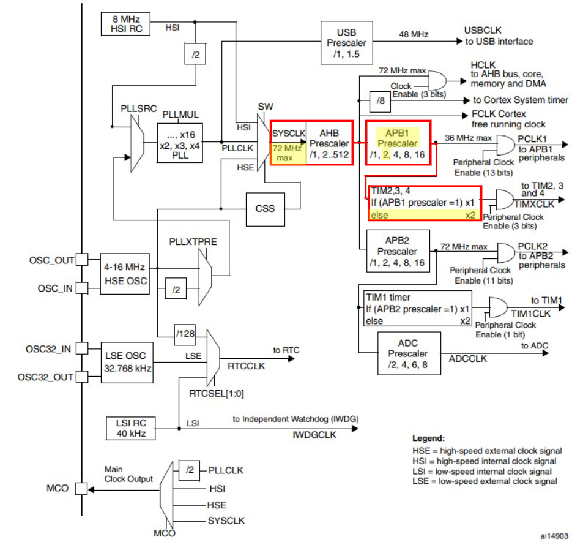
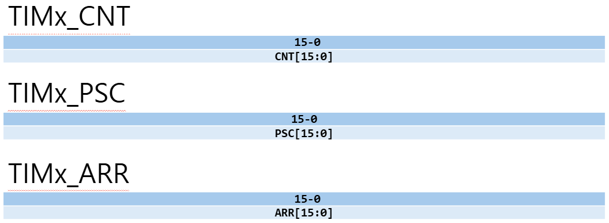
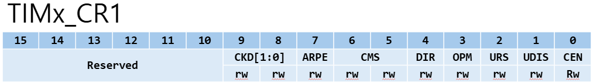
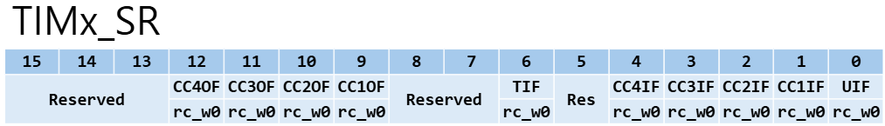
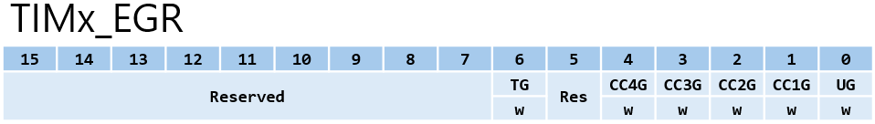
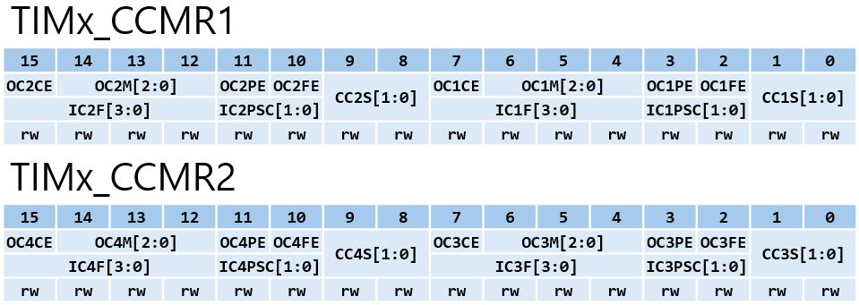
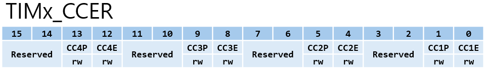
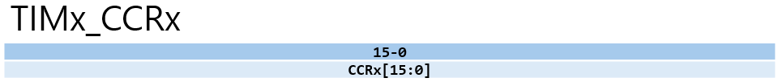
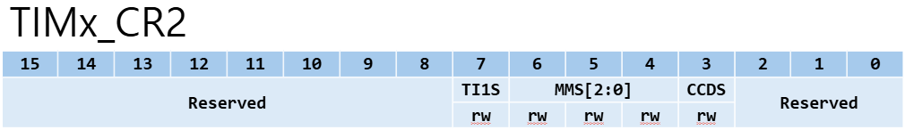
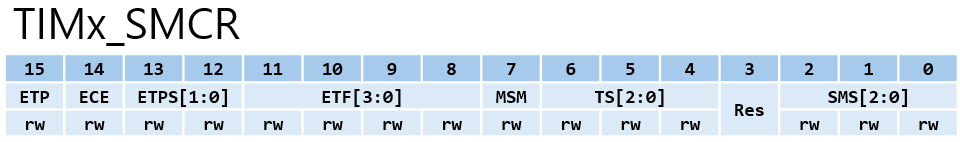

# Timer_Registers.md

## 요약
해당 문서는 STM32F103의 Timer(TIM) 레지스터 구조를 정리하고,  
`tim.c / tim.h` 코드가 **어떤 레지스터를 어떻게 제어하는지**를 연결해 설명한다.  

---

## 1. TIM 주변장치(타이머)와 레지스터 구조 개요
STM32의 TIM은 **카운터(CNT)를 어떤 클럭으로 얼마나 빠르게 증가/감소시키고,  
특정 조건(ARR 도달, CCR 비교 일치 등)에서 이벤트/출력을 만들 것인가**를 레지스터로 설정한다.

|레지스터|역할|
|--------|----|
|TIMx_CNT|실제 카운트 값 저장|
|TIMx_PSC|Prescaler 설정|
|TIMx_ARR|Auto-Reload 값|
|TIMx_CCR1~4|비교/캡처 레지스터|
|TIMx_CR1|제어 레지스터 1|
|TIMx_CR2|제어 레지스터 2|
|TIMx_SMCR|슬레이브 모드 제어|
|TIMx_DIER|인터럽트/DMA 허용|
|TIMx_SR|상태 레지스터|
|TIMx_EGR|이벤트 생성|
|TIMx_CCMR1|채널 1, 2 모드 설정|
|TIMx_CCMR2|채널 3, 4 모드 설정|
|TIMx_CCER|채널 출력 제어|

---

## 2. TIM 클럭 공급과 RCC의 관계
타이머 주변장치는 기본적으로 비활성화 상태이며, 이를 사용하기 위해서는 **RCC**를 통해 해당 타이머에 클럭을 공급해야 한다.

STM32F103에서 타이머는 연결된 버스에 따라 클럭 소스가 달라진다.
|버스|클럭 속도|해당 타이머|
|----|---------|------------|
|APB1|최대 36MHz|TIM2, TIM3, TIM4|
|APB2|최대 72MHz|TIM1|

**왜 APB1 버스트는 36MHz인데 TIM2~4는 72MHz로 동작하는가?**
- STM32F103 설계상 TIM2~4가 연결된 **APB1 버스**는 최대 **36MHz**까지만 감당할 수 있다.
- 하지만, 타이머가 너무 느려지만 정밀한 제어가 어렵기 때문에, 타이머 입구에 클럭을 다시 2배 늘려주는 **배수기**를 배치했다.



그림 속 클럭 트리 로직을 문장으로 풀면 다음과 같다.
**APB1 분주비(Prescaler)가 1이면 그대로 가고, 1이 아니면(×2, ×4 등) 2배를 곱해라.**

우리가 사용하는 일반적인 72MHz 환경을 단계별로 설명하겠다.
  1. SYSCLK : 72MHz로 출발
  2. APB1 Prescaler : APB1 버스의 한계(36MHz)를 지키기 위해 **2분주**를 거친다.
     - 그 결과 주변 장치들이 쓰는 **PCLK1은 36MHz**가 된다.
  3. Timer Multiplier : APB1 Prescaler가 2였기 때문 이때 2를 곱하는 로직이 작동한다.
     - 결과적으로 타이머에 들어가는 클럭은 **36MHz × 2 = 72MHz**가 된다.

**관련 코드**
```c
/* TIM3를 사용하기 위해 APB1 버스 클럭을 활성화 */
RCC_APB1PeriphClockCmd(RCC_APB1Periph_TIM3, ENABLE);
```
> `RCC_APB1ENR` 레지스터의 `TIM3EN` 비트를 **SET**하여 TIM3 주변장치에 클럭을 공급한다.

---

## 3. Time-Base Unit : 주기와 분주 설정
Time-Base Unit은 타이머의 가장 기본이 되는 '시간 생성' 역할을 한다. PSC, ARR, CNT 세 레지스터의 조합으로 정확한 주기를 만들어낸다.



### 3.1 레지스터 상세
|레지스터|이름|역할|
|--------|----|----|
|TIMx_PSC|Prescaler|입력 클럭을 나누어 카운터 속도를 조절|
|TIMx_ARR|Auto-Reload|카운터가 도달해야 할 목표값을 설정|
|TIMx_CNT|Counter|실제 숫자를 세는 16비트 레지스터|

### 3.2 레지스터 동작 흐름 (Up-count 시)
  1. **PSC**는 들어오는 고속 클럭을 나누어 **카운터가 1증가하는 데 걸리는 시간**을 결정
  2. **CNT**는 결정된 시간마다 숫자를 하나씩 올림
  3. **CNT**값이 **ARR**과 일치하면, 다음 클럭에서 **Update Event**를 발생시키고 **CNT**를 0으로 리셋한다.
---

## 4. 제어 및 상태 관리 (CR1, SR, EGR)
타이머의 동작 모드를 설정하고 이벤트 발생 여부를 확인하며, 설정값을 하드웨어에 반영하는 과정을 관리하는 레지스터들이다.

### 4.1 TIMx_CR1(Control Register 1)
타이머의 기본적인 동작 방향과 활성화 상태를 제어한다.



|비트|이름|설명|
|----|----|----|
|Bit[0]|CEN|Counter Enable. `1`일 때 카운터 동작, `0`일 때 정지|
|Bit[1]|UDIS|Update Disable. 업데이트 이벤트 발생 여부를 결정|
|Bit[2]|URS|Update Request Source. 인터럽트/DMA 요청의 발생 소스를 제한|
|Bit[3]|OPM|One-Pulse Mode. `1`설정 시 다음 업데이트 이벤트에서 카운터 정지|
|Bit[4]|DIR|Direction. `0` : Up-counter, `1` : Down-counter|
|Bit[6:5]|CMS|Center-aligned Mode Selection. 중앙 정렬 모드 및 인터럽트 발생 시점 설정|
|Bit[7]|ARPE|Auto-reload Preload Enable. `1`이면 ARR 변경 시 다음 업데이트 이벤트에서 반영|
|Bit[9:8]|CKD|Clock Division. 디지털 필터 등에 사용되는 클럭 분주 설정|

### 4.2 TIMx_SR(Status Register)
타이머 내부에서 발생한 이벤트의 상태 플래그를 저장한다.
하드웨어에 의해 세트되며, 인터럽트 서비스 루틴 등에서 소프트웨어적으로 클리어해야 한다.



|비트|이름|설명|
|----|----|----|
|Bit[0]|UIF|Update Interrupt Flag. <br> 카운터가 ARR에 도달(오버플로우)하거나 0에 도달(언더플로우)하여 한 주기가 끝나는 업데이트 이벤트 발생 시 SET|
|Bit[4:1]|CCxIF|Capture/Compare x Interrupt Flag. <br> - 출력 비교 : `CNT`값이 `CCRx`값과 일치할 때 SET <br> - 입력 캡처 : 설정된 에지가 감지되어 `CNT`값이 `CCRx`레지스터에 복사될 때 SET|
|Bit[6]|TIF|Trigger Interrupt Flag. <br> 설정된 트리거 입력 신호(외부 클럭, 내부 동기화 신호 등)가 감지되었을 때 하드웨어가 SET|
|Bit[12:9]|CCxOF|Capture/Compare x Overcapture Flag. <br> 입력 캡처 모드에서만 사용. 이전 캡처 값을 읽기전에 새로운 캡처 이벤트가 발생하여 `CCxIF`가 이미 SET 된 상태에서 다시 데이터가 저장될 경우 SET 됨(데이터 손실 알림).|

### 4.3 TIMx_EGR(Event Generation Register)
소프트웨어 제어를 통해 하드웨어 이벤트를 강제로 발생시키는 레지스터이다. 비트 SET 후 하드웨어가 자동으로 클리어한다.



|비트|이름|설명|
|----|----|----|
|Bit[0]|UG|Update Generation. <br> 업데이트 이벤트를 강제로 발생시켜 카운터를 초기화하고, PSC와 ARR의 설정값을 실제 연산 로직에 즉시 반영.|
|Bit[4:1]|CCxG|Capture/Compare x Generation. <br> 물리적인 신호 입력이나 값 일치 없이도 각 채널의 비교/캡처 동작을 강제로 수행하게 함.|
|Bit[6]|TG|Trigger Generation. <br> 소프트웨어적으로 트리거 이벤트를 발생시킴. 연결된 다른 타이머나 주변장치에 시작 신호를 보낼 때 사용.|

### 4.2 `TIM_TimeBaseInit()`함수와 레지스터 매핑
```c
// 예시
TIM_TimeBaseInitTypeDef TIM_TimeBaseStructure;

TIM_TimeBaseStructure.TIM_Prescaler = 7200 - 1;        // PSC 레지스터에 저장
TIM_TimeBaseStructure.TIM_Period = 10000 - 1;          // ARR 레지스터에 저장
TIM_TimeBaseStructure.TIM_CounterMode = TIM_CounterMode_Up; // CR1 레지스터의 DIR 비트
TIM_TimeBaseStructure.TIM_ClockDivision = TIM_CKD_DIV1;           // CR1 레지스터의 CKD 비트

TIM_TimeBaseInit(TIM3, &TIM_TimeBaseStructure);
```

```c
// map.h
/*
CPU는 메모리에서 데이터를 읽어올 때 4바이트(32비트) 단위로 읽는다.
타이머 레지스터들은 보통 16비트 크기지만, 주소 할당은 32비트 단위로 이루어지기 떄문에 16비트 레지스터 바로 다음에 공간을 비워둠(Reserved)으로써
다음 레지스터가 정확 32비트 경계 주소에 위치하도록 맞추는 것이다.
*/
typedef struct
{
  vu16 CR1;
  u16 RESERVED0; 
  vu16 CR2;
  u16 RESERVED1;
  vu16 SMCR;
  u16 RESERVED2;
  vu16 DIER;
  u16 RESERVED3;
  vu16 SR;
  u16 RESERVED4;
  vu16 EGR;
  u16 RESERVED5;
  vu16 CCMR1;
  u16 RESERVED6;
  vu16 CCMR2;
  u16 RESERVED7;
  vu16 CCER;
  u16 RESERVED8;
  vu16 CNT;
  u16 RESERVED9;
  vu16 PSC;
  u16 RESERVED10;
  vu16 ARR;
  u16 RESERVED11[3];
  vu16 CCR1;
  u16 RESERVED12;
  vu16 CCR2;
  u16 RESERVED13;
  vu16 CCR3;
  u16 RESERVED14;
  vu16 CCR4;
  u16 RESERVED15[3];
  vu16 DCR;
  u16 RESERVED16;
  vu16 DMAR;
  u16 RESERVED17;
} TIM_TypeDef;

// tim.h
typedef struct
{
  u16 TIM_Period;          /* ARR */
  u16 TIM_Prescaler;       /* PSC */
  u16 TIM_ClockDivision;   /* CR1의 CKD[1:0] */
  u16 TIM_CounterMode;     /* CR1의 DIR/CMS 관련 */
} TIM_TimeBaseInitTypeDef;

/* 예시에서 설정된 ClockDivision과 CounterMode는 다음과 같이 매크로 정의되어 있다. */
#define TIM_CKD_DIV1                      ((u16)0x0000)
#define TIM_CounterMode_Up                ((u16)0x0000)

// tim.c
#define CR1_CKD_Mask                ((u16)0x00FF)
#define CR1_CounterMode_Mask        ((u16)0x038F)

void TIM_TimeBaseInit(TIM_TypeDef* TIMx, TIM_TimeBaseInitTypeDef* TIM_TimeBaseInitStruct)
{
  /* 파라미터 체크 */
  assert_param(IS_TIM_COUNTER_MODE(TIM_TimeBaseInitStruct->TIM_CounterMode));
  assert_param(IS_TIM_CKD_DIV(TIM_TimeBaseInitStruct->TIM_ClockDivision));

  /* ARR에 Period 저장 */
  TIMx->ARR = TIM_TimeBaseInitStruct->TIM_Period ; // TIM3->ARR = 9999

  /* PSC에 Prescaler 저장 */
  TIMx->PSC = TIM_TimeBaseInitStruct->TIM_Prescaler; // TIM3->PSC = 7199

  /* CR1의 관련 비트만 Clear한 다음, CounterMode/ClockDivision을 OR로 반영 */
  TIMx->CR1 &= CR1_CKD_Mask & CR1_CounterMode_Mask; // TIM3->CR1 &= 0x008F
  TIMx->CR1 |= (u32)TIM_TimeBaseInitStruct->TIM_ClockDivision |
               TIM_TimeBaseInitStruct->TIM_CounterMode;
}
```
CR1의 관련 비트만 Clear하기 위해 사용된 마스크는:
- `CR1_CKD_Mask = 0x00FF`
- `CR1_CounterMode_Mask = 0x038F`
그리고 실제로 AND 해서 쓰는 값은:
- `0x00FF & 0x038F = 0x008F`
- 보존되는 비트:
  - Bit[0] CEN
  - Bit[1] UDIS
  - Bit[2] URS
  - Bit[3] OPM
  - Bit[7] ARPE
- 클리어되는 비트:
  - Bit[4] DIR
  - Bit[6:5] CMS
  - Bit[9:8] CKD
즉, **CounterMode/DIR/CMS, ClockDivision/CKD**를 깨끗하게 비우고, 나머지 동작 비트(CEN/ARPE 등)는 유지하려는 의도이다.

`TIM_TimeBaseInit(...);` 함수는 카운터를 실제로 돌리는 함수가 아니다.
해당 예시에서 카운터를 돌리기 위해서는 TIM3_CR1의 CEN 비트를 1로 설정해야 한다.
이는 `TIM_Cmd(TIM3, ENABLE);` 함수를 실행하면 동작한다.

```c
void TIM_Cmd(TIM_TypeDef* TIMx, FunctionalState NewState)
{
  assert_param(IS_FUNCTIONAL_STATE(NewState));
  
  if (NewState != DISABLE)
  {
    TIMx->CR1 |= CR1_CEN_Set;
  }
  else
  {
    TIMx->CR1 &= CR1_CEN_Reset;
  }
}
```

---

## 5. Output Compare & PWM (CCMR, CCER, CCR)
타이머의 카운터(`CNT`)값과 사용자가 설정한 비교 레지스터(`CCR`)값을 실시간으로 대조하여 특정 전압 파형(PWM 등)을 생성하는 과정을 제어한다.

### 5.1 TIMx_CCMR1/CCMR2 (Capture/Compare Mode Register)
각 채널의 출력 모드(PWM, Toggle 등)를 결정하며, CCMR1은 채널 1과 2를, CCMR2는 채널 3과 4를 담당



|비트|이름|설명|
|----|----|----|
|Bit[1:0], Bit[9:8]|CCxS|Capture/Compare x Selection. <br> 해당 채널을 출력(`00`)으로 쓸지 입력(`01/10/11`)으로 쓸지 결정|
|Bit[2], Bit[10]|OCxFE|Output Compare x fast enable. <br> `1` 설정 시 출력 신호의 응답 지연을 최소화함. 특정 이벤트 발생 시 하드웨어가 클럭 지연을 무시하고 출력을 트리거하여 응답 속도를 높임|
|Bit[3], Bit[11]|OCxPE|Output Compare x Preload Enable. <br> `1` 설정 시 CCR 값 변경이 다음 Update Event 때 반영|
|Bit[6:4], Bit[14:12]|OCxM|Output Compare x Mode. <br> 출력 형태를 결정하는 핵심 비트. <br> - `110`: PWM Mode 1 (CNT<CCR 시 Active) <br> - `111`: PWM Mode 2 (CNT<CCR 시 Inactive) <br> - `011`: Toggle (CNT=CCR 시 출력 반전)|
|Bit[7], Bit[15]|OCxCE|Output Compare x Clear Enable. <br> `1` 설정 시 외부 트리거 입력 신호에 의해 해당 채널의 출력을 강제로 Low(CLear) 상태로 만들 수 있음.|

### 5.2 TIMx_CCER (Capture/Compare Enable Register)
생성된 신호를 실제 외부 핀으로 내보낼지 여부와 전기적 극성(High/Low)을 결정



|비트|이름|설명|
|----|----|----|
|Bit[0, 4, 8, 12]|CCxE|Capture/Compare x Output Enable. <br> `1`일 때 해당 채널의 신호가 출력|
|Bit[1, 5, 9, 13]|CCxP|Capture/Compare x Output Polarity. <br> - `0`: Active High (활성 시 High 전압 출력) <br> - `1`: Active Low (활성 시 Low 전압 출력)|

### 5.3 TIMx_CCRx (Capture/Compare Register)



- PWM의 듀티비(Duty Cycle)를 결정하는 임계값(Threshold)이다.
- 하드웨어가 실시간으로 `CNT`와 `CCRx`를 비교하며, 설정된 모드(`OCxM`)에 따라 출력 핀의 상태를 바꾼다.

### 5.4 `TIM_OCInit()`함수와 레지스터 매핑

```c
TIM_OCInitStructure.TIM_OCMode     = TIM_OCMode_PWM1;      // 0x0060
TIM_OCInitStructure.TIM_Channel    = TIM_Channel_1;        // 0x0000
TIM_OCInitStructure.TIM_Pulse      = CCR1_Val;             // CCR1에 들어갈 값 (이전에 변수로 선언되었다 가정)
TIM_OCInitStructure.TIM_OCPolarity = TIM_OCPolarity_High;  // 0x0000
TIM_OCInit(TIM3, &TIM_OCInitStructure);

// tim.h
typedef struct
{
  u16 TIM_OCMode;          /* CCMR1/2 */
  u16 TIM_Channel;         /* 레지스터 선택용 */
  u16 TIM_Pulse;           /* CCR1~CCR4 중 TIM_Channel에 의해 결정 */
  u16 TIM_OCPolarity;      /* CCER */
} TIM_OCInitTypeDef;

#define TIM_OCMode_PWM1                   ((u16)0x0060)
#define TIM_Channel_1                     ((u16)0x0000)
#define TIM_OCPolarity_High               ((u16)0x0000)

```c
/*
 * (1) 공통 준비(변수/검사/CCER 백업)
 * tmpccmrx : CCMR1 또는 CCMR2를 조작하기 위한 임시 값
 * tmpccer : CCER을 조작하기 위한 임시값
 */
u32 tmpccmrx = 0, tmpccer = 0;

/* 파라미터 검사 */
assert_param(IS_TIM_OC_MODE(TIM_OCInitStruct->TIM_OCMode));
assert_param(IS_TIM_CHANNEL(TIM_OCInitStruct->TIM_Channel));
assert_param(IS_TIM_OC_POLARITY(TIM_OCInitStruct->TIM_OCPolarity));

/* TIMx의 CCER 백업 */
tmpccer = TIMx->CCER;
```

```c
/*
 * (2) 채널 그룹 선택(CCMR1: CH1/2, CCMR2: CH3/4)
 * TIM_OCInitStructure->TIM_Channel 에는 TIM_Channel_1 이 저장되어 있다.
 * 채널 그룹 선택(CCMR1: CH1/2, CCMR2: CH3/4)
 * tmpccmrx = TIMx->CCMR1; → 채널 1을 설정할 수 있는 CCMR1 선택
 */
if ((TIM_OCInitStruct->TIM_Channel == (u16)TIM_Channel_1) ||
    (TIM_OCInitStruct->TIM_Channel == (u16)TIM_Channel_2))
{
  tmpccmrx = TIMx->CCMR1;

  /*
   * (3) 그룹 공통 초기화(OC Mode/Polarity Field Clear)
   * #define CCER_CC1P_Mask              ((u16)0x3331)
   * #define CCER_CC2P_Mask              ((u16)0x3313)
   * #define CCER_CC3P_Mask              ((u16)0x3133)
   * #define CCER_CC4P_Mask              ((u16)0x1333)

   * static uc16 Tab_OCModeMask[4] = {0xFF00, 0x00FF, 0xFF00, 0x00FF};
   * static uc16 Tab_PolarityMask[4] = {CCER_CC1P_Mask, CCER_CC2P_Mask, CCER_CC3P_Mask, CCER_CC4P_Mask};
  
   * Tab_OCModeMask[TIM_Channel_1] = 0xFF00
   * tmpccmrx &= Tab_OCModeMask[0xFF00]; → 해당 마스크를 사용하여 CCMR1의 하위 8비트(=CH1 관련 OC 필드)가 0으로 정리된다.
   * tmpccer &= Tab_PolarityMask[0x3331]; → 해당 마스크를 사용하여 CCER의 1번 비트(=CC1P)가 0으로 정리된다.
   */
  tmpccmrx &= Tab_OCModeMask[TIM_OCInitStruct->TIM_Channel];
  tmpccer &= Tab_PolarityMask[TIM_OCInitStruct->TIM_Channel];

  /*
   * (4) 채널별 설정(Disable → 모드 → CCRx → Enable/Polarity)
   * #define CCER_CC1E_Reset             ((u16)0x3332)
   * #define CCER_CC1E_Reset             ((u16)0x0001)
   * TIMx->CCER &= 0x3332; → CCER의 0번 비트(=CC1E)를 0으로 내려 설정 도중 출력이 흔들리는 것을 막는다.
   * tmpccmrx |= TIM_OCInitStruct->TIM_OCMode_PWM1; → 채널1은 CCMR1의 하위 바이트에 모드가 들어가므로 Shift 연산 없이 tmpccmrx에 올린다.
   * TIMx->CCR1 = TIM_OCInitStruct->CCR1_Val; → 듀티(또는 OC 비교값) 기준이 되는 CCR1이 설전된다.
   * tmpccer |= 0x0001; → 채널 1을 Enable 상태로 만들기 위한 비트를 tmpccer에 올린다.
   * tmpccer |= TIM_OCInitStruct->TIM_OCPolarity_High; → 반영할 Polarity 를 tmpccer에 올린다(High는 값이 0이라 OR 해도 변화가 없다).
   */
  if (TIM_OCInitStruct->TIM_Channel == TIM_Channel_1)
  {
    TIMx->CCER &= CCER_CC1E_Reset; 

    tmpccmrx |= TIM_OCInitStruct->TIM_OCMode;

    TIMx->CCR1 = TIM_OCInitStruct->TIM_Pulse;

    tmpccer |= CCER_CC1E_Set;

    tmpccer |= TIM_OCInitStruct->TIM_OCPolarity;
  }
  else {/* TIM_Channel_2 */}

  /*
   * (5) CCMR 반영
   * TIM3->CCMR1의 CH1 영역이 PWM1 모드로 바뀜
   */
  TIMx->CCMR1 = (u16)tmpccmrx;
}
else{/* TIM_Channel_3 , TIM_Channel_4 */}

/*
 * (6) CCER 반영
 * CH1 enable(CC1E=1)이 확정된다.
 * Polarity는 High(=0)이므로 CC1P는 기본(비반전) 방향으로 유지된다.
 */
TIMx->CCER = (u16)tmpccer;
```

---

## 6. 외부 트리거 및 이벤트 전파 관리 (CR2, SMCR, DIER)
타이머 내부 이벤트를 외부 장치(ADC 등)나 다른 타이머로 전달하거나, 외부 신호를 받아 타이머의 동작을 동기화할 때 사용한다.

### 6.1 TIMx_CR2 (Control Register 2)
주로 마스터 모드(Master Mode)에서 트리거 출력 신호(TRGO)를 관리하여 외부 장치나 다른 타이머로 이벤트를 전파함



|비트|이름|설명|
|----|----|----|
|Bit[3]|CCDS|Capture/Compare DMA Selection. <br> `0` : CCx 이벤트 발생 시 DMA 요청을 보냄. <br> `1` : Update 이벤트 발생 시 DMA 요청을 보냄|
|Bit[6:4]|MMS|Master Mode Selection. 마스터로서 외부(TRGO)에 보낼 신호 선택. <br> - `000` : Reset(UG 비트로 트리거) <br> - `001` : Enable(CEN 비트로 트리거) <br> - `010` : Update(업데이트 이벤트로 트리거) <br> - `011` : Compare Pulse(Capture/Compare Match 성공으로 트리거) <br> - `100` : Compare-OC1REF : 채널 1의 출력 참조 신호(OC1REF)를 TRGO 신호로 사용 <br> - `101` : Compare-OC2REF : 채널 2의 출력 참조 신호(OC2REF)를 TRGO 신호로 사용 <br> - `110` : Compare-OC3REF : 채널 3의 출력 참조 신호(OC3REF)를 TRGO 신호로 사용 <br> - `111` : Compare-OC4REF : 채널 4의 출력 참조 신호(OC4REF)를 TRGO 신호로 사용|
|Bit[7]|TI1S|TI1 Selection. <br> -`0` : CH1 핀이 TI1 입력에 직접 연결됨. <br> - `1` : CH1, CH2, CH3 핀의 XOR 연산 결과가 TI1 입력에 연결됨.|

**타이머가 발생시킨 이벤트를 외부 장치에 알리는 '출력' 설정 예시**:
- **ADC 자동 샘플링 트리거**
  - 타이머 주기가 끝날 때마다(`MMS = 010, Update`) 자동으로 ADC 변환을 시작하고 싶을 때 사용한다.
  - CPU가 매번 개입하지 않아도 정해진 시간 간격마다 센서 값을 읽을 수 있다.
- **다른 타이머 구동**
  - 본인의 카운터가 시작될 때(`MMS = 001, Enable`) 연결된 슬레이브 타이머도 동시에 시작하게 하여 두 타이머의 동기화를 맞춘다.

### 6.2 TIMx_SMCR (Slave Mode Control Register)
외부 신호를 타이머의 클럭으로 사용하거나, 트리거 입력에 따른 자동 동작(Reset, Strat 등)을 설정



|비트|이름|설명|
|----|----|----|
|Bit[2:0]|SMS|Slave Mode Selection. 트리거 입력 시 동작 모드 결정 <br> `100` : Reset 모드(트리거 시 CNT 리셋) <br> `110` : Trigger 모드(트리거 시 타이머 시작)|
|Bit[6:4]|TS|Trigger Selection. 슬레이브 동작을 유발할 입력 소스(ITR0~3, TI1F_ED 등)를 선택|
|Bit[7]|MSM|Master/Slave Mode. `1` 설정 시 마스터 타이머와 슬레이브 타이머 간의 동기화 지연을 하드웨어가 보정|
|Bit[11:8]|ETF|External Trigger Filter. 외부 트리거 신호(ETR)의 노이즈를 제거하기 위한 샘플링 주파수와 필터 길이 설정|
|Bit[13:12]|ETPS|External Trigger Prescaler. ETR 신호의 주파수를 분주하여 입력 속도를 조절(1, 2, 4, 8 분주)|
|Bit[14]|ECE|External Clock Enable. `1` 설정 시 외부 트리거 입력(ETRF) 신호를 타이머의 메인 클럭 소스로 사용|
|Bit[15]|ETP|External Trigger Polarity. 외부 트리거 신호의 극성을 선택(0: 상승 에지, 1: 하강 에지)|

**외부에서 들어오는 신호에 따라 타이머의 동작 방식을 결정하는 '입력' 설정 예시**":
- **외부 펄스 카운팅(External Clock Mode)**
  - 내부 클럭 대신 외부 핀(`ETR`)으로 들어오는 펄스를 클럭으로 사용한다.
  - 이를 통해 컨베이어 벨트의 물체 개수나 유량계의 펄스 수를 직접 CNT 레지스터로 셀 수 있다.
- **타이머 간 동기화(Gated/Trigger Mode)**
  - 마스터 타이머의 신호를 받아 본인의 카운터를 초기화하거나(`SMS = 100, Reset`), 특정 구간에서만 동작하게(`SMS = 101, Gated`) 조절한다.

### 6.3 TIMx_DIER (DMA/Interrupt Enable Register)
타이머 내부에서 발생한 각 이벤트를 시스템 인터럽트나 DMA 요청으로 연결할지 결정.


|비트|이름|설명|
|----|----|----|
|Bit[0]|UIE|Update Interrupt Enable. 업데이트 이벤트 발생 시 인터럽트 요청을 활성화|
|Bit[4:1]|CCxIE|Capture/Compare x Interrupt Enable. 채널 1~4의 비교 일치 또는 캡처 발생 시 인터럽트를 활성화|
|Bit[6]|TIE|Trigger Interrupt Enable. 트리거 이벤트 발생 시 인터럽트 요청을 활성화|
|Bit[8]|UDE|Update DMA Enable. 업데이트 이벤트 발생 시 DMA 요청을 활성화|
|Bit[12:9]|CCxDE|Capture/Compare x DMA Enable. 각 채널의 비교/캡처 이벤트 발생 시 DMA 요청을 활성화|
|Bit[14]|TDE|Trigger DMA Enable. 트리거 이벤트 발생 시 DMA 요청을 활성화|

**타이머 내부에서 발생한 이벤트(Update, Compare 등)를 시스템 전체의 작업으로 연결하는 설정 예시**:
- **주기적인 데이터 처리(Interrupt)**
  - `UIE`를 활성화하여 타이머 주기가 끝날 때마다 CPU를 호출한다.
  - CPU는 인터럽트 서비스 루틴(ISR)에서 제어 알고리즘을 계산하거나 상태를 업데이트한다.
- **대량 데이터 고속 전송(DMA)**
  - `UDE`나 `CCxDE`를 활성화한다.
  - 예를 들어, 타이머 주기에 맞춰 메모리에 있는 데이터를 DAC로 자동으로 보내 복잡한 파형을 생성할 때 사용한다.

---

