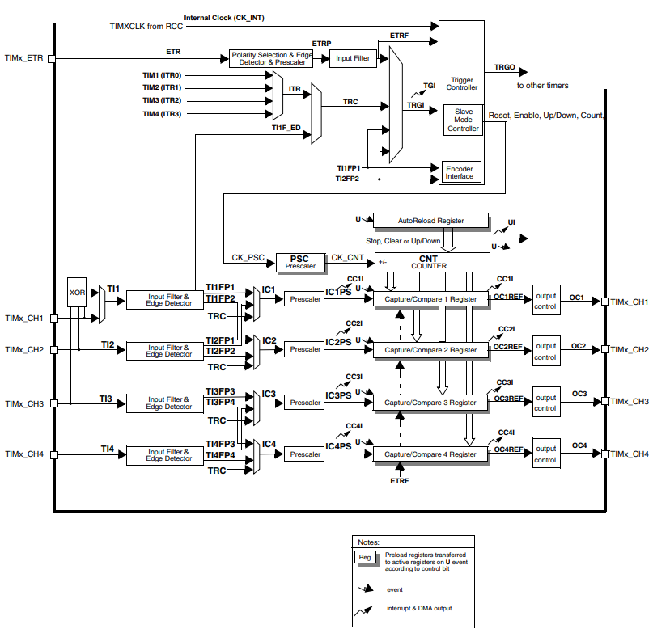

# Timer - PSC와 CKD 비교

해당 문서는 STM32 타이머 설정에서 **PSC(Prescaler)와 CKD(Clock Division)의 차이**를 정리한다  
두 설정 모두 클럭을 나누는(분주) 동작을 하지만, **클럭이 도달하는 최종 목적지**가 다르다는 점이 핵심이다

---

## 1. 개요
프리스케일러(PSC)와 클럭 분주(CKD)는 모두 입력 클럭($f_{TIM}$)의 주파수를 낮추는 역할을 수행한다
- `PSC` : 타이머의 **메인 카운팅 속도**제어
- `CKD` : **입력 필터 및 데드타임 제어**를 위한 샘플링 속도를 제어

---

## 2. PSC (Prescaler)
타이머의 '시간 기준'을 만드는 설정이다.
- **목적지** : 카운터 레지스터(CNT)
- **역할** : 카운터가 숫자를 하나 올리는 데 걸리는 시간을 결정하며, 이를 통해 전체 주기를 설정한다
- **영향 범위** : 타이머의 모든 시간 기반 동작(PWM 주파수, 인터럽트 주기 등)에 영향을 준다
- **공식** : $f_{CNT}=\frac{f_{TIM}}{PSC+1}$

---

## 3. CKD (Clock Division)
외부 신호를 감시하거나 정밀한 출력을 제어하기 위한 '보조 시계' 설정이다.
- **목적지** : 디지털 필터(Digital Filter) 및 데드타임 발생기(Dead-time Generator)
- **역할** : 입력 캡처 신호의 노이즈를 제거하기 위한 샘플링 클럭($t_{DTS}$)의 주기를 생성한다
- **영향 범위** : 카운터의 숫자 증가 속도에는 아무런 영향을 주지 않으며, 오직 필터링 성능이나 데드타임의 정밀도에만 관여한다
- **설정값** : `TIM_CKD_DIV1`, `TIM_CKD_DIV2`, `TIM_CKD_DIV4` 중 선택 가능

### 3.1 $t_{DTS}$(Dead-time and Digital Filter Sampling Clock)
타이머가 숫자를 세는 메인 시계(CK_CNT)와는 별개로, **입력 신호를 감시(필터링)** 하거나 **출력 신호의 안전 구간(데드타임)을 계산**하기 위해 존재한다

### 3.2 $t_{DTS}$의 생성 원리
타이머로 들어오는 내부 클럭($f_{TIM}$ 또는 CK_INT)을 `TIMx_CR1` 레지스터의 **CKD(Clock Division)** 비트 설정에 따라 나누어 생성한다
- **CKD = 00**(DIV1): $t_{DTR}=t_{CK \textunderscore INT}$ (분주 없음)
- **CKD = 01**(DIV2): $t_{DTR}=2 \times t_{CK \textunderscore INT}$ (2분주, 2배 느린 시계)
- **CKD = 10**(DIV4): $t_{DTR}=4 \times t_{CK \textunderscore INT}$ (4분주, 4배 느린 시계)

### 3.3 $t_{DTS}$가 사용되는 곳
#### 3.3.1 디지털 필터(Digital Filter)
입력 캡처 모드에서 외부 신호를 **얼마나 자주 샘플링할 것인가**를 결정한다
- $t_{DTS}$ 주기가 길어질수록(분주비가 클수록) 더 넓은 폭의 노이즈를 효과적으로 걸러낼 수 있다
- 입력 캡처 필터 설정(`ICxF`) 비트와 조합되어 "이 신호가 $t_{DTS}$주기로 N번 연속 확인되었는가?"를 판단하는 기준이 된다

#### 3.3.2 데드타임 발생기(Dead-time Generator)
상보 PWM(CHx, CHxN) 출력 시 두 스위치가 동시에 켜지지 않도록 하는 **데드타임의 시간 폭**을 계산하는 단위가 된다
- 데드타임 설정값은  " $t_{DTS} \times$설정 비트 "의 형태로 계산되므로, $t_{DTS}$가 느려질수록 더 긴 지연시간을 확보할 수 있다

### 3.4 왜 $t_{CK_CNT}$(카운팅 클럭)와 분리되어 있는가?
- 카운터의 속도(PSC)를 빠르게 유지하면서도, 노이즈 필터는 느리고 꼼꼼하게 동작시켜야 할 때가 있다
- 만약 $t_{DTS}$가 메인 클럭인 PSC를 따라간다면, PWM 주파수를 바꿀 때마다 노이즈 필터 성능과 데드타임 시간도 같이 변해버리는 문제가 발생한다.
- 이를 방지하기 위해 별도의 분주 회로인 `CKD`를 사용하는 것이다 (`TIMx`에서 `CKD` 설정을 바꿔도 `CNT`레지스터가 숫자를 세는 속도에는 영향이 없다)

---

## 4. 차이점 비교표
|구분|PSC(Prescaler)|CKD(Clock Division)|
|----|--------------|-------------------|
|타겟 레지스터|`TIMx_PSC`|`TIMx_CR1`(Bit[9:8])|
|최종 목적지|Counter(CNT)|Digital Filter / Dead-time|
|주요 용도|PWM 주파수 및 시간 지연 설정|입력 신호의 노이즈 제거(필터링)|
|동작 특징|모든 타이머 동작의 기초가 됨|입력 캡처나 모터 제어 시에만 주로 사용됨|
