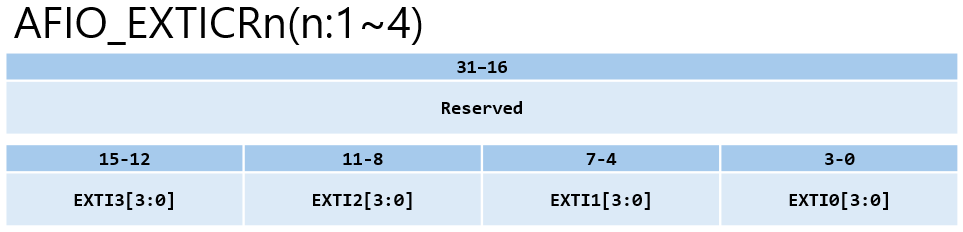
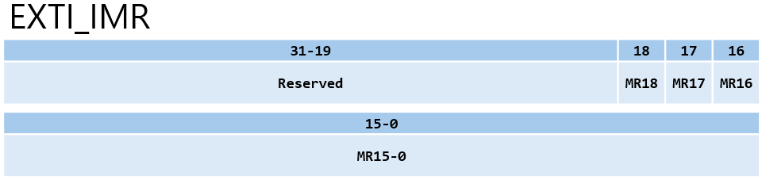
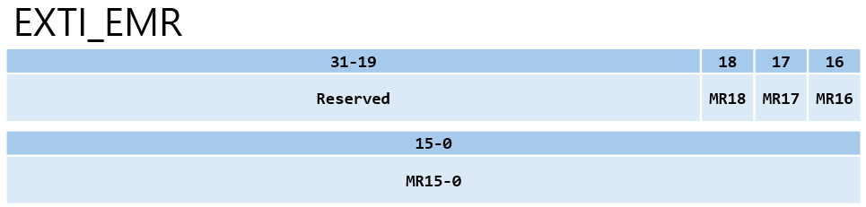
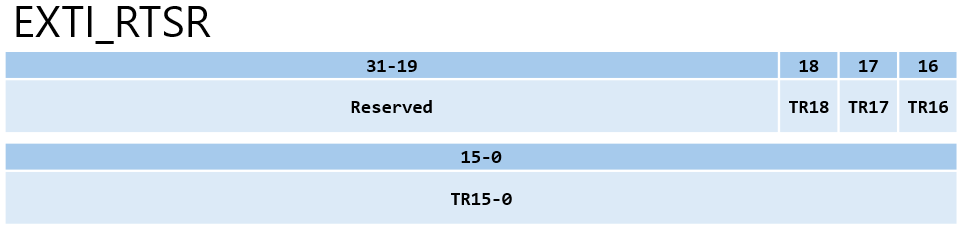
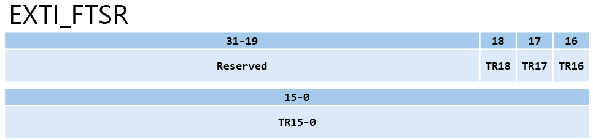
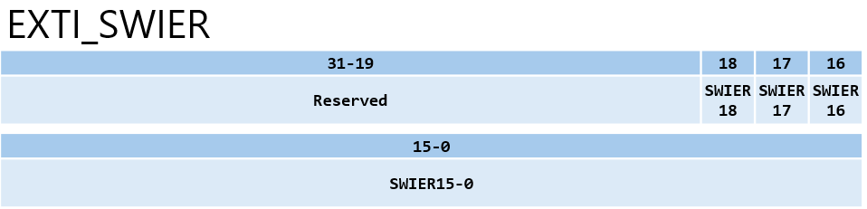
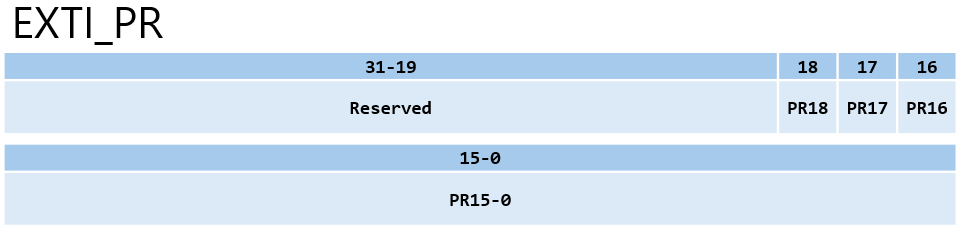

# EXTI_Registers.md

## 요약
EXTI 레지스터는 인터럽트 허용, </br>
트리거 설정, Pending 상태 관리 기능을 수행한다.

---

## 1. AFIO_EXTICR : 포트 매핑 레지스터



- **AFIO_EXTICR1** : 외부인터럽트 0~3에 대한 입력설정을 처리
- **AFIO_EXTICR2** : 외부인터럽트 4~7에 대한 입력설정을 처리
- **AFIO_EXTICR3** : 외부인터럽트 8~11에 대한 입력설정을 처리
- **AFIO_EXTICR4** : 외부인터럽트 12~15에 대한 입력설정을 처리

설정 전 반드시 AFIO Clock 활성화 필요

---

## 2. EXTI_IMR : 인터럽트 마스크 레지스터



- **MR15~0** : 외부 인터럽트
- **MR16** : PVD(Programmable voltage detector)
- **MR17** : RTC Alarm
- **MR18** : USB Wakeup

MRx 비트 </br>

1 → 인터럽트 허용 </br>
0 → 차단

---

## 3. EXTI_EMR : 이벤트 마스크 레지스터



이벤트 발생 허용 제어

---

## 4. EXTI_RTSR : Rising Trigger



TRx = 1 → 상승엣지 허용

---

## 5. EXTI_FTSR : Falling Trigger



TRx = 1 → 하강엣지 허용

---

## 6. EXTI_SWIER : 소프트웨어 인터럽트



SWIERx = 1 설정 시 </br>
강제로 인터럽트 발생

---

## 7. EXTI_PR : Pending 레지스터



PRx = 1 → 인터럽트 발생 상태

인터럽트 처리 후 </br>
1을 써서 클리어해야 한다.

---

## 8. EXTI_InitTypeDef 구조체

```c
typedef struct
{
  u32 EXTI_Line;
  EXTIMode_TypeDef EXTI_Mode;
  EXTITrigger_TypeDef EXTI_Trigger;
  FunctionalState EXTI_LineCmd;
}EXTI_InitTypeDef;
```

---

## 9. GPIO_EXTILineConfig(u8 GPIO_PortSource, u8 GPIO_PinSource)

```c
/*
 * gpio.c
 * GPIO_EXTILineConfig(GPIO_PortSourceGPIOB, GPIO_PinSource0);를 예로들어 설명하겠다.
 * 1. EXTI Line 0은 AFIO_EXTICR1의 Bit[3:0]을 사용한다.
 * 2. GPIO_PortSourceGPIOB = 0x01 , GPIO_PinSource0 = 0x00
 * 3. 이 함수는 AFIO_EXTICR1의 해당 비트 영역에 0x01을 기록한다.
 */

void GPIO_EXTILineConfig(u8 GPIO_PortSource, u8 GPIO_PinSource)
{
  u32 tmp = 0x00;

  /* 파라미터 체크 */
  assert_param(IS_GPIO_PORT_SOURCE(GPIO_PortSource));
  assert_param(IS_GPIO_PIN_SOURCE(GPIO_PinSource));

  /*
   * tmp = (u32)0x0F << 0x04 * (0x00 & 0x03)
   * tmp = (u32)0x0F << 0
   * tmp = 0x0000_000F
   */
  tmp = ((u32)0x0F) << (0x04 * (GPIO_PinSource & (u8)0x03));

  /*
   * EXTICR1의 Bit[3:0] Reset
   * AFIO->EXTICR[0] &= 0xFFFF_FFF0
   */
  AFIO->EXTICR[GPIO_PinSource >> 0x02] &= ~tmp;

  /*
   * EXTICR1의 Bit[3:0] 설정한 포트로 설정
   * AFIO->EXTICR[0] |= (u32)0x01 << 0x04 * (0x00 & 0x03)
   * AFIO->EXTICR[0] |= (u32)0x01
   */
  AFIO->EXTICR[GPIO_PinSource >> 0x02] |= (((u32)GPIO_PortSource) << (0x04 * (GPIO_PinSource & (u8)0x03)));
}
```

---

## 10. EXTI_Init(EXTI_InitTypeDef* EXTI_InitStruct)

```c
/*
 * exti.c
 * EXTI_InitStructure.EXTI_Line = EXTI_Line0;
 * EXTI_InitStructure.EXTI_Mode = EXTI_Mode_Interrupt;
 * EXTI_InitStructure.EXTI_Trigger = EXTI_Trigger_Rising;
 * EXTI_InitStructure.EXTI_LineCmd = ENABLE;
 * EXTI_Init(&EXTI_InitStructure);
 * 를 예로들어 설명하겠다.
 * 설정 조건: Line0, Interrupt 모드, Rising 트리거, 활성화(ENABLE)
 */

void EXTI_Init(EXTI_InitTypeDef* EXTI_InitStruct)
{
  /*
   * 1. 인터럽트/이벤트 모드 선택 및 마스크 해제
   * EXTI_Mode_Interrupt = 0x00
   */
  if (EXTI_InitStruct->EXTI_LineCmd != DISABLE)
  {
    /*
     * 아래 코드는 다음과 같다.
     * EXTI->IMR |= 0x00001; (Line 0의 인터럽트 요청을 허용)
     * *(u32 *) → 메모리 주소를 u32로 형변환 하고 해당 주소가 가리키는 실제 메모리 공간(레지스터) 내부로 들어감 
     */
    *(u32 *)(EXTI_BASE + (u32)EXTI_InitStruct->EXTI_Mode) |= EXTI_InitStruct->EXTI_Line;

    /*
     * 2. 트리거 에지 설정 전 초기화
     * RTSR(Rising)과 FTSR(Falling)에서 해당 라인 비트를 먼저 지운다.
     * EXTI->RTSR &= ~0x01;
     * EXTI->FTSR &= ~0x01;
     */
    EXTI->RTSR &= ~EXTI_InitStruct->EXTI_Line;
    EXTI->FTSR &= ~EXTI_InitStruct->EXTI_Line;
    
    /*
     * 3. 트리거 방식 선택 (Rising Edge)
     * EXTI_Trigger_Rising = 0x08
     * 이는 EXTI_BASE + 0x08 위치인 EXTI_RTSR 레지스터에 접근함을 의미한다.
     * 아래 코드는 다음과 같다.
     * EXTI->RTSR |= 0x00001
     */
    *(u32 *)(EXTI_BASE + (u32)EXTI_InitStruct->EXTI_Trigger) |= EXTI_InitStruct->EXTI_Line;
  }

  else
  {
    /*
     * EXTI_LineCmd = DISABLE 일 때,
     * EXTI Line에 해당하는 Bit 리셋
     * EXTI->IMR &= ~EXTI_Line
     */
    *(u32 *)(EXTI_BASE + (u32)EXTI_InitStruct->EXTI_Mode) &= ~EXTI_InitStruct->EXTI_Line;
  }
}
```
