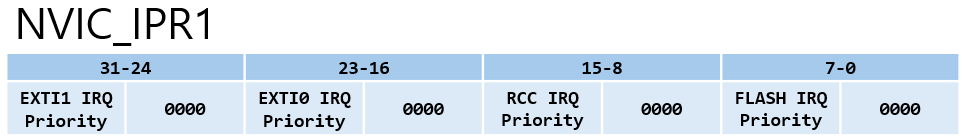
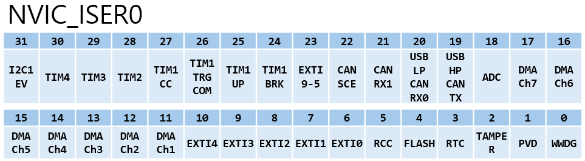

# NVIC_Registers.md

## 요약
이 문서는 **NVIC가 외부 주변장치 레지스터 블록에 존재하지 않는다는 점**을 전제로, </br>
`main.c`에서 `NVIC_Init()`를 호출하는 흐름이 **코어 내부 레지스터에 어떻게 반영되는지**를 코드 기반으로 연결해 설명한다.

---

## 1. NVIC 레지스터 위치와 구조

NVIC는 STM32의 **주변장치(GPIO, TIM, EXTI …)** 가 아니라 **Cortex‑M3 코어(System Control Space, SCS)** 내부에 존재한다.

따라서 NVIC는 다음과 같은 특징을 가진다.

- RCC에서 "**NVIC 클럭 enable**" 같은 절차가 없다.
- `NVIC->ISER`, `NVIC->ICER`, `NVIC->IPR` 등은 **코어 내부 레지스터**에 대한 접근이다.
- 우선순위 그룹(PRIGROUP)은 **SCB->AIRCR**에서 관리된다.

`stm32f10x_map.h`에서 NVIC 레지스터 배열 구조는 다음과 같이 정의되어 있다.

```c
typedef struct
{
  vu32 ISER[2];
  u32 RESERVED0[30];
  vu32 ICER[2];
  u32 RSERVED1[30];
  vu32 ISPR[2];
  u32 RESERVED2[30];
  vu32 ICPR[2];
  u32 RESERVED3[30];
  vu32 IABR[2];
  u32 RESERVED4[62];
  vu32 IPR[11];
} NVIC_TypeDef;

#define NVIC_BASE             (SCS_BASE + 0x0100)
#define NVIC                ((NVIC_TypeDef *) NVIC_BASE)
```

---

## 2. NVIC_InitTypeDef 구조체

`NVIC_Init()`은 사용자가 채운 구조체를 기반으로, 내부적으로 **IPR(우선순위) + ISER/ICER(Enable/Disable)**를 갱신한다.

```c
typedef struct
{
  u8 NVIC_IRQChannel;
  u8 NVIC_IRQChannelPreemptionPriority;
  u8 NVIC_IRQChannelSubPriority;
  FunctionalState NVIC_IRQChannelCmd;
} NVIC_InitTypeDef;
```

- `NVIC_IRQChannel` : 어떤 IRQ(예: EXTI0)를 설정할지 선택
- `NVIC_IRQChannelPreemptionPriority` : 선점 우선순위 값
- `NVIC_IRQChannelSubPriority` : 동일 그룹 내 보조 우선순위 값
- `NVIC_IRQChannelCmd` : ENABLE/DISABLE

`stm32f10x_nvic.h`에는 IRQ 번호가 매크로로 정의되어 있다(일부 예).

```c
#define EXTI0_IRQChannel  ((u8)0x06)  /* EXTI Line0 Interrupt */
#define EXTI1_IRQChannel  ((u8)0x07)  /* EXTI Line1 Interrupt */
#define EXTI2_IRQChannel  ((u8)0x08)  /* EXTI Line2 Interrupt */
```

---

## 3. NVIC_Init() 함수의 레지스터 반영 흐름

`NVIC_Init()`은 크게 다음 순서로 동작한다.

1) 입력 파라미터 검사  
2) 현재 PRIGROUP 값을 기반으로 **Preemption/Sub 비트 분할 계산**  
3) `NVIC->IPR[]`에 우선순위 필드 기록  
4) `NVIC->ISER[]` 또는 `NVIC->ICER[]`에 Enable/Disable 비트 기록  

---

### 3.1 파라미터 검사(유효성 검증)

```c
assert_param(IS_FUNCTIONAL_STATE(NVIC_InitStruct->NVIC_IRQChannelCmd));
assert_param(IS_NVIC_IRQ_CHANNEL(NVIC_InitStruct->NVIC_IRQChannel));
assert_param(IS_NVIC_PREEMPTION_PRIORITY(NVIC_InitStruct->NVIC_IRQChannelPreemptionPriority));
assert_param(IS_NVIC_SUB_PRIORITY(NVIC_InitStruct->NVIC_IRQChannelSubPriority));
```

---

### 3.2 PRIGROUP 기반 비트 분할 계산(우선순위의 '경계선' 긋기)

```c
/*
 * 0x700은 AIRCR의 PRIGROUP 필드(Bit[10:8]) 마스크이다.
 * tmpprioriy는 하위 우선순위가 사용할 비트 수이다.
 */
tmppriority = (0x700 - (SCB->AIRCR & (u32)0x700)) >> 0x08;

/* 선점 우선순위가 차지할 비트 수 계산 */
tmppre = (0x4 - tmppriority);

/* 하위 우선순위 마스크 결정 */
tmpsub = tmpsub >> tmppriority; // u32 tmpsub = 0x0F (초기값)
```
- **비트 마스킹의 의미** : `SCB->AIRCR`의 PRIGROUP 값이 `0x500`이라면, 4bit 중 선점 우선순위에 2bit, 하위 우선순위에 2bit를 할당하겠다는 뜻이다.
- **왜 4인가?** : STM32의 IPR은 8bit중 상위 4bit만 유효하기 때문이다.

---

### 3.3 IPR(우선순위) 레지스터 기록(8bit 필드 채우기)


> 코드의 동작 흐름을 이해하기 위해 직접 그린 그림입니다. 여러 IPR 중 EXTI0에 대한 예시를 작성하므로 IPR1에 대해 그렸습니다. </br>
> 공식 사양과 차이가 있을 수 있으니 주의 바랍니다.

**1개의 32bit** IPR이 4개의 IRQ(각 8bit)를 관리**하므로 '주소'와 '위치'를 정확하게 찾아야 한다.

#### 3.3.1. 인덱스와 오프셋 계산 

IPR_Index = IRQ >> 2 (IRQ ÷ 4) </br>
Byte_Offset=(IRQ & 0x03) × 8 (IRQ를 4로 나눈 나머지 × 8)

- **예시**: 만약 EXTI0(IRQ 6)**라면:
  - 6 >> 2 = 3번 IPR을 사용한다
  - (6 & 3) × 8 = 2 × 8 = 16bit만큼 왼쪽으로 밀어서 저장한다.

#### 3.3.2. 4bit shift(`<< 0x04`)
STM32 하드웨어는 IPR의 8bit 중 **상위 4bit만 인식**한다.
- 계산한 `tmppriority`가 `0x01`(0001)이라도 하드웨어에 전달할 때는 `0x10`(0001000)이 되어야 하므로 반드시 `<< 0x04`를 해줘야 한다.


- IPR 인덱스: `IRQ >> 2`  
- IPR 내 바이트 오프셋: `(IRQ & 0x03) * 8`


```c
/*
 * `SCB->AIRCR`의 PRIGROUP 값이 `0x500` 인 경우,
 * tmppriority = 2
 * tmppre = 2
 * tmpsub = 3
 * NVIC_IRQChannelPreemptionPriority = 1, NVIC_IRQChannelSubPriority = 1, NVIC_IRQChannel = EXTI0_IRQChannel(=6) 로 설정할 경우 코드의 흐름을 확인해보겠다.
 */
tmppriority  = (u32)NVIC_InitStruct->NVIC_IRQChannelPreemptionPriority << tmppre; // tmpprioriy = 1 << 2 → tmppriority = 4
tmppriority |=  NVIC_InitStruct->NVIC_IRQChannelSubPriority & tmpsub; // tmpprioriy = 4 | (1 & 3) → tmppriority = 5

/*
 * 하위 4비트는 0으로 두고 상위 비트에 우선순위를 배치
 * tmppriority = 0x00000101
 * → tmppriority = 0x01010000
 */
tmppriority = tmppriority << 0x04;

/*
 * tmppriority = (u32)0x01010000 << (( 6 & 3 ) * 8)
 * → tmppriority = (u32)0x01010000 << 16
 * → tmppriority = 0x00500000
 */
tmppriority = ((u32)tmppriority) << ((NVIC_InitStruct->NVIC_IRQChannel & (u8)0x03) * 0x08);

/*
 * tmpreg = NVIC->IPR[6 >> 2]
 * → tmpreg = NVIC->IPR[1]
 */
tmpreg  = NVIC->IPR[(NVIC_InitStruct->NVIC_IRQChannel >> 0x02)];

/*
 * tmpmask = (u32)0xFF << (( 6 & 3 ) * 8)
 * → tmpmask = (u32)0xFF << 16
 * → tmpmask = 0x00FF0000
 */
tmpmask = (u32)0xFF << ((NVIC_InitStruct->NVIC_IRQChannel & (u8)0x03) * 0x08);

/*
 * 해당 IRQ 바이트 영역 clear
 * tmpreg = NVIC->IPR[1] & 0xFF00FFFF
 */
tmpreg &= ~tmpmask;

/*
 * 마스크 적용
 * tmppriority = 0x00500000 & 0x00FF0000
 * → tmppriority = 0x00500000
 */
tmppriority &= tmpmask;

/*
 * 새 우선순위 삽입
 * tmpreg = NVIC->IPR[1] & 0xFF00FFFF | 0x00500000
 * → tmpreg = NVIC->IPR[1] & 0xFF50FFFF
 */
tmpreg |= tmppriority;       

/* NVIC->IPR[1] = NVIC->IPR[1] & 0xFF50FFFF */
NVIC->IPR[(NVIC_InitStruct->NVIC_IRQChannel >> 0x02)] = tmpreg;
```

---

### 3.4 (4) ISER/ICER(Enable/Disable) 기록(스위치 켜고 끄기)


> 코드의 동작 흐름을 이해하기 위해 직접 그린 그림입니다. 여러 ISER 중 EXTI0에 대한 예시를 작성하므로 ISER0에 대해 그렸습니다. </br>
> 공식 사양과 차이가 있을 수 있으니 주의 바랍니다.

인터럽트의 활성화 여부를 결정한다. 여기서는 1bit가 IRQ 1개를 담당하므로 32개씩 묶인다.

- ISER/ICER 인덱스: `IRQ >> 5`  (32로 나누기)
- 비트 위치: `IRQ & 0x1F`       (0~31)

```c
/*
 * IRQ 6 (EXTI0)를 Enable 하는 경우
 * Index : 6 >> 5 = 0 (ISER[0] 사용)
 * Bit : 6 & 0x1F = 0x06 (6번째 비트를 1로 Set)
 * NVIC->ISER[0] = u(32)0x01 << 6;
 * /

/* Enable */
NVIC->ISER[(NVIC_InitStruct->NVIC_IRQChannel >> 0x05)] =
  (u32)0x01 << (NVIC_InitStruct->NVIC_IRQChannel & (u8)0x1F);

/* Disable */
NVIC->ICER[(NVIC_InitStruct->NVIC_IRQChannel >> 0x05)] =
  (u32)0x01 << (NVIC_InitStruct->NVIC_IRQChannel & (u8)0x1F);
```

---

## 4. main.c에서 NVIC_Init() 호출 흐름 예시

첨부된 `main.c`에서는 EXTI0/1/2에 대해 NVIC를 다음과 같이 설정한다.

```c
NVIC_InitStructure.NVIC_IRQChannel = EXTI0_IRQChannel;
NVIC_InitStructure.NVIC_IRQChannelPreemptionPriority = 0;
NVIC_InitStructure.NVIC_IRQChannelSubPriority = 0;
NVIC_InitStructure.NVIC_IRQChannelCmd = ENABLE;
NVIC_Init(&NVIC_InitStructure);

NVIC_InitStructure.NVIC_IRQChannel = EXTI1_IRQChannel;
NVIC_InitStructure.NVIC_IRQChannelPreemptionPriority = 1;
NVIC_InitStructure.NVIC_IRQChannelSubPriority = 0;
NVIC_InitStructure.NVIC_IRQChannelCmd = ENABLE;
NVIC_Init(&NVIC_InitStructure);

NVIC_InitStructure.NVIC_IRQChannel = EXTI2_IRQChannel;
NVIC_InitStructure.NVIC_IRQChannelPreemptionPriority = 2;
NVIC_InitStructure.NVIC_IRQChannelSubPriority = 0;
NVIC_InitStructure.NVIC_IRQChannelCmd = ENABLE;
NVIC_Init(&NVIC_InitStructure);
```

위 코드는 `NVIC_Init()` 내부에서 다음을 의미한다.

- EXTI0/1/2 IRQ 각각에 대해  
1. `NVIC->IPR[1:2]`의 해당 바이트에 우선순위 기록
2. `NVIC->ISER[0]`의 해당 비트 Set (Enable)

즉, "**IRQ 선택 → 우선순위 기록 → Enable 비트 set**" 의 반복 구조다.

---

## 6. it.c(ISR)와의 연결

`NVIC_Init()`로 IRQ를 Enable하면,
해당 IRQ가 발생했을 때 CPU는 벡터 테이블을 통해 ISR로 분기한다.

실습 코드에서는 ISR 구현이 `stm32f10x_it.c`에 존재한다.

- `EXTI0_IRQHandler()`
- `EXTI1_IRQHandler()`
- `EXTI2_IRQHandler()`

즉,

- `main.c` : NVIC/EXTI/GPIO 설정(환경 준비)
- `stm32f10x_it.c` : 실제 인터럽트 발생 시 실행될 동작 정의

로 역할이 분리된다.
