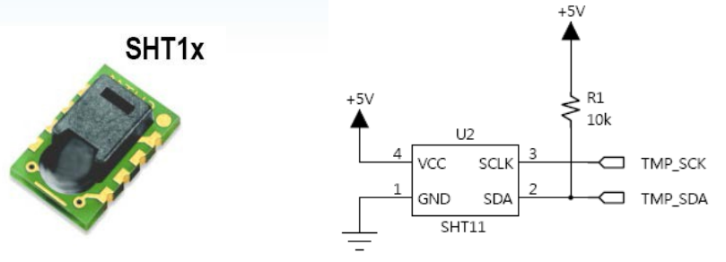
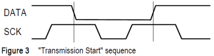
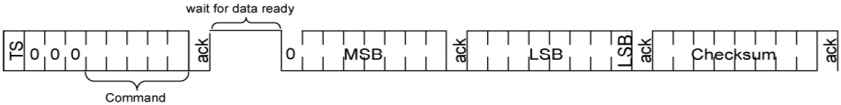
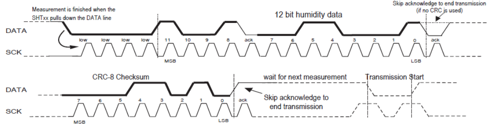

# SHT11_Sensor_Control

## 요약

해당 문서는 STM32F10x 환경에서 온습도 센서인 SHT11을 제어하기 위한 펌웨어 구조와 동작 원리를 설명한다. </br>



SHT11 센서는 I2C와 유사한 2선식(2-Wire) 인터페이스(SCK, SDA)를 사용하지만, **표준 I2C 프로토콜과 호환되지 않는다.** </br>

따라서 본 코드는 I2C 레지스터(`I2C_CR1`, `I2C_DR` 등) 대신 **GPIOC의 핀을 소프트웨어로 직접 제어하여 통신 파형을 만들어내는 비트뱅잉(Bit-Banging) 방식**으로 구현되었다.

---

## 1. 하드웨어 핀 매핑 및 제어 레지스터

실제 통신을 주관하는 핵심 레지스터는 I2C가 아닌 **GPIO 제어 레지스터**이다.

- **연결 핀**:
- - `SHT11_SCK` : `PC0` (클럭 핀)
  - `SHT11_SDA` : `PC1` (데이터 핀)

- **핵심 제어 레지스터 흐름**:
- - **RCC_APB2ENR** : `RCC_APB2PeriphClockCmd(SHT11_DDR, ENABLE)`을 통해 GPIOC에 클럭을 공급하여 핀 제어를 활성화한다.
  - **GPIOC_CRL** : 통신 중 SDA(PC1) 핀의 방향을 실시간으로 변경한다.
  - - 데이터 송신 시 : `MAKE_I2CDATA_OUTPUT()` 매크로를 통해 Push-Pull 출력 모드로 변경.
    - 데이터 수신/ACK 대기 시 : `MAKE_I2CDATA_INPUT()` 매크로를 통해 Floating 입력 모드로 변경.
  - **GPIOC_BSRR/BRR** : `SETDATA()`, `CLRDATA()`, `SETSCK()`, `CLRSCK()` 매크로를 사용하여 핀에 High(1), Low(0) 신호를 즉각적으로 출력하여 클럭과 데이터 파형을 직접 그린다.
  - GPIOC_IDR: `READDATA()`매크로를 통해 현재 SDA 핀의 상태를 읽어 센서가 보낸 데이터나 ACK 신호를 확인한다.
 
```c
#define SHT11_PORT      GPIOC
#define SHT11_SCK       GPIO_Pin_0
#define SHT11_SDA       GPIO_Pin_1

static inline void MAKE_I2CDATA_OUTPUT() { SHT11_GPIO_InitStructure.GPIO_Pin = SHT11_SDA;\
                                            SHT11_GPIO_InitStructure.GPIO_Mode = GPIO_Mode_Out_PP;\
                                            GPIO_Init(SHT11_PORT, &SHT11_GPIO_InitStructure);}

static inline void MAKE_I2CDATA_INPUT() {SHT11_GPIO_InitStructure.GPIO_Pin = SHT11_SDA;\
                                            SHT11_GPIO_InitStructure.GPIO_Mode = GPIO_Mode_IN_FLOATING;\
                                            GPIO_Init(SHT11_PORT, &SHT11_GPIO_InitStructure);}

#define	SETDATA()   	SET_I2CDATA_PIN()
#define	CLRDATA()   	CLR_I2CDATA_PIN()

#define	SETSCK()   	SET_I2CSCK_PIN()
#define	CLRSCK()   	CLR_I2CSCK_PIN()

static inline void SET_I2CDATA_PIN() {GPIO_SetBits(SHT11_PORT , SHT11_SDA);}
static inline void CLR_I2CDATA_PIN() {GPIO_ResetBits(SHT11_PORT , SHT11_SDA);}

static inline void SET_I2CSCK_PIN() {GPIO_SetBits(SHT11_PORT , SHT11_SCK);}
static inline void CLR_I2CSCK_PIN() {GPIO_ResetBits(SHT11_PORT , SHT11_SCK);}
```

---

## 2. 프로토콜 구현 원리 (Bit-Banging)

### 2.1 통신 시작(Transmission Start)

`s_transstart(void)`함수는 SHT11 센서를 깨우기 위한 특수한 신호를 생성한다.

```c
/*
 * asm(...)은 어셈블리어니까 해석하지말고 그대로 CPU에게 명령어를 전달한다.
 * nop(No Operation)은 아무 동작을 하지 않고, 그저 프로그램 카운터(PC)만 다음으로 넘기는 명령어이다.
 */

void s_transstart(void)
{  
   SETDATA(); CLRSCK(); // (1)
   asm("nop");asm("nop");
   SETSCK();            // (2)
   asm("nop");asm("nop");
   CLRDATA();           // (3)
   asm("nop");asm("nop");
   CLRSCK();            // (4)  
   asm("nop");asm("nop");
   SETSCK();            // (5)
   asm("nop");asm("nop");
   SETDATA();	          // (6)
   asm("nop");asm("nop");
   CLRSCK();            // (7)
}
```

- SCK가 High인 상태에서 DATA 핀을 Low로 내리고(`T2`), 다시 SCK가 High일 때 DATA 핀을 High로 올리는(`T5`) 일련의 GPIO 토글 과정을 거친다.



```
Time (흐름) : T0    T1    T2    T3    T4    T5    T6
              |     |     |     |     |     |     |
            1 |─────|─────┐     |     |     ┌─────|─────
DATA (SDA)    |     |     │     |     |     │     |
            0 |     |     └─────|─────|─────┘     |
              |     |     |     |     |     |     |
            1 |     ┌─────|─────┐     ┌─────|─────┐
SCK  (SCL)    |     │     |     │     │     |     │
            0 |─────┘     |     └─────┘     |     └─────
              |     |     |     |     |     |     |
[실행 코드]   (1)   (2)   (3)   (4)   (5)   (6)   (7)
```

---

### 2.2 데이터 송신
`s_write_byte()` : 1 byte 명령(예: 습도 측정 명령 `0x05`)을 센서로 전송한다.

- `MAKE_I2CDATA_OUTPUT()`으로 SDA를 출력으로 설정한다.
- 8번의 루프를 돌며 bit masking(`i & value`)을 통해 1이면 `SETDATA()`, 0이면 `CLRDATA()`를 수행하고 SCK 핀을 토글한다.
- 8bit 전송 후, SDA를 입력(`MAKE_I2CDATA_INPUT()`)으로 바꾸고 9번째 클럭에서 `READDATA()`를 호출해 센서가 SDA를 Low로 당겼는지(ACK) 확인한다.


```c
                            // add  commnad
#define STATUS_REG_W 0x06   // 000   00110
#define STATUS_REG_R 0x07   // 000   00111
#define MEASURE_TEMP 0x03   // 000   00011
#define MEASURE_HUMI 0x05   // 000   00101
#define RESET        0x1e   // 000   11110

u8 s_write_byte(u8 value)
{ 
  u8 i,error=0;
  MAKE_I2CDATA_OUTPUT();

  for (i=0x80;i>0;i/=2)
  {
    if (i & value) SETDATA();
    else CLRDATA();                        
    SETSCK();                
    asm("nop");asm("nop");   
    CLRSCK();
  }

  /* 8bit 전송 후 */
  SETDATA(); /* ACK를 확인하기 위해 SDA 라인을 High 상태로 만든다. */
  MAKE_I2CDATA_INPUT(); /* SDA라인의 제어권을 SHT11에게 넘겨주기 위해서 Floating 모드로 변경 */
  asm("nop");asm("nop");
  SETSCK();          /* 9번째 클럭 */
  error=READDATA();  /* SHT11이 데이터를 잘 받았으면 SDA 라인을 Low로 끌어내린다(ACK) */
  CLRSCK();
  MAKE_I2CDATA_OUTPUT(); /* ACK 확인 후 SDA라인을 출력 모드로 변경 */
  return error;
}
```

---

### 2.3 데이터 수신

`s_read_byte()` : 센서가 측정한 결과값을 MCU로 읽어온다.

- SDA를 입력으로 설정하고 SCK를 토글할 때마다 `READDATA()`로 핀의 상태를 읽어 1byte의 데이터를 조립한다.
- 8bit 모두 읽은 후, MCU가 센서에게 수신 확인(ACK)을 보낼지 결정하여 SDA 핀을 직접 제어한다.

```c
u8 s_read_byte(u8 ack)
{ 
  u8 i,val=0;

  MAKE_I2CDATA_INPUT();
  SETDATA();
  asm("nop");asm("nop");

  for (i=0x80;i>0;i/=2)
  {
    SETSCK();
    asm("nop");asm("nop");
    if (READDATA()) val=(val | i); /* MSB부터 1bit씩 핀 상태를 읽어오며, High(1)일 경우 OR 연산(|)을 통해 'val' 변수의 해당 자리를 1로 설정한다. */
    CLRSCK();
    asm("nop");asm("nop");					 
  }

  /* 8bit 전송 후 */
  MAKE_I2CDATA_OUTPUT();
  if(ack) CLRDATA(); /* SDA라인을 Low로 하여, SHT11은 ACK로 받아들여, 다음 데이터를 보낼 준비를 한다. */
  else SETDATA();    /* SDA라인을 High로 하여, SHT11은 NACK로 받아들여, 송신을 완전 중단한다. */
  SETSCK();   /* 9번째 클럭 */
  asm("nop");asm("nop");
  CLRSCK();
  asm("nop");asm("nop");					    
  SETDATA(); /* SDA라인의 기본 대기 상태는 High이므로, 모든 송신이 끝나면 SETDATA()를 해줘야 한다. */

  return val;
}
```

### 2.4 센서 측정

`s_measure()` : 위의 단위 함수들을 조합하여 실제 센서의 값을 읽는다.

1. **명령 전송** : `s_transstart()`로 통신을 시작한 뒤, 온도(`0x03`) 또는 습도(`0x05`) 측정 명령을 전송환다.


2. **측정 완료 대기** : 센서가 아날로그 값을 디지털로 변환하는 동안 대기한다. 변환이 완료되면 센서가 SDA라인을 Low로 당기며, MCU는 이를 폴링으로 감지하여 다음으로 넘어간다.


3. **연속 데이터 수신** : 
- 첫 번째 데이터를 읽고, `ACK(1)`를 보내 다음 데이터를 요구한다.
- 두 번째 데이터를 읽고, 다시 `ACK(1)`를 보내 체크섬을 요구한다.
- 마지막 체크섬을 읽은 후에는 `noACK(0)`을 보내 수신을 완전히 종료하고 버스를 해제한다.

```c
u8 s_measure(u16 *p_value, u16 *p_checksum, u8 mode)
{ 
  unsigned short error=0;
  u16 sht11_msb, sht11_lsb;

  s_transstart();
  switch(mode){
    case TEMP	: error+=s_write_byte(MEASURE_TEMP); break;
    case HUMI	: error+=s_write_byte(MEASURE_HUMI); break;
    default   : break;	 
  }
  if(error != 0){return error;}
  
  MAKE_I2CDATA_INPUT();
  while(1){ sht11_delay(500); if(READ_I2CDATA_PIN() == 0) break; } /* SHT11이 측정한 온/습도를 아날로그에서 디지털로 변환하는 시간을 기다려주는 대기열이다(폴링 방식). 계산이 다 끝나면 SDA라인을 Low로 당긴다. */
  
  MAKE_I2CDATA_INPUT();

  /* 센서의 측정값은 14bit/12bit 길이이므로, 한 번에 8bit씩 두 번에 걸쳐서 받아와야 한다. */
  sht11_msb = s_read_byte(ACK);    /* 상위 8bit */
  sht11_lsb = s_read_byte(ACK);    /* 하위 8bit */
  *p_value = (sht11_msb * 256) + sht11_lsb;
  *p_checksum = s_read_byte(noACK);  /* 오류 확인하기 위한 검증용 1byte, noACK를 넘겨주어, SDA라인을 High로 방치하여 SHT11에게 통신이 종료됐음을 알림. */
  return error;
}
```




위 그림은 습도를 가정으로 든 **측정 및 데이터 수신 단계**에 대한 타이밍 다이어그램이다. </br>
**얇은선은 MCU가 제어**하는 것이고, **굵은선은 SHT11 센서가 제어**하는 것이다.


- **측정 대기(Measurement Wait)** : 명령을 받은 센서가 실제로 습도를 측정하는 동안 시간이 소요된다. 측정이 끝나면 센서가 스스로 SDA라인을 Low로 떨어뜨려 MCU에게 계산이 완료되었음을 알린다.
- **데이터 수신(12 bit humidity data)** :
- - MSB 수신 : SHT11이 12bit 습도 데이터 중 상위 8bit만 보낸다(상위 4bit는 `Low`로 고정). 수신 후 MCU가 Low로 당겨 다음 데이터를 요구하는 ACK를 보낸다.
  - LSB 수신 : 이어서 하위 8bit 데이터가 들어오고, MCU는 다시 한 번 ACK를 보낸다.
- **CRC-8 및 통신 종료(NACK)** : 마지막으로 오류 검증용 체크섬 1byte를 받는다. 이때 9번째 클럭에서 MCU는 **DATA 라인을 끌어내리지 않고 High 상태로 둔다**. 이를 통해 SHT11에게 통신 종료를 알리고 대기 상태로 만든다.

---

## 3. 메인 루프 실행 흐름

1. **초기화** : `initialize_sht11_hanback()`을 호출하여 `GPIOC` 클럭을 키고 `PC0`, `PC1`을 초기화 한다.

2. **데이터 요청 및 수신** :
- `get_sht11_hanback_data(TEMP)`와 `get_sht11_hanback_data(HUMI)`를 호출한다.
- 함수 내부적으로 센서에 측정 명령을 보내고, 센서가 측정을 완료할 때까지 대기(Polling)한 뒤, 1byte 단위 데이터 수신 함수(`s_read_byte`)를 통해 순수 데이터를 가져온다.

3. **데이터 변환 및 출력** : 읽어온 Raw Data를 14bit/12bit 공식에 대입하여 실제 섭씨온도와 상대습도로 변환(`calc_sth11`)한 후 LCD에 출력한다.

---

## 4. 주의점

현재 구현된 `s_measure()` 함수는 센서가 측정을 완료할 때까지 `while(1)` 루프 안에서 무한정 대기하는 **폴링 구조**를 가지고 있다.
- SHT11 센서가 12ibt 습도를 측정하는 데는 **최대 55ms**가 소요된다.
- 이 55ms 동안 CPU는 루프에 갇혀 다른 작업을 전혀 수행할 수 없다.

**발생 가능한 문제**
이러한 구조는 단일 센서 테스트에는 문제가 없으나, 여러 주변장치를 동시에 제어해야 하는 통합 시스템에서는 오류를 발생 시킬 수 있다.
1. **스텝 모터 제어**: 밀리초(ms) 단위의 펄스 타이밍이 어긋나 모터가 탈조(Step Loss)되거나 덜컹거릴 수 있다.
2. **LED 및 디스플레이**: 다이나믹 구동(Multiplexing)을 하는 FND나 LCD의 화면 갱신 주기를 놓쳐 화면이 심하게 깜빡이거나 멈추는 현상이 발생한다.

**개선 방향**
실무 통합 펌웨어에서는 이 문제를 해결하기 위해 **SDA 핀을 외부 인터럽트(EXTI) 핀으로 설정**하는 것을 권장한다. </br>
측정 명령만 내린 후 CPU는 다른 작업(모터 제어 등)을 수행하다가, 센서가 측정을 마치고 SDA 핀을 Low(Falling Edge)로 떨어뜨려 인터럽트를 발생시키면 그때 ISR로 넘어가 데이터를 읽어오는 방식으로 구조를 개선할 수 있다.
