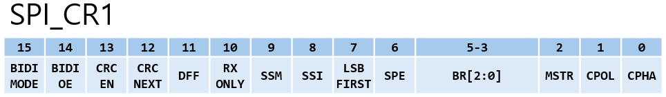
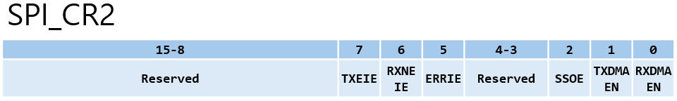
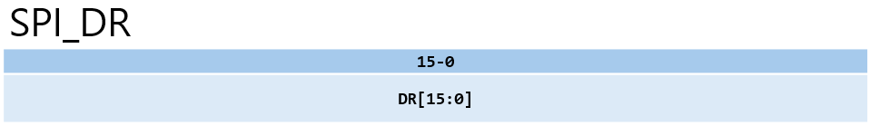

# SPI Registers

## 요약

해당 문서는 STM32F10x의 **SPI(Serial Peripheral Interface)** 주변장치에 대해 레지스터 관점에서 정리한 문서이다. </br>
제공된 실습 코드(`main.c`, `at25fxx.c`)를 바탕으로 **SPI 레지스터 구성, 각 비트의 의미, 송수신 동작흐름** 및 **초기화 함수의 레지스터 제어 원리**를 중심으로 설명한다.

---

## 1. SPI 관련 클럭 및 핀

### 1.1 클럭

- **SPI1** : APB2 클럭(최대 72MHz) 사용
- **SPI2**, **SPI3** : APB1 클럭(최대 36MHz) 사용
- 실습에서는 SPI1을 사용하므로, 동작 전 반드시 `RCC_APB2Periph_SPI1`클럭을 활성화 해준다.

### 1.2 핀 구성(SPI1 Master 기준)
- **SCK(클럭)** : PA5 (Alternate Function Push-Pull 설정)
- **MISO(Master In Slave Out) : PA6 (Input Floating 권장, 실습에서는 AF_PP로 설정.)
- **MOSI(Master Out Slave In) : PA7 (Alternate Function Push-Pull 설정)
- NSS/CS(Chip Select) : PA4 (하드웨어 NSS 대신 GPIO `Out_PP`로 설정하여 소프트웨어적으로 제어)

> MISO 핀은 외부 Slave가 Master로 신호를 보내는 핀이므로 Input_Floating 또는 Input Pull-Up 으로 설정하는 것을 권장한다.
> STM32 하드웨어 특성상 Master 모드일 때 AF_PP로 설정해도 내부적으로 입력으로 우회되어 동작하기 때문에 실습 코드가 정상 작동하는 것이다.

---

## 2. SPI_CR1 (Control Register 1)



SPI 모듈의 활성화, Master/Slave 모드, 클럭 극성 및 위상, 데이터 포맷 등 통신의 핵심 규칙을 설정한다.

|비트|이름|설명|
|----|----|----|
|Bit[0]|CPHA|Clock Phase. <br> 데이터를 캡처하는 위상(`0`:첫 번째 엣지, `1`:두 번째 엣지)을 설정한다.|
|Bit[1]|CPOL|Clock Polarity. <br> 대기 상태(Idle)일 때 클럭의 기본 상태(`0`:Low, `1`:High)를 설정한다.|
|Bit[2]|MSTR|Master Selection. <br> `0`이면 Slave, `1`이면 Master 모드로 동작한다.|
|Bit[5:3]|BR|Baud Rate Control. <br> 입력 클럭(APB2)을 분주하여 통신 속도를 결정한다. (예: `000` = fPCLK/8, `010` = fPCLK/8)|
|Bit[6]|SPE|SPI Enable. <br> SPI 모듈의 전체 전원을 활성화한다.|
|Bit[7]|LSBFIRST|`0`이면 MSB부터, `1`이면 LSB부터 전송한다.|
|Bit[8]|SSI|Internal Slave Select. <br> SSM이 `1`일 때, 이 비트의 값이 실제 하드웨어 NSS 핀의 상태를 대신한다.|
|Bit[9]|SSM|Software Slave Management <br> `1`로 설정 시 내부 NSS 핀의 상태를 SSI 비트 값으로 대체한다.|
|Bit[10]|RXONLY|수신 전용 모드 설정 (BIDIMODE=0일 때만 유효). <br> `0`: 전이중(Full-Duplex) 통신, `1`: 출력(MOSI)을 비활성화하고 수신 전용 모드로 동작한다.|
|Bit[11]|DFF|Data Frame Format <br> `0`이면 8-bit, `1`이면 16-bit 프레임으로 설정한다.|
|Bit[12]|CRCNEXT|다음 전송에 CRC 값 포함 여부 설정. <br> `0`: 일반 데이터 전송 단계, `1`: 다음 전송할 때 데이터 대신 CRC 값을 전송함.|
|Bit[13]|CRCEN|하드웨어 CRC 계산 활성화 <br> `0`: CRC 계산 비활성화, `1`: 하드웨어 CRC 계산 활성화.|
|Bit[14]|BIDIOE|1-Line 모드 시 출력 활성화(BIDIMODE=1일 떄만 유효). <br> `0`: 출력 비활성화(수신 전용), `1`: 출력 활성화(송신 전용).|
|Bit[15]|BIDIMODE| 1-Line 양방향 통신 모드를 설정. <br> `0`: 2-Line 단방향(MISO, MOSI 분리), `1`: 1-Line 양방향 데이터 모드.|

---

## 3. SPI_CR2 (Control Register 2)



인터럽트 활성화 및 DMA(Direct Memory Access) 사용 여부 등을 제어한다.

|비트|이름|설명|
|----|----|----|
|Bit[0]|RXDMAEN|Rx Buffer DMA Enable. <br> 수신 시 DMA를 사용한다.|
|Bit[1]|TXDMAEN|Tx Buffer DMA Enable. <br> 송신 시 DMA를 사용한다.|
|Bit[2]|SSOE|SS Output Enable. <br> Master 모드에서 하드웨어 NSS 출력 기능을 켠다.|
|Bit[5]|ERRIE|Error Interrupt Enable. <br> 에러 발생 시 인터럽트를 발생시킨다.|
|Bit[6]|RXNEIE|Rx Buffer Not Empty Interrupt Enable. <br> RXNE 플래그가 1이 될 때 인터럽트를 발생시킨다.|
|Bit[7]|TXEIE|Tx Buffer Empty Interrupt Enable. <br> TXE 플래그가 1이 될 때 인터럽트를 발생시킨다.|

---

## 4. SPI_SR (Status Register)


SPI 모듈의 현재 동작 상태와 버퍼의 상태, 에러 발생 여부를 나타내는 플래그 레지스터이다.

|비트|이름|설명|
|----|----|----|
|Bit[0]|RXNE|Receive Buffer Not Empty. <br> 수신 버퍼에 유효한 데이터가 도착하여 DR 레지스터에서 읽을 수 있음을 의미한다.|
|Bit[1]|TXE|Transmit Buffer Empty. <br> 송신 버퍼가 비어 있어 DR 레지스터에 새 데이터를 쓸 수 있음을 의미한다.|
|Bit[4]|CRCERR|CRC Error Flag. <br> 수신된 CRC 값과 내부 하드웨어에서 계산된 CRC 값이 일치하지 않을 때 1로 SET된다. (소프트웨어로 0을 써서 클리어해야 함)|
|Bit[7]|BSY|Busy Flag. <br> 현재 SPI 통신(시프트 레지스터 동작)이 진행 중이면 1로 SET된다.|
|Bit[6]|OVR|Overrun Error. <br> 이전 데이터를 읽기(RXNE=1) 전에 새로운 데이터가 덮어써졌을 때 1로 SET된다.|
|Bit[5]|MODF|Mode Fault. <br> Master 모드에서 NSS 핀이 의도치 않게 Low로 떨어져 다중 Master 충돌이 발생했을 때 1로 SET된다.|

---

## 5. SPI_DR (Data Register)



실제 송수신 데이터가 저장되는 16bit 레지스터이다. UART와 마찬가지로 하드웨어 내부에서는 송신 버퍼(Tx Buffer)와 수신 버퍼(Rx Buffer)로 분리되어 동작한다.

- **송신 시(Write)** : DR에 데이터를 쓰면 Tx Buffer에 저장되었다가 내부 시프트 레지스터로 이동하여 MOSI 핀으로 출력된다.
- **수신 시(Read)** : MISO 핀으로 들어온 데이터가 시프트 레지스터를 거쳐 Rx Buffer에 저장되며, DR을 읽어서 이 값을 가져온다.

---

## 6. 송신/수신 동작 흐름 (Polling 기준)
SPI는 **전이중(Full-Duplex)** 통신이므로, 송신 시 항상 수신 동작이 함께 발생한다. 실습코드 `at25fxx.c`의 `SPI_FLASH_SendByte()`함수는 다음의 4단계 흐름을 보여준다.

1. **송신 버퍼 확인** : `SPI_SR`에서 `TXE == 1`이 될 때까지 대기한다.
2. **데이터 송신** : `SPI_DR`에 보낼 데이터를 기록한다. (이때 하드웨어가 자동으로 8개의 SCK 클럭을 발생시킨다)
3. **수신 버퍼 확인** : `SPI_SR`에서 `RXNE=1`이 될 때까지 대기한다.
4. **데이터 수신** : `SPI_DR`의 데이터를 읽어서 변환한다. (데이터를 읽으면 RXNE 플래그는 자동으로 클리어 된다)

```c
u8 SPI_FLASH_SendByte(u8 byte)
{
  /* SPI_SR의 TXE bit를 확인해서 SPI_DR(송신 버퍼)이 비어 있으면 루프 탈출 */
  while(SPI_GetFlagStatus(SPI1, SPI_FLAG_TXE) == RESET);

  /* SPI_DR에 데이터(byte) 전송(하드웨어가 자동으로 클럭(SCK)을 발생시키며 실제 통신이 시작됨) */
  SPI_SendData(SPI1, byte);

  /* SPI_SR의 RXNE bit를 확인해서 SPI_DR(수신 버퍼)에 데이터 수신이 완료되어 버퍼가 채워지면 루프 탈출  */
  while(SPI_GetFlagStatus(SPI1, SPI_FLAG_RXNE) == RESET);

  /* SPI_DR에서 수신된 데이터 읽기 및 반환(읽기와 동시에 하드웨어가 RXNE 플래그 자동으로 클리어) */
  return SPI_ReceiveData(SPI1);
}

```

---

## 7. SPI_Init(SPI_TypeDef* SPIx, SPI_InitTypeDef* SPI_InitStruct)

`main.c`에서 선언한 `SPI_InitStructure`의 설정값들이 `SPI_Init()`함수 내부에서 어떻게 비트 연산을 거쳐 `SPI_CR1`에 반영되는지 확인한다.

### 7.1 main.c의 SPI 설정값

```c
SPI_InitStructure.SPI_Direction = SPI_Direction_2Lines_FullDuplex;  // 0x0000
SPI_InitStructure.SPI_Mode = SPI_Mode_Master;                       // 0x0104 (MSTR=1, SSI=1)
SPI_InitStructure.SPI_DataSize = SPI_DataSize_8b;                   // 0x0000 (DFF=0)
SPI_InitStructure.SPI_CPOL = SPI_CPOL_Low ;                         // 0x0000 (CPOL=0)
SPI_InitStructure.SPI_CPHA = SPI_CPHA_1Edge;                        // 0x0000 (CPHA=0)
SPI_InitStructure.SPI_NSS = SPI_NSS_Soft;                           // 0x0200 (SSM=1)
SPI_InitStructure.SPI_BaudRatePrescaler = SPI_BaudRatePrescaler_32; // 0x0020 (BR[2:0]=100)
SPI_InitStructure.SPI_FirstBit = SPI_FirstBit_MSB;                  // 0x0000 (LSBFIRST=0)
SPI_InitStructure.SPI_CRCPolynomial = 7;
```

### 7.2 SPI_CR1 레지스터 병합 및 적용

`SPI_Init()`함수 내부에서는 기존 설정을 초기화하고 새로운 값을 bit OR 연산으로 덮어쓴다.

```c
void SPI_Init(SPI_TypeDef* SPIx, SPI_InitTypeDef* SPI_InitStruct)
{
  u16 tmpreg = 0;

  assert_param(IS_SPI_DIRECTION_MODE(SPI_InitStruct->SPI_Direction));
  assert_param(IS_SPI_MODE(SPI_InitStruct->SPI_Mode));
  assert_param(IS_SPI_DATASIZE(SPI_InitStruct->SPI_DataSize));
  assert_param(IS_SPI_CPOL(SPI_InitStruct->SPI_CPOL));
  assert_param(IS_SPI_CPHA(SPI_InitStruct->SPI_CPHA));
  assert_param(IS_SPI_NSS(SPI_InitStruct->SPI_NSS));
  assert_param(IS_SPI_BAUDRATE_PRESCALER(SPI_InitStruct->SPI_BaudRatePrescaler));
  assert_param(IS_SPI_FIRST_BIT(SPI_InitStruct->SPI_FirstBit));
  assert_param(IS_SPI_CRC_POLYNOMIAL(SPI_InitStruct->SPI_CRCPolynomial));

  tmpreg = SPIx->CR1;
  /* CR1_CLEAR_Mask(0x3040)를 통해 기존 모드, DFF, CPOL, CPHA, BR 등 초기화*/
  tmpreg &= CR1_CLEAR_Mask;

  tmpreg |= (u16)((u32)SPI_InitStruct->SPI_Direction | SPI_InitStruct->SPI_Mode |
                  SPI_InitStruct->SPI_DataSize | SPI_InitStruct->SPI_CPOL |  
                  SPI_InitStruct->SPI_CPHA | SPI_InitStruct->SPI_NSS |  
                  SPI_InitStruct->SPI_BaudRatePrescaler | SPI_InitStruct->SPI_FirstBit);

  SPIx->CR1 = tmpreg;

  SPIx->CRCPR = SPI_InitStruct->SPI_CRCPolynomial;
}
```

- `SPI_Mode_Master` 및 `SPI_NSS_Soft` 설정으로 인해 CR1의 **MSTR(Bit[2])**, **SSM(Bit[9]**, **SSI(Bit[8])가 모두 1로 SET** 된다. 이는 외부 핀 상태와 무관하게 내부적으로 항상 자신을 안전한 Master로 인식하게 만드는 설정이다.
- `SPI_CPOL_Low`, `SPI_CPHA_1Edge`에 의해 **CPOL(Bit[1])**, **CPHA(Bit[0])는 0으로 유지**되며, 이는 **SPI Mode 0**을 의미한다.
- `SPI_BaudRatePresacler_32`에 의해 **BR(Bit[5:3])**에 분주비 값(`100`)이 들어가 통신 속도가 72MHz/32=2.25MHz로 설정된다.
이후 `SPI_Cmd(SPI1, ENABLE)`함수를 호출하면 `CR1`의 `SPE(Bit[6])`가 **1로 SET**되면서 SPI 하드웨어가 작동을 시작한다.

---

## 8. AR25F512 플래시 메모리 동작 프로토콜

실습에서 사용하는 플래시 메모리 칩(AT24F512)과 SPI 통신할 차례이다. </br> 플래시 메모리는 내부에 정의된 **8bit 명령어(Instruction Code)**를 수신해야만 지정된 동작을 수행한다.

|명령어 이름|Opcode (Hex)|동작 설명|
|-----------|------------|---------|
|WREN|0x06|Write Enable Latch. <br> 데이터 쓰기나 지우기 전에 반드시 선행되어야 하는 잠금 해제 명령어이다.|
|RDSR|0x05|Read Status Register. <br> 현재 칩이 쓰기/지우기 작업 중인지(Busy) 확인할 때 사용한다.|
|READ|0x03|Read Data. <br> 지정된 주소부터 데이터를 순차적으로 읽어온다.|
|PROGRAM|0x02|Program Data. <br> 지정된 주소에 1byte 또는 여러 byte의 데이터를 기록한다.|
|CHIP ERASE|0x62|Erase All. <br>  메모리 전체를 0xFF(모든 bit를 1)로 초기화한다.|

---

## 9. 실습 코드(main.c) 기준 동작 분석

플래시 메모리의 모든 통신 처리과정은 `CS Low`(시작) → `Opcode 전송` → `주소 전송` → `데이터 송수신` → `CS High`(종료) 의 프레임으로 구성된다.

### 9.1 메모리 초기화: `at25fxx_CHIP_ERASE()`
주소 공간에 실제 데이터를 기록하는 과정이다.

1. **잠금 해제** : 쓰기 작업이므로 `at25fxx_WREN()`이 먼저 실행된다.
2. **명령 및 주소 전송** : CS를 Low로 내리고 `PROGRAM(0x02)` 명령을 전송한다. 이후 24bit(3byte) 체계의 주소를 전송한다.
3. **데이터 전송 및 종료** : 기록할 데이터 byte들을 연속으로 보낸 뒤, **CS를 High로 올려야만 내부적으로 실제 플래시 메로리에 기록이 시작**된다. 이후 `at25fxx_Ready()`로 작업이 끝날 때까지 대기한다.


