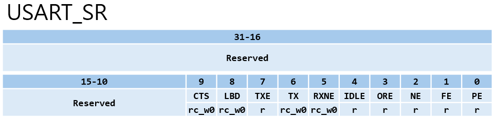
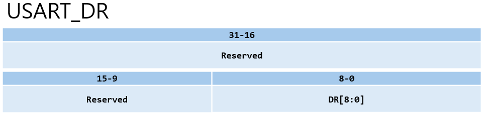
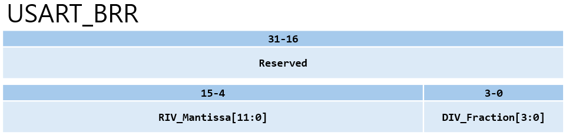
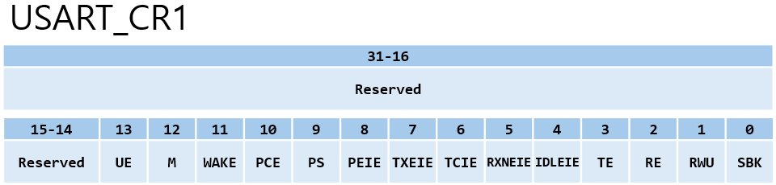
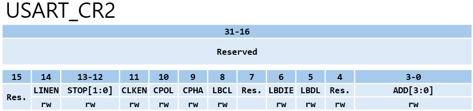
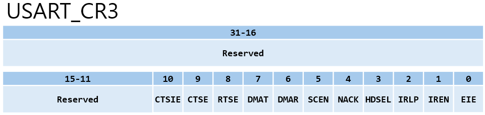

# UART Registers (USART)

## 요약

해당 문서는 STM32F103의 **USART(Universal Synchronous/Asynchronous Receiver/Transmitter)** 주변장치에 대해 레지스터 관점에서 정리한 문서이다. 
UART 통신의 기본 개념은 `Communication_Concepts.md`를 전제로 하며, 해당 문서에서는 **USART 레지스터 구성**, **각 비트의 의미**, **송수신 동작 흐름**을 중심으로 설명한다.

---

## 1. USART 관련 클럭 및 핀

### 1.1 클럭

- USART1 : APB2 클럭 사용
- USART2, USART3 : APB1 클럭 사용
- USART 사용 전 반드시 RCC에서 해당 USART 클럭을 활성화해야 한다.

### 1.2 핀 구성 (USART1 기준)

- TX : PA9 (Alternate Function Push-Pull 설정)
- RX : PA10 (Input Floating 또는 Input Pull-up 설정)
- (Optional) CTS : PA11
- (Optional) RTS : PA12
- (Optional) CK : PA8

---

## 2. USART_SR (Status Register)



USART_SR은 송수신 상태와 각종 에러 발생 여부를 나타내는 플래그 레지스터이다.

---

### 2.1 에러 감지 비트

|비트|이름|설명|
|----|----|----|
|Bit[0]|PE|Parity Error. <br> 수신 모드에서 패리티 검사 오류가 발생할 때 1로 SET.|
|Bit[1]|FE|Framing Error. <br> 동기화가 맞지 않거나 과도한 노이즈로 인해 프레임 형태가 깨졌을 때 1로 SET.|
|Bit[2]|NE|Noise Error. <br> 수신 프레임에서 노이즈가 감지되었을 때 1로 SET.|
|Bit[3]|ORE|OverRun Error. <br> RXNE 플래그가 1인 상태(데이터를 아직 읽지 않음)에서 새로운 데이터가 수신 버퍼로 들어오려 할 때 1로 SET.|

---

### 2.2 주요 상태 비트

|비트|이름|설명|
|----|----|----|
|Bit[4]|IDLE|IDLE Line 감지 플래그. <br> 통신 라인이 유휴 상태가 되었을 때 1로 SET.|
|Bit[5]|RXNE|Read Data Register Not Empty. <br> 수신 시프트 레지스터의 데이터가 USART_DR로 전달되어 읽을 준비가 완료되었을 때 1로 SET.|
|Bit[6]|TC|Transmission Complete. <br> 데이터 프레임 전송이 완전히 완료되었을 때 1로 SET.|
|Bit[7]|TXE|Transmit Data Register Empty. <br> TDR의 데이터가 시프르 레지스터로 모두 이동하여 버퍼가 비었음을 의미하며, 1일 때 새로운 데이터를 쓸 수 있음.|
|Bit[8]|LBD|LIN Break Detection 플래그. <br> LIN 통신 중 Break 신호가 감지되면 1로 SET.|
|Bit[9]|CTS|Clear To Send 플래그. <br> 하드웨어 흐름 제어 시 nCTS 입력 핀의 상태가 변경되면 1로 SET.|

```
LIN(Local Interconnect Network) : 자동차 내의 창문, 와이퍼, 좌석 제어 등 저속/저비용 차량용 네트워크에 사용되는 통신 규격으로서, 실습에서는 사용하지 않는다.
```

---

## 3. USART_DR (Data Register)



실제 송수신 데이터가 저장되는 레지스터이며, 하드웨어 내부적으로 송신 버퍼(TDR)와 수신 버퍼(RDR) 두 개의 레지스터로 분리되어 동작한다.

- Bits[8:0] : 송수신 데이터 값
- - 송신 시(Write): DR에 데이터를 쓰면 내부 버스에서 TDR 레지스터를 거쳐 출력 시프트 레지스터로 전달된다.
  - 수신 시(Read) : 수신 시프트 레지스터에서 RDR 레지스터로 데이터가 들어오며, DR을 읽어서 데이터를 가져올 수 있다.

---

## 4. USART_BRR (Baud Rate Register)



통신 속도(Baud Rate)를 설정하는 레지스터이다. </br> 클럭을 정밀하게 분주하기 위해 정수부와 소수부로 나누어 설정한다.
- Bits[15:4] : 분주비(USARTDIV)의 정수부를 정의한다.
- Bits[3:0]  : 분주비(USARTDIV)의 소수부를 정의한다.

Baud Rate는 다음 공식으로 결정된다.
$$BaudRate = \frac{f_{CK}}{16 \times USARTDIV}$$

아래 표는 $f_{CK}=72MHz$ 일 때, 해당 Baud Rate를 만들기 위해 설정되는 USARTDIV 값과 실제 계산되 Actual 값이다.

|Baud Rate <br> (kbps)|Actual|USARTDIV|
|---------------------|------|--------|
|2.4|2.4|1875|
|9.6|9.6|468.75|
|19.2|19.2|234.375|
|57.6|57.6|78.125|
|115.2|115.2|39.0625|
|230.4|230.769|19.5|
|460.8|461.538|9.75|
|921.6|923.076|4.875|
|2250|2250|2|
|4500|4500|1|

---

## 5. USART_CR1 (Control Register 1)



USART의 전체 전원, 프레임 구조, 송수신 활성화 및 주요 인터럽트를 제어한다.

|비트|이름|설명|
|----|----|----|
|Bit[0]|SBK|Send Break. <br> 통신 라인에 Break 문자를 전송한다.|
|Bit[1]|RWU|Receiver Wakeup. <br> 수신기를 Mute(수면) 모드로 설정한다.|
|Bit[2]|RE|Receiver Enable. <br> 수신기를 활성화 한다.|
|Bit[3]|TE|Transmitter Enable. <br> 송신기를 활성화 한다.|
|Bit[4]|IDLEIE|IDLE Interrupt Enable. <br> Idle Line 감지 시 인터럽트를 허용한다.|
|Bit[5]|RXNEIE|RXNE Interrupt Enable. <br> 수신 데이터가 도착했을 때(RXNE=1) 인터럽트를 허용한다.|
|Bit[6]|TCIE|Transmission Complete Interrupt Enable. <br> 전송이 완료되었을 때(TC=1) 인터럽트를 허용한다.|
|Bit[7]|TXEIE|TXE Interrupt Enable. <br> 버퍼가 비었을 때(TXE=1) 인터럽트를 허용한다.|
|Bit[8]|PEIE|PE Interrupt Enable. <br> 패리티 에러 발생 시 인터럽트를 허용한다.|
|Bit[9]|PS|Parity Selection. <br> `0`은 짝수(Even), `1`은 홀수(Odd) 패리티를 선택한다.|
|Bit[10]|PCE|Parity Control Enable. <br> 하드웨어 패리티 생성을 활성화 한다.|
|Bit[11]|WAKE|Wakeup Method. <br> 멀티 드롭 통신 시 깨우는 방식을 선택한다(`0`:Idle Line, `1`:Address Mark).|
|Bit[12]|M|Word Length <br> `0`이면 8 Data bits, `1`이면 9 Data bits로 설정한다.|
|Bit[13]|UE|USART Enable. <br> 전체 모듈의 전원을 켠다.|

---

## 6. USART_CR2 (Control Register 2)



Stop Bit 길이 조절 및 동기식 클럭 출력, LIN 통신 설정을 담당한다.

|비트|이름|설명|
|----|----|----|
|Bit[3:0]|ADD|Address of the USART node. <br> 멀티프로세서 통신 시 이 노드의 고유 주소를 설정한다.|
|Bit[5]|LBDL|LIN Break Detection Length. <br> Break 감지 길이를 10bit 또는 11bit로 선택한다.|
|Bit[6]|LBDIE|LIN Break Detection Interrupt Enable. <br> LIN Break 감지 시 인터럽트를 허용한다.|
|Bit[8]|LBCL|Last Bit Clock Pulse. <br> 마지막 데이터 비트의 클럭 펄스 출력 여부를 결정한다.|
|Bit[9]|CPHA|Clock Phase. <br> 동기식 통신의 데이터 캡처 위상(1번째 또는 2번째 엣지)을 설정한다.|
|Bit[10]|CPOL|Clock Polarity. <br> 동기식 통신의 클럭 극성(Idle 상태일 때 high/Low)을 설정한다.|
|Bit[11]|CLKEN|Clock Enable. <br> 동기식 통신을 위해 CK 핀 출력을 활성화 한다.|
|Bit[13:12]|STOP|Stop Bit 길이를 설정한다. <br> `00`:1bit <br> `01`:0.5bit <br> `10`:1.5bit <br> `11`:2bit|
|Bit[14]|LINEN|LIN Mode Enable. <br> LIN 통신 모드를 활성화한다.|

```
Stop Bit에서 .5bit는 반쪽짜리 데이터가 아니라, 1bit를 전송하는 시간의 절반(0.5배)만큼만 통신선을 쉬게 하라는 '타이머' 설정이다.
```

---

## 7. USART_CR3 (Control Register 3)



|비트|이름|설명|
|----|----|----|
|Bit[0]|EIE|Error Interrupt Enable. <br> 다중 버퍼 통신 시 에러 플래그(FE, ORE, NE)에 대한 인터럽트를 허용한다.|
|Bit[1]|IREN|IrDA mode Enable. <br> 적외선 통신 모드를 활성화한다.|
|Bit[2]|IRLP|IrDA Low-Power. <br> IrDA 통신 시 저전력 모드를 선택한다.|
|Bit[3]|HDSEL|Half-Duplex Selection. <br> 단일 선(Single-wire) 반이중 통신 모드를 선택한다.|
|Bit[4]|NACK|Smartcard NACK enable. <br> 패리티 에러 시 NACK 전송을 활성화한다.|
|Bit[5]|SCEN|Smartcard mode enable. <br> 스마트카드 모드를 활성화한다.|
|Bit[6]|DMAR|DMA Enable Receiver. <br> 수신 시 DMA 모드를 활성화한다.|
|Bit[7]|DMAT|DMA Enable Transmitter. <br> 송신 시 DMA 모드를 활성화한다.|
|Bit[8]|RTSE|RTS Enable. <br> 수신 버퍼 여유 공간 관리를 위한 RTS 흐름 제어를 활성화한다.|
|Bit[9]|CTSE|CTS Enable. <br> 송신을 위한 CTS 흐름 제어를 활성화한다.|
|Bit[10]|CTSIE|CTS Interrupt Enable. <br> CTS 상태 변경 시 인터럽트를 허용한다.|

```
IrDA(Infrared Data Association) : 과거 휴대폰이나 TV 리모컨 등에 쓰이던 적외선 기반 무선 통신 규격으로서, 실습에서는 사용하지 않는다. </br>
Smartcard : 신용카드나 유심(USIM) 칩 등에 들어가는 IC 카드와 통신하기 위한 국제 규격으로서, 실습에서는 사용하지 않는다.
```

---

## 8. 송신/수신 동작 흐름(Polling 기준)

### 송신(Transmit)

1. `USART_SR`에서 TXE = 1 확인
2. `USART_DR`에 전송할 데이터 기록
3. 데이터 프레임 전송이 완전히 끝났는지 확인하기 위해 TC = 1 상태를 대기

### 수신(Receive)

1. `USART_SR`에서 RXNE = 1 확인
2. `USART_DR`에서 데이터 읽기(데이터를 읽으면 RXNE는 자동으로 0으로 클러이됨)

---

## 9. 인터럽트 기반 통신 개요

- RXNEIE 활성화 시 수신 인터럽트 발생
- 송신 인터럽트는 TXEIE 또는 TCIE 사용

---

## 10. USART_Init(USART_TypeDef* USARTx, USART_InitTypeDef* USART_InitStruct)

`main.c`에서 선언한 `USART_Initstructure`의 설정값들이 `USART_Init()`함수 내부에서 어떻게 비트 연산을 거쳐 레지스터에 반영되는지 확인한다.

---

### 10.1 main.c의 USART 설정값
```c
/*
 * 각 값들은 usart.h에 있다. 
 */
USART_InitStructure.USART_BaudRate = 9600;
USART_InitStructure.USART_WordLength = USART_WordLength_8b;  // 0x0000
USART_InitStructure.USART_StopBits = USART_StopBits_1;       // 0x0000
USART_InitStructure.USART_Parity = USART_Parity_No ;         // 0x0000
USART_InitStructure.USART_HardwareFlowControl = USART_HardwareFlowControl_None; // 0x0000
USART_InitStructure.USART_Mode = USART_Mode_Rx | USART_Mode_Tx; // 0x0004 | 0x0008 = 0x000C
USART_InitStructure.USART_Clock = USART_Clock_Disable;       // 0x0000
USART_InitStructure.USART_CPOL = USART_CPOL_Low;             // 0x0000
USART_InitStructure.USART_CPHA = USART_CPHA_2Edge;           // 0x0200
USART_InitStructure.USART_LastBit = USART_LastBit_Disable;   // 0x0000
```

---

### 10.2 USART_CR2 설정 (Stop Bit 및 동기화 클럭)

가장 먼저 `CR2`의 기존 설정을 지우고 새로운 값을 덮어쓴다.

```c
tmpreg = USARTx->CR2;
/* CR2_CLEAR_Mask(0xC0FF)를 통해 STOP[13:12], CLKEN[11], CPOL[10], CPHA[9], LBCL[8] Bit 초기화 (0으로 Clear) */
tmpreg &= CR2_CLEAR_Mask;

/* 구조체 값들을 Bit OR 연산으로 병합 */
tmpreg |= (u32)USART_InitStruct->USART_StopBits | USART_InitStruct->USART_Clock |
          USART_InitStruct->USART_CPOL | USART_InitStruct->USART_CPHA |
          USART_InitStruct->USART_LastBit;

USARTx->CR2 = (u16)tmpreg;
```
- **결과**: `main.c`설정에 따라 다른 비트들은 모두 `0`이 되고, `USART_CPHA_2Edge (0x0200)`에 의해 Bit[9]만 `1`로 SET 된다. </br> (참고: 비동기 UART 통신에서는 `Clock_Disable`이므로 CPHA 설정은 하드웨어 동작에 영향을 주지 않는다.

---

### 10.3 USART_CR1 설정 (데이터 길이, 패리티, 송수신 모드)

통신의 가장 핵심적인 뼈대를 설정한다.

```c
tmpreg = USARTx->CR1;
/* CR1_CLEAR_Mask(0xE9F3)를 통해 M[12], PCE[10], PS[9], TE[3], RE[2] Bit 초기화 */
tmpreg &= CR1_CLEAR_Mask;

/* 구조체 값들을 Bit OR 연산으로 병합 */
tmpreg |= (u32)USART_InitStruct->USART_WordLength | USART_InitStruct->USART_Parity |
          USART_InitStruct->USART_Mode;

/* Write to USART CR1 */
USARTx->CR1 = (u16)tmpreg;
```
- **결과**: `WordLength(8b)`와 `Parity(No)`는 `0x0000`이므로 해당 비트틑 `0`으로 유지된다. </br> `USART_Mode`값은 `Rx(0x04) | Tx(0x08) = 0x000C`이다. 따라서 Bit[3]와 Bit[2]가 `1`로 SET 된다.

---

### 10.4 USART_CR3 설정 (하드웨어 흐름 제어)

```c
tmpreg = USARTx->CR3;
/* CR3_CLEAR_Mask(0xFCFF)를 통해 CTSE[9], RTSE[8] Bit 초기화 */
tmpreg &= CR3_CLEAR_Mask;

/* 구조체 값들을 Bit OR 연산으로 병합 */
tmpreg |= USART_InitStruct->USART_HardwareFlowControl;

USARTx->CR3 = (u16)tmpreg;
```
- **결과**: `HardwareFlowControl_None (0x0000)`으로 설정했으므로, Bit[9]dhk Bit[8]은 `0`으로 유지된다.

---

### 10.5 USART_BRR 설정 (Baud Rate 계산 로직)

usart.c는 부동소수점(float) 연산으로 인한 메모리 및 성능 저하를 막기 위해, 오직 정수 연산만으로 소수점 분주비를 정밀하게 계산하는 방식을 사용한다.

- 기본 공식 : $USARTDIV = \frac{f_{CK}}{16\times BaudRate}$

(1) 100배 스케일링을 통한 오차 없는 계산 (`integerdivider`)
- `0x19`(25)를 곱하고 `0x04`(4)로 나누는 이유는 원래 공식에 100을 곱하여 소수점 손실을 막기 위함이다.
$$100\times USARTDIV = \frac{100\timse f_{CK}}{16\times BaudRate}$$
- 위 분수식을 약분하면 다음과 같이 변한다.
$$100\times USARTDIV = \frac{25\timse f_{CK}}{4\times BaudRate}$$
- 해당 연산을 통해 `integerdivider`변수에는 실제 USARTDIV의 100배 된 값이 소수점 잘림 없이 정수로 담긴다.

```c
integerdivider = ((0x19 * apbclock) / (0x04 * (USART_InitStruct->USART_BaudRate))); // apbclock = RCC_ClocksStatus.PCLK2_Frequency; (USART1 기준)
```

(2) 정수부(Mantissa) 추출 및 레지스터 위치 조정
- 이후 BRR 정수부(`DIV_Mantissa[11:0]`)에 기록되는 값은, 100배 된 `integerdivider`를 `0x64`(100)로 나누어 정수만 남긴 뒤 왼쪽으로 4칸 shift(`<<0x04`)하여 자리를 맞춘 값이다.

```c
tmpreg = (integerdivider / 0x64) << 0x04;
```

(3) 소수부(Fraction) 추출 및 레지스터 위치 조정
- 전체 100배 값(`integerdivider`)에서 방금 구한 정수부의 100배 값(`0x64 * (tmpreg >> 0x04)`)을 빼서, 순수한 '**100배 스케일링된 소수부**'만 남긴다.
```c
fractionaldivider = integerdivider - (0x64 * (tmpreg >> 0x04));
```

(4) 4bit 소수부 변환 및 반올림 적용
- BRR의 소수부(`DIV_Fraction[3:0]`)는 4bit로 표현되므로, 남은 소수부에 `0x10`(16)을 곱해 단계를 맞춘다.
- 이때 나눗셈 과정의 오차를 줄이기 위해 정확한 반올림 공식을 적용한다. 나눌 값인 100의 절반인 `0x32`(50)을 더한 후 `0x64`(100)으로 나눈다.
- 마지막으로 `0x0F`와 Bit AND 연산을 수행하여 하위 4bit만 잘라낸 뒤, `tmpreg`의 [3:0]위치에 병합한다.

```c
tmpreg |= ((((fractionaldivider * 0x10) + 0x32) / 0x64)) & ((u8)0x0F);

USARTx->BRR = (u16)tmpreg;
```
