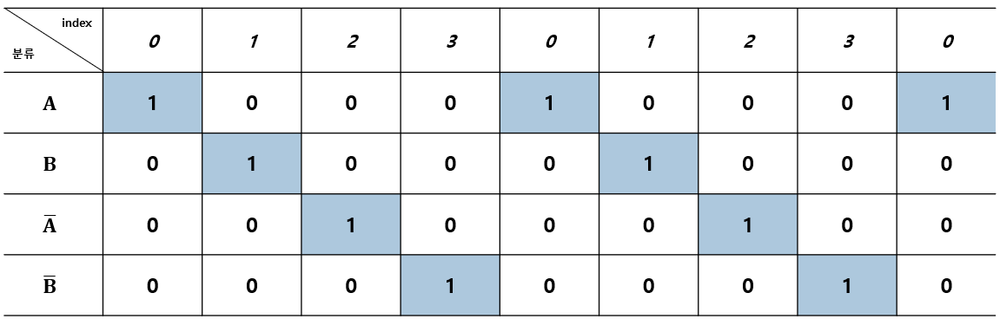
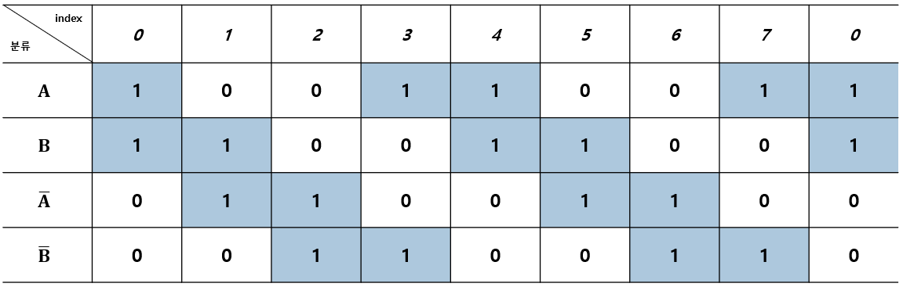
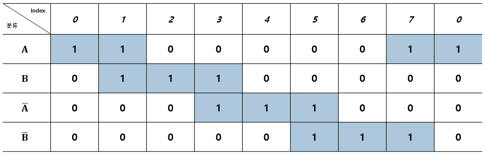

# Step_Motor_Concepts.md

## 1. 요약

해당 문서는 개루프 제어(Open-Loop Control) 시스템에서 주로 사용되는 **스텝 모터(Step Motor)** 의 구동 원리와 하드웨어적 특징을 정리한 문서이다.  
펄스 신호에 기반한 위치 제어 개념을 다루며, 모터 코일에 전류를 인가하는 세 가지 주요 여자(勵磁) 방식의 특징과 시퀀스를 비교 분석한다.

---

## 2. 스텝 모터 개념 및 특징 

스텝 모터(스테핑 모터, 펄스 모터)는 입력되는 펄스 신호의 횟수와 속도에 비례하여 일정 각도씩 회전하는 위치 제어용 모터이다.

- **개루프 제어 (Open-Loop Control)** : 샤프트(축)의 위치를 검출하기 위한 별도의 피드백 센서 없이 정해진 각도를 회전하고 상당히 높은 정확도로 정지할 수 있다.
- **유지 토크 (Holding Torque)** : 정지 시 매우 큰 유지 토크를 가지므로 전자 브레이크 등의 위치 유지 기구가 필요하지 않다(단, 전원 유지는 필요함).
- **제어 용이성** : 회전 속도가 펄스 주파수에 정확히 비례하므로 마이크로컨트롤러(MCU)의 디지털 출력만으로 간편하게 제어 수 있다.
- **스텝 각 (Step Angle)** : 모터의 스펙에 따라 1펄스 당 회전 각도가 결정된다. 예를 들어 실습에서 사용하는 PF/PFC 시리즈 모터의 경우 권선 및 자석 재질에 따라 3.75˚, 7.5˚, 15˚ 등의 고유 스텝 각을 가진다.  

---

## 3. 스테핑 모터 구동 시스템

스텝 모터를 구동하기 위해서는 마이크로컨트롤러, 여자 시퀀스 발생부, 그리고 전류 구동부가 유기적으로 동작해야 한다.

1. **마이크로컨트롤러** : 방향 신호와 펄스열을 발생시켜 하위 시스템으로 전달한다.
2. **여자 시퀀스 발생부** : 입력된 펄스를 해석하여 모터의 각 상(Phase: A, /A, B, /B)에 인가할 논리 신호를 생성한다.
3. **전류 구동부** : 생성된 논리 신호를 바탕으로 실제 모터 권선(코일)에 물리적인 여자 전류를 흘려보낸다.

---

## 4. 여자 방식별 특징 및 시퀀스

코일에 전류를 흘려보내는 순서를 **여자 방식**이라 하며, 제어 로직에 따라 모터의 토크, 진동, 분해능 특성이 달라진다.

### 4.1 1상 여자 방식

1개의 코일만을 차례대로 여자하는 구동 방식이다.

- **시퀀스** : `A` → `B` → `/A` → `/B` → `A`
- **특징** : 소비 전력이 낮고 1스텝당 각 정밀도가 높지만, 감쇠 진동이 크고 고속 회전 시 동기를 잃는 탈조 현상이 발생하기 쉽다.

### 4.2 2상 여자 방식

인접한 2개의 코일을 동시에 여자하는 구동 방식이다.

- **시퀀스** : `A, B` → `B, /A` → `/A, /B` → `/B, A` → `A, B`
- **특징** : 1상 여자 방식에 비해 2배의 전류가 필요하지만 기동 토크가 크고 감쇠 진동이 적다.

### 4.3 1-2상 여자 방식

1상 여자와 2상 여자를 교대로 수행하여 하나의 상과 두 개의 상에 교대로 전류를 흐르게 하는 방식이다.

- **시퀀스** : `A` → `A, B` → `B` → `B, /A` → `/A` → `/A, /B` → `/B` → `/B, A` → `A`
- **특징** : 1상 여자 구동에 비해 평균적으로 1.5배의 전류가 필요하지만, 1펄스에 대한 스텝 각이 절반으로 줄어들어 각도를 훨씬 정밀하고 부드럽게 제어할 수 있다.

