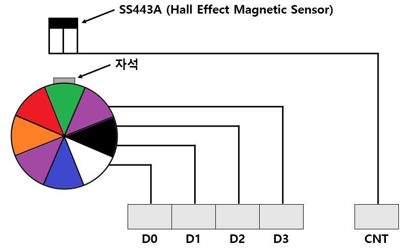

# Step_Motor_Control.md

## 1. 요약

해당 문서는 STM32F103 마이크로컨트롤러를 이용하여 스텝 모터를 제어하는 펌웨어 설계 원리를 분석한 문서이다. <br>
GPIO 포트를 통한 1-2상 여자 방식 시퀀스 출력 기법과, 타이머 기반의 딜레이, 그리고 자기 센서의 외부 인터럽트를 활용한 피드백 처리 로직을 다룬다.

---

##  2. 하드웨어 구성 및 핀 매핑



MCU 모듈과 스텝 모터 구동 모듈은 다음과 같이 연결되어 제어 신호와 센서 신호를 교환한다.

- MCU의 `PC0`~`PC3` 핀이 스텝 모터 모듈의 `D0`~`D3`에 연결되어 모터의 각 상(Phase)을 제어한다.
- 모터가 1회전 할 때마다 펄스를 발생시키는 Hall Effect 자기 센서(SS443A)의 `MOTOR_CNT` 출력 라인이 MCU의 `PC5` 핀에 연결된다. 이 핀은 외부 인터럽트(EXTI5) 소스로 사용된다.

---

## 3. 제어 시퀀스 설계(1-2상 여자 방식)

스텝 모터를 회전시키기 위해서는 일정한 시간 간격(타이머 활용)으로 데이터 버스(`PC0~PC3`)에 논리 시퀀스를 순차적으로 출력해야 한다. <br>
실습에서 사용한 1-2상 여자 방식 데이터 배열은 다음과 같다.

- **정회전 시퀀스** : `0x01` → `0x03` → `0x02` → `0x06` → `0x04` → `0x0C` → `0x08` → `0x09` → `0x01`
```c
unsigned char mot_tbl[] = {0x01, 0x03, 0x02, 0x06, 0x04, 0x0C, 0x08, 0x09};
```

---

## 4. 코드 분석

제공된 `main.c` 및 `stm32f10x_it.c` 파일의 로직은 다음과 같다.

### 4.1 GPIO 및 타이머 초기화

- `GPIOA`는 LED 출력을 위한 Push-Pull 모드로 설정되며, `GPIOC`의 하위 4bit(`Pin_0~3`)는 스텝 모터 여자 신호 출력을 위해 설정된다.
- `TIM_init()` 함수는 TIM3를 구동 클럭 10kHz(Prescaler 7199), 주기 1ms(Period 9)로 설정하여 폴링 방식의 `delay_ms()` 딜레이 함수를 구현한다.

### 4.2 외부 인터럽트 설정 및 처리
- `INT_init()` 함수를 통해 `PC5` 핀을 Floating Input 모드로 설정하고, 하강 에지(Falling Edge)에서 인터럽트(EXTI_Line5)가 발생하도록 구성한다.
- `EXTI9_5_IRQHandler`인터럽트 서비스 루틴에서는 센서 펄스가 입력될 때마다 전역 변수 `LED_data`의 비트를 좌측으로 시프트(`<<=1`)시켜 회전수를 시각적으로 카운트한다.

### 4.3 메인 제어 루프

```c
/* main.c */
#include "stm32f10x_lib.h"
#include "System_func.h"

u16 LED_data = 0x0001;

void INT_init(void){
  EXTI_InitTypeDef EXTI_InitStructure;
  NVIC_InitTypeDef NVIC_InitStructure;
  GPIO_InitTypeDef GPIO_InitStructure;

  RCC_APB2PeriphClockCmd(RCC_APB2Periph_GPIOC | RCC_APB2Periph_AFIO, ENABLE);
  
  GPIO_InitStructure.GPIO_Pin = GPIO_Pin_5;
  GPIO_InitStructure.GPIO_Mode = GPIO_Mode_IN_FLOATING;
  GPIO_Init(GPIOC, &GPIO_InitStructure);

  NVIC_InitStructure.NVIC_IRQChannel = EXTI9_5_IRQChannel;
  NVIC_InitStructure.NVIC_IRQChannelPreemptionPriority = 0;
  NVIC_InitStructure.NVIC_IRQChannelSubPriority = 0;
  NVIC_InitStructure.NVIC_IRQChannelCmd = ENABLE;
  NVIC_Init(&NVIC_InitStructure);

  GPIO_EXTILineConfig(GPIO_PortSourceGPIOC, GPIO_PinSource5);

  EXTI_InitStructure.EXTI_Line = EXTI_Line5;
  EXTI_InitStructure.EXTI_Mode = EXTI_Mode_Interrupt;
  EXTI_InitStructure.EXTI_Trigger = EXTI_Trigger_Falling;
  EXTI_InitStructure.EXTI_LineCmd = ENABLE;
  EXTI_Init(&EXTI_InitStructure);
}

void TIM_init(){
  TIM_TimeBaseInitTypeDef TIM_TimeBaseInitStruct;
  
  RCC_APB1PeriphClockCmd(RCC_APB1Periph_TIM3, ENABLE);
  
  TIM_TimeBaseInitStruct.TIM_Prescaler = 7200 - 1;
  TIM_TimeBaseInitStruct.TIM_CounterMode = TIM_CounterMode_Up;
  TIM_TimeBaseInitStruct.TIM_Period = 10 - 1;
  TIM_TimeBaseInitStruct.TIM_ClockDivision = TIM_CKD_DIV1;
  TIM_TimeBaseInit(TIM3, &TIM_TimeBaseInitStruct);
}

void delay_ms(u16 time){
  TIM_Cmd(TIM3, ENABLE);
  while (--time) {
    while (TIM_GetFlagStatus(TIM3, TIM_IT_Update) == RESET);
    TIM_ClearFlag(TIM3, TIM_FLAG_Update);
  }
  TIM_Cmd(TIM3, DISABLE);
}

int main(void) {
  Init_STM32F103();

  unsigned char mot_tbl[] = {0x01, 0x03, 0x02, 0x06, 0x04, 0x0C, 0x08, 0x09};

  u8 index = 0;
  
  GPIO_InitTypeDef GPIO_InitStructure;
  RCC_APB2PeriphClockCmd(RCC_APB2Periph_GPIOA | RCC_APB2Periph_GPIOC, ENABLE);

  GPIO_InitStructure.GPIO_Pin = 0xFF;
  GPIO_InitStructure.GPIO_Speed = GPIO_Speed_50MHz;
  GPIO_InitStructure.GPIO_Mode = GPIO_Mode_Out_PP;
  GPIO_Init(GPIOA, &GPIO_InitStructure);
  
  GPIO_InitStructure.GPIO_Pin = GPIO_Pin_0 | GPIO_Pin_1 | GPIO_Pin_2 | GPIO_Pin_3;
  GPIO_Init(GPIOC, &GPIO_InitStructure);

  INT_init();
  TIM_init();

  GPIO_ResetBits(GPIOA, 0xFF);
  while (1) {
    GPIO_ResetBits(GPIOC, mot_tbl[index]);
    if (index == 7) index = 0;
    else index++;
    GPIO_SetBits(GPIOC, mot_tbl[index]);

    if (LED_data <= 0x0080) GPIO_SetBits(GPIOA, LED_data);
    else GPIO_ResetBits(GPIOA, LED_data >> 8);
    delay_ms(10);
  }
}


/* stm32f10x_it.c */
extern u16 LED_data;
void EXTI9_5_IRQHandler(void){
  if(EXTI_GetITStatus(EXTI_Line5) != RESET){
    if(LED_data==0x8000) LED_data = 0x0001;
    else LED_data <<= 1;
    EXTI_ClearITPendingBit(EXTI_Line5);
  }
}
```


