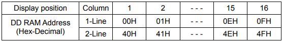
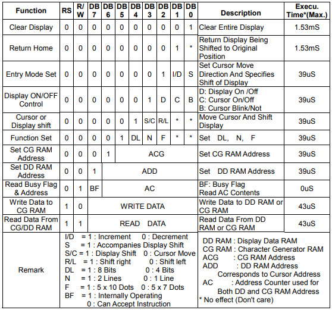

# Text_LCD_Concepts.md

## 1. 요약

해당 문서는 실습에서 사용한 **Text LCD**의 하드웨어 사양과 내부 메모리 아키텍처에 대해 작성한 문서이다.  
실습에 사용된 `LMC16213A-YTDSYW-B0` 모듈과 내장된 디스플레이 컨트롤러(KS0066)의 동작 원리 및 명령어 체계를 다룬다.

---

## 2. Text LCD 하드웨어 사양

실습에 사용된 텍스트 LCD 모듈은 16개의 문자를 2줄로 표시할 수 있는 장치이다.

- **디스플레이** : 16×2 Characters
- **내장 컨트롤러** : Samsung KS0066
- **폰트 크기** : 5×8 도트
- **인터페이스 핀 기능**:
  - `VDD`, `VSS` : 시스템 전원(+5V, GND)
  - `VEE` : 명암비 조절 단자
  - `RS` : Register Select, 0이면 명령어 레지스터, 1이면 데이터 레지스터 선택
  - `R/W` : Read/Write, 0이면 쓰기, 1이면 읽기 모드
  - `E` : Enable, 데이터 읽기/쓰기 활성화 신호 (하강 에지에서 데이터 래치)
  - `DB0`~`DB7` : 8bit 데이터 버스

---

## 3. 내부 아키텍처 및 메모리 구조

컨트롤러 내부는 데이터 처리를 위한 레지스터와 화면 출력을 위한 메모리로 구성된다.

### 3.1 주요 레지스터
- **IR (Instruction Register)** : 디스플레이 클리어, 커서 이동, 메모리 주소 설정 등 제어 명령을 일시적으로 저장한다.
- **DR (Data Register)** : 화면에 표시할 데이터나 메모리에 쓸 데이터를 임시로 보관한다.
- **BF (Busy Flag)** : 컨트롤러가 내부 연산을 수행 중인지 나타내는 플래그이다. `DB7`핀을 통해 읽을 수 있으며, 값이 1이면 동작 중이므로 새로운 명령을 받을 수 없다.
- **AC (Address Counter)** : DDRAM이나 CGRAM의 주소를 지정하며, 데이터가 기록되거나 읽힐 때 자동으로 1씩 증가 또는 감소한다.

### 3.2 메모리 영역
- **CGROM (Character Generator ROM)** : 영문자, 숫자, 기호 등에 대한 도트 패턴이 영구적으로 저장되어 있는 읽기 전용 메모리이다.
- **CGRAM (Character Generator RAM)** : 사용자가 원하는 특수 문자(커스텀 폰트)를 직접 만들어 저장할 수 있는 읽기/쓰기 메모리이다.
- **DDRAM (Display Data RAM)** : 화면에 표시할 문자의 ASCII 코드 값을 저장하는 메모리이다. 16×2 LCD의 경우 1행은 `0x00`-`0x0F`, 2행은 `0x40`-`0x4F`의 주소가 매핑되어 있다.

> 숫자 뒤에 'H'(예: `00H`, `40H`)를 붙이는 것은 해당 숫자가 10진수가 아니라 16진수 체계로 표기되었음을 나타내는 표현 방식이다.

---

## 4. 주요 명령어

명령 레지스터에 값을 기록하여 디스플레이를 제어할 수 있다. 주요 명령어는 다음과 같다.

- **Clear Display**
  > 전체 화면을 지우고 AC를 DDRAM Address 0으로 하여 커서를 Home(0x00) 위치로 이동 시킨다.

- **Return Home**
  > DDRAM의 내용은 변경하지 않고 커서만을 Home 위치로 이동 시킨다.

- **Entry Mode Set**
  > 데이터를 Read하거나 Write할 경우에 커서의 위치를 증가시킬 것인가(I/D=1) 감소 시킬 것인가(I/D=0)를 결정하며,  
  또 이때 화면을 시프트 할 것인지(S=1) 아닌지(S=0)를 결정한다.

- **Display ON/OFF Control**
  > 화면 표시를 ON/OFF 하거나(D) 커서를 ON/OFF하거나(C) 커서를 깜박이게 할 것인지(B)의 여부를 지정 한다.

- **Cursor or Display Shift**
  > 화면(S/C=1) 또는 커서(S/C=0)를 오른쪽(R/L=1) 또는 왼쪽(R/L=0)으로 시프트 한다.

- **Function Set**
  > 인터페이스에서 데이터의 길이를 8bit(DL=1) 또는 4bit(DL=0)로 지정하고, 화면 표시 행수를 2행(N=1) 또는 1행(N=0)으로 지정하며,  
  문자의 폰트를 5x10 도트(F=1) 또는 5x8 도트(F=0)로 지정할 수 있다.  
  ※ 4bit로 인터페이스 할 경우에는 DB4~DB7을 사용하며, 상위 4bit를 먼저 전송하고 다음에 하위 4bit를 전송해야 한다.

- **Set CG RAM Address**
  > CGRAM의 어드레스를 지정한다. 이후에 송수신하는 데이터는 CGRAM의 데이터이다.

- **Set DD RAM Address**
  > DDRAM의 어드레스를 지정한다. 이후에 송수신하는 데이터는 DDRAM의 데이터이다.

- **Read Busy Flag & Address**
  > LCD 모듈이 내부 동작중임을 나타내는 BF 및 AC의 내용을 Read한다.  
  LCD 모듈이 각 명령을 실행하는데 지정된 시간이 필요하므로 MCU는 BF를 읽어 1일 경우에는 기다리고 0일 경우 다음 명령을 보낸다.

- **Write Data to CG RAM**
  > CGRAM 또는 DDRAM에 데이터를 쓴다.

- **Read Data From CG/DD RAM**
  > CGRAM 또는 DDRAM에 데이터를 읽는다.
