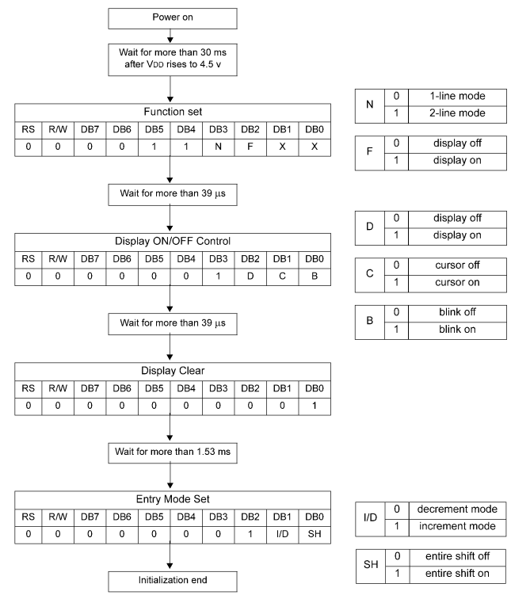

# Text LCD Control.md

## 1. 요약

해당 문서는 STM32F103 마이크로컨트롤러의 GPIO를 사용하여 Text LCD를 제어하는 펌웨어 로직을 분석한 문서이다. <br>
8bit 데이터 버스 인터페이스를 기반으로 한 초기화 시퀀스, Busy Flag 폴링 기법, 그리고 CGRAM을 활용한 사용자 정의 문자 출력 및 애니메이션 구현 방법을 다룬다.

---

## 2. 하드웨어 핀 매핑

LCD 제어를 위해 MCU의 범용 포트를 제어 버스와 데이터 버스로 나누어 연결한다.

- **Control Bus** (`GPIOB`):
  - `PB0` → `RS` (Register Select)
  - `PB1` → `R/W` (Read/Write)
  - `PB2` → `E` (Enable)

- **Data Bus** (`GPIOA`):
  - `PA0`-`PA7` → `DB0`-`DB7` (8bit interface Mode)

```c
/* lcdconf.h */
#ifndef LCDCONF_H
#define LCDCONF_H

#define LCD_PORT_INTERFACE
//#define LCD_DATA_4BIT

#ifdef LCD_PORT_INTERFACE
	#ifndef LCD_CTRL_PORT
		#define LCD_CTRL_PORT_CLK	RCC_APB2Periph_GPIOB
                #define LCD_CTRL_PORT	        GPIOB
		#define LCD_CTRL_RS		GPIO_Pin_0
		#define LCD_CTRL_RW		GPIO_Pin_1
		#define LCD_CTRL_E		GPIO_Pin_2
	#endif
	#ifndef LCD_DATA 

		#define LCD_DATA	GPIOA
		#define LCD_DATA_CLK	RCC_APB2Periph_GPIOA
	#endif
#endif
```

---

## 3. 펌웨어 로직 분석

### 3.1 하드웨어 초기화 및 BF 대기

`lcdInitHW()` 함수는 제어 핀(PB0-2)과 데이터 핀(PA0-7)을 Push-Pull 출력 모드로 초기화 한다.

```c
GPIO_InitTypeDef GPIO_LCD;

void lcdInitHW(void)
{

#ifdef LCD_PORT_INTERFACE
      /* 제어 버스 핀 초기화 */
      RCC_APB2PeriphClockCmd(LCD_CTRL_PORT_CLK, ENABLE);

      GPIO_LCD.GPIO_Pin = LCD_CTRL_RS | LCD_CTRL_RW | LCD_CTRL_E;
      GPIO_LCD.GPIO_Speed = GPIO_Speed_50MHz;
      GPIO_LCD.GPIO_Mode = GPIO_Mode_Out_PP;
      GPIO_Init(LCD_CTRL_PORT, &GPIO_LCD);

      /* 제어 핀 초기 상태를 Low(0)로 설정하여 통신 대기 상태 유지 */
      GPIO_ResetBits(LCD_CTRL_PORT, LCD_CTRL_RS | LCD_CTRL_RW |LCD_CTRL_E );
		
	#ifdef LCD_DATA_4BIT
          /* 데이터 버스 핀 초기화 - 4bit 모드 */
          RCC_APB2PeriphClockCmd(LCD_DATA_CLK, ENABLE);

          /* 데이터 버스 4bit 사용시 상위 4bit(Pin4~7)사용 */
          GPIO_LCD.GPIO_Pin = 0x00F0; 
          GPIO_LCD.GPIO_Speed = GPIO_Speed_50MHz;
          GPIO_LCD.GPIO_Mode = GPIO_Mode_Out_PP;
          GPIO_Init(LCD_DATA, &GPIO_LCD);

          /* 데이터 핀 초기 상태를 High(1)로 설정 */
          GPIO_SetBits(LCD_DATA, 0x00f0 );
	#else
          /* 데이터 버스 핀 초기화 - 8bit 모드 */
          RCC_APB2PeriphClockCmd(LCD_DATA_CLK, ENABLE);

          GPIO_LCD.GPIO_Pin = 0x00FF;
          GPIO_LCD.GPIO_Speed = GPIO_Speed_50MHz;
          GPIO_LCD.GPIO_Mode = GPIO_Mode_Out_PP;
          GPIO_Init(LCD_DATA, &GPIO_LCD);

          GPIO_SetBits(LCD_DATA, 0x00FF );
	#endif
#else

#endif
}
```

LCD에 새로운 명령을 내리기 전에는 반드시 컨트롤러가 이전 명령을 완료했는지 확인해야 한다.
`lcdBusyWait()` 함수는 데이터 포트(`GPIOA`)를 Floating Input 모드로 변경한 다음, `RS=0`, `R/W=1` 상태에서 Enable 핀을 토글하여 `DB7`(BF)이 0이 될 때까지 대기하는 역할을 한다.

```c
void lcdBusyWait(void)
{
#ifdef LCD_PORT_INTERFACE
	GPIO_ResetBits(LCD_CTRL_PORT, LCD_CTRL_RS);	/* RS = 0 → Instruction Register 선택. */
	#ifdef LCD_DATA_4BIT
          GPIO_LCD.GPIO_Pin = 0x00F0;
          GPIO_LCD.GPIO_Speed = GPIO_Speed_50MHz;
          GPIO_LCD.GPIO_Mode = GPIO_Mode_IN_FLOATING;
          GPIO_Init(LCD_DATA, &GPIO_LCD);

          GPIO_SetBits(LCD_DATA, 0x00F0 );
	#else
          GPIO_LCD.GPIO_Pin = 0x00FF;
          GPIO_LCD.GPIO_Speed = GPIO_Speed_50MHz;
          GPIO_LCD.GPIO_Mode = GPIO_Mode_IN_FLOATING;
          GPIO_Init(LCD_DATA, &GPIO_LCD);

          GPIO_SetBits(LCD_DATA, 0x00FF );
	#endif
	
        GPIO_SetBits(LCD_CTRL_PORT, LCD_CTRL_RW | LCD_CTRL_E); /* RW = 1 , Enable = 1 → 데이터 출력 요청 */
 
	LCD_DELAY;

  /* DB7 bit가 1(Busy)인 동안 계속해서 루프를 돌며 대기 */
	while((GPIO_ReadInputDataBit(LCD_DATA, 1<<LCD_BUSY)))
	{
    /* Enable 신호를 토글(Low → High)하여 LCD 컨트롤러의 상태를 다시 읽는다 */
    GPIO_ResetBits(LCD_CTRL_PORT, LCD_CTRL_E);
		LCD_DELAY;
		LCD_DELAY;
		GPIO_SetBits(LCD_CTRL_PORT, LCD_CTRL_E);
		LCD_DELAY;
		LCD_DELAY;

		#ifdef LCD_DATA_4BIT
      /* 4bit 모드에서는 Enable 신호를 두 번 토글해야 한다.
       * 상위 4bit(BF 포함)를 읽은 후, 하위 4bit를 비우기 위한 Dummy 토글을 수행한다
       */
			GPIO_ResetBits(LCD_CTRL_PORT, LCD_CTRL_E);
			LCD_DELAY;
			LCD_DELAY;
			GPIO_SetBits(LCD_CTRL_PORT, LCD_CTRL_E);
			LCD_DELAY;
			LCD_DELAY;
		#endif
	}

  /* Busy 상태가 해제되면 Enable 신호를 초기화하여 통신 종료 */
	GPIO_ResetBits(LCD_CTRL_PORT, LCD_CTRL_E);
#else
	
#endif
}
```

### 3.2 제어 명령 및 데이터 쓰기

LCD 컨트롤러에 데이터를 전송하는 과정은 `RS`핀의 상태에 따라 두 가지로 나뉜다.

- `lcdControlWrite()` (명령어 쓰기):
  `RS`를 0(Low), `R/W`를 0(Low)으로 설정한 후, 데이터 버스에 명령 값을 출력하고 `E`핀을 High에서 Low로 전환(하강 에지)하여 명령을 래치시킨다.

```c
void lcdControlWrite(u8 data) 
{
#ifdef LCD_PORT_INTERFACE
    /* 이전 명령 처리가 완료될 때까지 대기 */
    lcdBusyWait();                  

    /* RS = 0 → Instruction Register 선택, R/W = 0 → Write 모드 설정 */
    GPIO_ResetBits(LCD_CTRL_PORT, LCD_CTRL_RS | LCD_CTRL_RW); 
    
    #ifdef LCD_DATA_4BIT
        /*
         * 4bit 인터페이스 모드 쓰기 시퀀스
         * 8bit 데이터를 상위 4bit와 하위 4bit로 나누어 두 번 전송함.
         */
        GPIO_SetBits(LCD_CTRL_PORT, LCD_CTRL_E);    /* Enable = 1 → 데이터 수신 준비 */
        
        /* 데이터 핀(상위 4핀)을 Push-Pull 출력 모드로 설정 */
        GPIO_LCD.GPIO_Pin = 0x00F0;
        GPIO_LCD.GPIO_Speed = GPIO_Speed_50MHz;
        GPIO_LCD.GPIO_Mode = GPIO_Mode_Out_PP;
        GPIO_Init(LCD_DATA, &GPIO_LCD);

        /* 1차 전송: 상위 4bit 출력 */
        GPIO_ResetBits(LCD_DATA, 0x00F0);           /* 데이터 버스 클리어 */
        GPIO_SetBits(LCD_DATA, (data & 0xF0));      /* 상위 4bit 마스킹 후 출력 */
        
        LCD_DELAY;                                  /* 데이터 셋업 타임 확보 */
        LCD_DELAY;                                  
        GPIO_ResetBits(LCD_CTRL_PORT, LCD_CTRL_E);  /* Enable = 0 → 하강 에지 발생 → LCD 내부로 래치 */
        LCD_DELAY;                                  /* 데이터 홀드 타임 확보 */
        LCD_DELAY;                                  
        
        GPIO_SetBits(LCD_CTRL_PORT, LCD_CTRL_E);    /* Enable = 1 → 두 번째 데이터 수신 준비 */
        
        /* 2차 전송: 하위 4bit 출력 */
        GPIO_ResetBits(LCD_DATA, 0x00F0);
        GPIO_SetBits(LCD_DATA, (data << 4) & 0xF0); /* 하위 4bit를 좌측으로 4칸 시프트하여 상위 비트로 출력 */

        LCD_DELAY;                                  
        LCD_DELAY;                                  
        GPIO_ResetBits(LCD_CTRL_PORT, LCD_CTRL_E);  /* Enable = 0 → 하강 에지 발생 → LCD 내부로 래치 */
    #else
        /* 8bit 인터페이스 모드 쓰기 시퀀스 */
        GPIO_SetBits(LCD_CTRL_PORT, LCD_CTRL_E);    /* Enable = 1 → 데이터 수신 준비 */
        
        /* 데이터 핀(전체 8핀)을 Push-Pull 출력 모드로 설정 */
        GPIO_LCD.GPIO_Pin = 0x00FF;
        GPIO_LCD.GPIO_Speed = GPIO_Speed_50MHz;
        GPIO_LCD.GPIO_Mode = GPIO_Mode_Out_PP;
        GPIO_Init(LCD_DATA, &GPIO_LCD);
        
        GPIO_ResetBits(LCD_DATA, 0x00FF);           /* 데이터 버스 클리어 */
        GPIO_SetBits(LCD_DATA, data);               /* 8bit 데이터 전체 출력 */
        
        LCD_DELAY;                                  /* 셋업 타임 대기 */
        LCD_DELAY;                                  
        GPIO_ResetBits(LCD_CTRL_PORT, LCD_CTRL_E);  /* Enable = 0 → 하강 에지 발생 → LCD 내부로 래치 */
    #endif

#else
    
#endif
}
```

- `lcdDataWrite()` (데이터 쓰기):
  `RS`를 1(High), `R/W`를 0(Low)으로 설정한 후, 데이터 버스에 ASCII 코드 값을 출력하고 `E`핀을 토글하여 DDRAM 또는 CGRAM에 데이터를 기록한다.

```c
void lcdDataWrite(u8 data) 
{
#ifdef LCD_PORT_INTERFACE
    /* 이전 명령 처리가 완료될 때까지 대기 */
    lcdBusyWait();                                  
    
    /* RS = 1 → Data Register 선택, R/W = 0 → Write 모드 설정 */
    GPIO_SetBits(LCD_CTRL_PORT, LCD_CTRL_RS);
    GPIO_ResetBits(LCD_CTRL_PORT, LCD_CTRL_RW);
    
    #ifdef LCD_DATA_4BIT
        /* 4bit 인터페이스 모드 쓰기 시퀀스 */
        GPIO_SetBits(LCD_CTRL_PORT, LCD_CTRL_E);    /* Enable = 1 → 데이터 수신 준비 */
            
        GPIO_LCD.GPIO_Pin = 0x00F0;
        GPIO_LCD.GPIO_Speed = GPIO_Speed_50MHz;
        GPIO_LCD.GPIO_Mode = GPIO_Mode_Out_PP;
        GPIO_Init(LCD_DATA, &GPIO_LCD);

        /* 1차 전송: 상위 4bit 출력 */
        GPIO_ResetBits(LCD_DATA, 0x00F0);
        GPIO_SetBits(LCD_DATA, (data & 0xF0));      

        LCD_DELAY;                                  
        LCD_DELAY;                                  
        GPIO_ResetBits(LCD_CTRL_PORT, LCD_CTRL_E);   /* Enable = 0 → 하강 에지 발생 → LCD 내부로 래치 */
        LCD_DELAY;                                  
        LCD_DELAY;                                  
        
        GPIO_SetBits(LCD_CTRL_PORT, LCD_CTRL_E);     /* Enable = 1 → 데이터 수신 준비 */

        /* 2차 전송: 하위 4bit 출력 */
        GPIO_ResetBits(LCD_DATA, 0x00F0);
        GPIO_SetBits(LCD_DATA, (data << 4) & 0xF0);              

        LCD_DELAY;                                  
        LCD_DELAY;                                  
        GPIO_ResetBits(LCD_CTRL_PORT, LCD_CTRL_E);   /* Enable = 0 → 하강 에지 발생 → LCD 내부로 래치 */
    #else
        /* 8bit 인터페이스 모드 쓰기 시퀀스 */
        GPIO_SetBits(LCD_CTRL_PORT, LCD_CTRL_E);     /* Enable = 1 → 데이터 수신 준비 */
        
        GPIO_LCD.GPIO_Pin = 0x00FF;
        GPIO_LCD.GPIO_Speed = GPIO_Speed_50MHz;
        GPIO_LCD.GPIO_Mode = GPIO_Mode_Out_PP;
        GPIO_Init(LCD_DATA, &GPIO_LCD);

        GPIO_ResetBits(LCD_DATA, 0x00FF);
        GPIO_SetBits(LCD_DATA, data & 0xFF);         /* 8bit 데이터 전체 출력 */
        
        LCD_DELAY;                                  
        LCD_DELAY;                                  
        GPIO_ResetBits(LCD_CTRL_PORT, LCD_CTRL_E);   /* Enable = 0 → 하강 에지 발생 → LCD 내부로 래치 */
    #endif
#else

#endif
}

```

### 3.3 CGRAM 커스텀 문자 생성

`custom()` 함수는 표준 ASCII 테이블에 없는 사용자 고유의 문자를 만들어낸다.

```c
void custom(void)
{
  /* 5x8 도트 매트릭스 패턴 배열 정의, 총 8개의 문자를 만들 수 있으며 그 때 배열의 크기는 64이다. */
  unsigned char map[8] = {0x07, 0x09, 0x11, 0x12, 0x1C, 0x04, 0x0E, 0x04};

  /* CGRAM 주소 0번지(0x40 명령어)로 접근 설정 */
  lcdControlWrite(0x40);

  /* 8byte의 도트 패턴 데이터를 CGRAM에 순차적으로 기록 */
  for(u8 i=0;i<8;i++) lcdDataWrite(map[i]);
}
```
위 코드를 실행하면 DDRAM에 `0x00`데이터(CGRAM 0번지 매핑)를 출력할 때 배열로 설계한 특수 문자가 화면에 나타나게 된다.

### 3.4 메인 제어 루프

`main.c`의 루프는 CGRAM에 저장된 특수 문자를 화면의 좌측 상단부터 우측 하단까지 순차적으로 이동시키는 애니메이션을 구현한다.
```c
while (1){
    for(u8 i=0; i<32; i++){
      lcdClear(); /* 화면 초기화 */
      if(i<16){
        /* 1행(Line 0): 왼쪽에서 오른쪽으로 이동 */
        lcdGotoXY(i, 0);
        lcdDataWrite(0x00); /* 0번지 커스텀 문자 출력 */
      }
      else{
        /* 2행(Line 1): 오른쪽에서 왼쪽으로 역방향 이동 */
        lcdGotoXY(31-i, 1);
        lcdDataWrite(0x00);
      }
      delay_ms(100); /* 100ms 프레임 대기 */
    }
  }
```

`lcdInit()`함수는 LCD 모듈에 전원이 인가된 후, 데이터시트에서 요구하는 명령어 순서(Function Set → Display Control → Clear → Entry Mode)를 구현한 로직이다.

아래 그림은 8bit interface mode에서 명령어 순서이다.


```c
void lcdInit(void)
{
    /* Clear Display 명령어 등 연산 시간이 긴 명령을 위한 딜레이 카운터 (약 60ms) */
    u32 i = 434782; 
    
    /*하드웨어 핀 초기화: 제어 버스(RS, R/W, E) 및 데이터 버스(DB) GPIO 설정 */
    lcdInitHW(); 

    /*
     * Function Set: 인터페이스 모드(8bit/4bit), 표시 행 수(2줄/1줄), 폰트 크기 설정
     * LCD_FUNCTION_DEFAULT = 0x38 , 8bit mode
     * LCD_FUNCTION_DEFAULT = 0x28 , 4bit mode
     */
    lcdControlWrite(LCD_FUNCTION_DEFAULT);

    /*
     * Clear Display: 전체 화면을 지우고 내부 Address Counter(AC)를 0으로 초기화
     * LCD_CLR = 0
     */
    lcdControlWrite(1 << LCD_CLR);
    
    /* Clear 명령어는 실행 시간이 가장 길기 때문에(일반적으로 1.52ms 이상) 충분한 지연 시간 확보 */
    while(i--);

    /* 
     * Entry Mode Set: 데이터를 읽고 쓸 때 커서의 이동 방향 설정
     * LCD_ENTRY_INC 플래그를 통해 데이터 기록 후 커서가 우측(주소 증가 방향)으로 자동 이동하도록 설정
     * LCD_ENTRY_MODE = 2
     * LCD_ENTRY_INC = 1
     */
    lcdControlWrite((1 << LCD_ENTRY_MODE) | (1 << LCD_ENTRY_INC));

    /* 
     * Display ON/OFF Control: 화면 표시 상태 제어
     * 화면 출력(Display)은 활성화(ON)하고, 커서(Cursor) 표시 및 깜박임(Blink)은 비활성화(OFF)
     * LCD_ON_CTRL = 3
     * LCD_ON_DISPLAY = 2
     * LCD_ON_BLINK = 0
     */
    lcdControlWrite((1<<LCD_ON_CTRL) | (1<<LCD_ON_DISPLAY) | (1<<LCD_ON_BLINK));

    /*
     * Return Home: DDRAM의 데이터는 유지한 채 커서만 초기 위치로 복귀
     * LCD_HOME = 1
     */
    lcdControlWrite(1 << LCD_HOME);

    /*
     * Set DDRAM Address: 데이터 기록을 시작할 메모리 주소를 명시적으로 0x00(1행 1열)으로 설정
     * LCD_DDRAM = 7
     */
    lcdControlWrite((1 << LCD_DDRAM) | 0x00);
}
```
