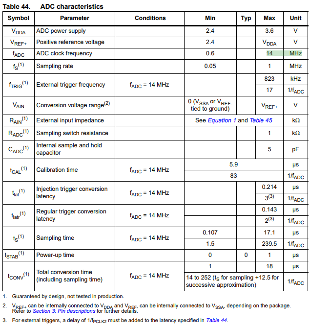

# ADC Concepts (Analog-to-Digital Converter)

## 1. 요약

해당 문서는 아날로그 신호를 디지털 데이터로 변환하는 **ADC**의 기본 개념과 동작 원리를 정리한 문서이다.  
ADC의 성능을 결정하는 핵심 지표인 **분해능(Resolution)**과 **변환 시간(Conversion Time)**의 개념을 다루며, 실습에 사용되는 **12bit 축차비교형 ADC**의 동작 원리와 하드웨어적 특징에 대한 내용을 다룬다.

---

## 2. 주요 성능 평가 지표

ADC의 성능을 결정짓는 가장 중요한 두 가지 요소는 **분해능(Resolution)**과 **변환 시간(Conversion Time)**이다.

### 2.1 분해능 (Resolution)

디지털 출력값을 한 단계(1 Step) 변화시키기 위해 필요한 아날로그 입력의 최소 변화량을 의미한다. 즉, ADC가 아날로그 값을 얼마나 잘게 쪼개서 섬세하게 표현할 수 있는가를 나타낸다.

- n bit ADC의 경우, 전체 아날로그 입력 범위를 $2^n$개로 나누어 표현하므로 출력의 분해능 범위는 $1/{2^n}$이 된다.
- 예) 12bit ADC는 0~4095(${2^{12}}-1$)까지 총 4096단계로 전압을 쪼개어 측정할 수 있다.

### 2.2 변환 시간 (Conversion Time)

입력 받은 아날로그 신호 샘플을 디지털 데이터로 변환하는 데 걸리는 시간이다.

- 위 표는 STMicroelectronics의 공식 데이터시트이다.
- 보통 초당 샘플링 속도(Sampling Rate)로 나타낸다.
- STM32F103의 축차 비교형 ADC 변환 시간 공식: `총 변환 시간 = 샘플링 시간 + 12.5 사이클`

### 2.3 1.17μs 최고 속도 도출 원리

STMicroelectronics의 공식 데이터시트에 따르면 STM32F103의 ADC 하드웨어는 최대 14MHz의 클럭(ADCCLK)까지만 입력받을 수 있다. 따라서 하드웨어 스펙을 준수하며 낼 수 있는 최고 속도 설정은 다음과 같다.
1. **클럭 분주**: 72MHz의 시스템 클럭(APB2)을 6분주하여 12MHz의 ADCCLK를 생성한다.
2. **최소 변환 사이클**: 샘플링 시간을 설정할 수 있는 최소값인 1.5사이클로 설정하면, 총 변환에 필요한 사이클은 `1.5 + 12.5 = 14사이클`이 된다.
3. **최종 계산**: 12MHz 클럭 속도에서 14사이클이 소요되는 실제 시간은 다음과 같이 계산된다.
$$T_{conv} = \frac{14\ \text{cycles}}{12,000,000\text{Hz}} \approx 1.17 \mu s$$

---

## 3. 축차비교형(SAR, Successive Approximation Register) ADC의 동작 원리

### 3.1 기본 원리: 이진 탐색

측정할 아날로그 전압이 인가되면, ADC는 전체 측정 범위의 중간값에 해당하는 기준 전압을 생성하여 입력 신호와 대소 관계를 판별한다. 이 비교 결과에 따라 탐색 범위를 1/2씩 축소해 나가며, 최상위 비트(MSB) 부터 최하위 비트(LSB)까지 순차적으로 논리 상태(0 또는 1)를 확정 짓는다.

### 3.2 내부 구조 및 변환 과정

SAR ADC의 내부 회로는 **비교기(Comparator)**, **내부 DAC**, 그리고 논리 연산을 제어하는 **SAR 제어기**로 구성된다. 12bit 분해능을 가정했을 때의 변환 시퀀스는 다음과 같다.

1. **초기 상태 (MSB 비교)**: SAR 제어기가 MSB만 `1`로 설정한 디지털 값 `1000_0000_0000`(전체 전압 범위의 50%)을 내부 DAC에 인가한다. DAC는 이를 아날로그 기준 전압으로 변환하여 외부 입력 신호와 비교한다.
2. **비교 및 상태 결정**:
  - 입력 신호가 DAC 기준 전압보다 높을 경우 → 해당 MSB를 `1`로 유지(Latch)하고, 다음 하위 비트를 `1`로 설정하여 `1100_0000_0000`을 생성한다.
  - 입력 신호가 DAC 기준 전압보다 낮을 경우 → 해당 MSB를 `0`으로 초기화(Reset)하고, 다음 하위 비트를 `1`로 설정하여 `0100_0000_0000`을 생성한다.
3. **순차적 근사**: 위와 같은 대소 비교 및 bit latch 과정을 MSB부터 LSB까지 1bit씩 이동하며 반복 수행한다. STM32의 12bit ADC는 이 비교 사이클을 정확히 12회 거치게 되며, 이것이 변환 공식에 고정 상수인 **12.5 사이클**이 포함된 하드웨어적 이유이다.

### 3.3 SAR ADC의 특징
- **일정한 변환 시간**: 입력 전압의 크기와 무관하게 n bit 분해능 시스템은 항상 n회의 고정된 비교 사이클만 수행하므로 변환 소요 시간이 일정하게 유지된다.
- **비교적 빠른 속도**: 이중적분형이나 계수비교형 대비 변환 시간이 짧아 고속 처리에 유리하다.
- **신호 안정성**: 디지털 데이터의 정밀도와 신호 안정이 구조적으로 보장된다.
- **높은 범용성**: 마이크로컨트롤러 내장형(On-Chip)으로 설계하기에 가장 적합한 회로 복잡도와 성능을 제공하여, 임베디드 제어 분야의 업계 표준으로 사용된다.

---

## 4. STM32 ADC의 채널 그룹 (Regular vs Injected)

STM32의 ADC 하드웨어는 여러 개의 아날로그 입력 핀을 효율적으로 처리하기 위해, 채널을 크게 **일반 채널(Regular Channel)** 과 **삽입 채널(Injected Channel)** 두 가지로 분류하여 관리한다.  
이는 마이크로컨트롤러의 main loop와 interrupt의 관계와 매우 유사하다.

### 4.1 일반 채널 (Regular Channel)

지정된 순서(Sequence)에 따라 순차적으로 아날로그 신호를 변환하는 기본 채널 그룹이다.
- **동작 방식**: 최대 16개의 채널을 지정하여 큐(Queue)처럼 등록된 순서대로 차례차례 A/D 변환을 수행한다.
- **사용 목적**: 조도, 온도, 가변저항 등 일반적인 센서 데이터를 주기적이고 안정적으로 수집할 때 사용된다.

### 4.2 삽입 채널 (Injected Channel)

일반 채널이 변환을 수행하는 도중, 긴급하게 처리해야 하는 신호가 발생했을 때 기존 작업을 일시 정지시쾨고 **우선적으로 변환 권한을 점유(Preemption)** 하는 특수 채널 그룹이다.
- **동작 방식**: 최대 4개까지 지정할 수 있다. 일반 채널 변환 중 인젝티드 트리거가 발생하면, 진행 중이던 일반 채널의 변환을 멈추고 인젝티드 채널의 변환을 먼저 끝낸 다음 다시 원래 일반 채널로 복귀한다.
- **사용 목적**: 모터 제어 시스템의 과전류 감지, 배터리 저전압 경보 등 시스템 보호를 위해 즉각적이고 결정론적인(Deteministic) 대응이 필수적인 응급 신호 처리에 사용된다.

### 4.3 채널 그룹 특성 비교
|구분|일반 채널 (Regular Channel)|삽입 채널 (Injected Channel)|
|----|---------------------------|----------------------------|
|최대 할당 개수|16개|4개|
|동작 특성|순차적 처리|우선순위 점유|
|데이터 레지스터|1개의 레지스터(`ADC_DR`) 공유   (데이터 덮어쓰임 주의)|4개의 독립된 레지스터(`ADC_JDRx`) 보유   (데이터 보존에 유리함)|
|적용 분야|범용 센서 데이터 주기적 모니터링|모터 제어, 보호 회로 등 실시간 응급 처리|
