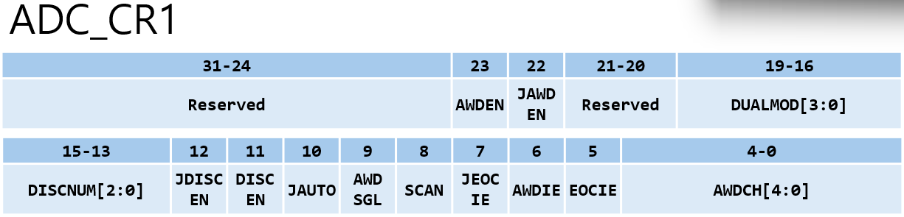
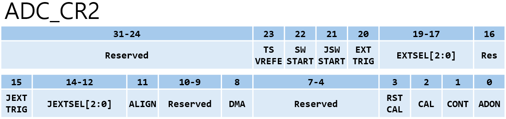
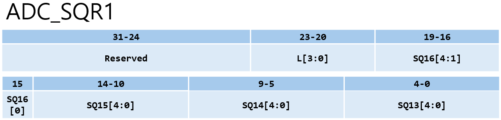
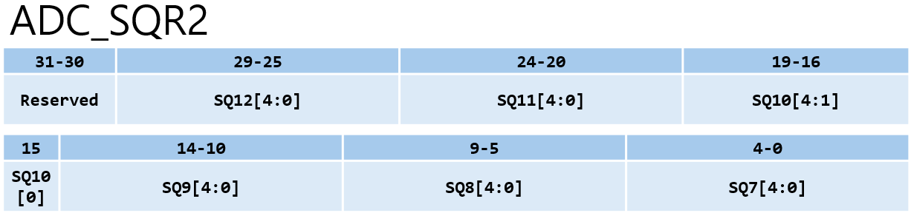
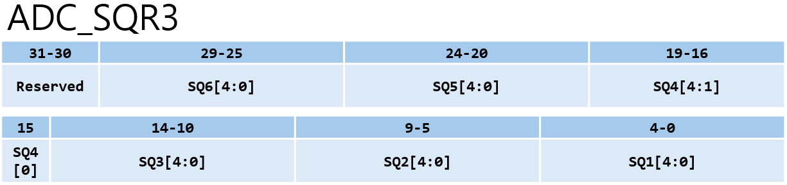
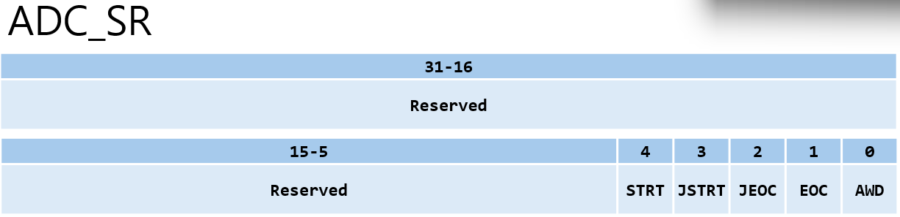
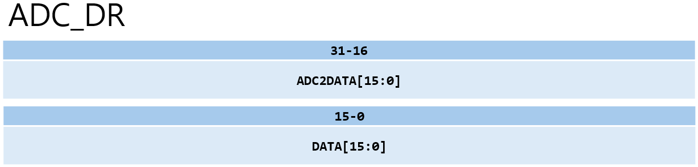

# ADC Registers

## 1. 요약

해당 문서는 STM32F10x의 **ADC** 주변장치에 대해 레지스터 관점에서 정리한 문서이다. <br>
실습 코드를 바탕으로 각 레지스터별 섹션을 나누고, **각 레지스터의 핵심 bit 구성과 의미**, 그리고 실제 코드가 하드웨어 레지스터를 어떻게 제어하여 변환을 수행하는지 분석한다.

---

## 2. ADC_CR1 (Control Register 1)



ADC의 해상도, 아날로그 워치독(Watchdog), 인터럽트 활성화, 스캔 모드 및 듀얼 모드 등 전반적인 제어 기능을 설정하는 레지스터이다.

|비트|이름|설명|
|----|----|----|
|Bit[4:0]|AWDCH[4:0]|Analog Watchdog Channel Select. <br> AWDSGL bit가 `1`일 때, 워치독으로 감시할 단일 채널의 번호(0~17)를 지정한다.
|Bit[5]|EOCIE|Interrupt Enable for EOC. <br> 일반 채널의 변환 완료(EOC) 플래그가 `1`이 될 때 하드웨어 인터럽트를 발생시키도록 설정한다.
|Bit[6]|AWDIE|Analog Watchdog Interrupt Enable. <br> 아날로그 전압이 설정된 임계치를 벗어날 때 발생하는 인터럽트를 켠다.
|Bit[7]|JEOCIE|Interrupt Enable for Injected Channels. <br> 삽입 채널(Injected Channel)의 변환 완료(JEOC) 인터럽트를 활성화한다.
|Bit[8]|SCAN|Scan Mode Enable. <br> `1`로 설정 시, ADC_SQRx 레지스터에 등록된 여러 채널을 순차적으로 스캔하며 변환하는 모드를 켠다. 단일 채널 변환 시에는 `0`으로 둔다.
|Bit[9]|AWDSGL|Enable Analog Watchdog on a Single Channel. <br> `0`: 모든 채널 감시, `1`: AWDCH[4:0]으로 지정된 단일 채널만 감시한다.
|Bit[10]|JAUTO|Automatic Injected Group Conversion. <br> 일반 채널 변환이 끝난 후 자동으로 삽입 채널 변환을 시작할지 설정한다.
|Bit[11]|DISCEN|Discontinuous Mode on Regular Channels. <br> 일반 채널 그룹에서 불연속 변환 모드를 사용할지 설정한다.
|Bit[12]|JDISCEN|Discontinuous Mode on Injected Channels. <br> 삽입 채널 그룹에서 불연속 변환 모드를 사용할지 설정한다.
|Bit[15:13]|DISCNUM[2:0]|Discontinuous Mode Channel Count. <br> 불연속 모드(Discontinuous mode) 사용 시, 한 번의 트리거로 변환할 서브 그룹의 채널 개수(1~8개)를 설정한다.
|Bit[19:16]|DUALMOD[3:0]|Dual Mode Selection. <br> 2개 이상의 ADC(ADC1, ADC2 등)를 함께 사용할 때의 동작 모드(독립 모드, 동시 모드, 교차 모드 등)를 설정한다.
|Bit[22]|JAWDEN|Analog Watchdog Enable on Injected Channels. <br> 삽입(Injected) 채널에 대해 아날로그 워치독 기능을 활성화한다.
|Bit[23]|AWDEN|Analog Watchdog Enable on Regular Channels. <br> 일반 채널에 대해 아날로그 워치독 기능을 활성화한다.

---

## 3. ADC_CR2 (Control Register 2)



ADC의 전원, 캘리브레이션, 데이터 정렬 방식, 연속 변환 모드 및 양대 채널(일반/삽입)의 변환 시작(Trigger)을 직접적으로 담당하는 핵심 제어 레지스터이다.

|비트|이름|설명|
|----|----|----|
|Bit[0]|ADON|A/D Converter ON / Power Down. <br> `0`에서 `1`로 바뀔 때 ADC 모듈을 대기(Wake-up) 상태로 전환하며, 이미 `1`인 상태에서 한 번 더 `1`을 쓰면 실제 변환이 개시된다.|
|Bit[1]|CONT|Continuous Conversion. <br> `0`: 단일 변환(한 번 변환 후 정지), `1`: 연속 변환(변환이 끝나면 자동으로 다음 변환을 즉시 시작)|
|Bit[2]|CAL|A/D Calibration. <br> `1`을 쓰면 하드웨어 자체 오차 보정(Calibration)을 시작한다. 보정이 끝나면 자동으로 `0`이 된다.|
|Bit[3]|RSTCAL|Reset Calibration. <br> `1`을 쓰면 내부 캘리브레이션 레지스터를 초기화한다. 하드웨어 초기화가 끝나면 자동으로 `0`이 된다.|
|Bit[8]|DMA|Direct Memory Access Mode. <br> `1`로 설정 시, 변환이 완료될 때마다 DMA 요청을 발생시켜 CPU 개입 없이 데이터를 메모리로 전송한다.|
|Bit[11]|ALIGN|Data Alignment. <br> 12bit 변환 결과를 16bit 데이터 레지스터에 저장할 때의 정렬 방식이다.  `0`: 우측 정렬 (0 ~ 4095 값으로 읽힘), `1`: 좌측 정렬|
|Bit[14:12]|JEXTSEL[2:0]|External Event Select for Injected Group. <br> JEXTTRIG가 켜져 있을 때, 어떤 외부 이벤트로 삽입 채널 변환을 시작할지 선택한다.|
|Bit[15]|JEXTTRIG|External Trigger Conversion Mode for Injected Channels. <br> 외부 이벤트에 의한 삽입 채널 변환 시작을 허용할지 결정한다.|
|Bit[19:17]|EXTSEL[2:0]|External Event Select for Regular Group. <br> EXTTRIG가 켜져 있을 때, 어떤 외부 이벤트(예: TIM1_CC1, EXTI 11 등)로 일반 채널 변환을 시작할지 선택한다.|
|Bit[20]|EXTTRIG|External Trigger Conversion Mode for Regular Channels. <br> 외부 이벤트(타이머 등)에 의한 일반 채널 변환 시작(Trigger)을 허용할지 결정한다.|
|Bit[21]|JSWSTART|Start Conversion of Injected Channels. <br> 소프트웨어 방식으로 삽입 채널의 변환을 개시한다.|
|Bit[22]|SWSTART|Start Conversion of Regular Channels. <br> 소프트웨어 방식으로 일반 채널의 변환을 개시한다. `1`을 쓰면 변환이 시작된다.|
|Bit[23]|TSVREFE|Temperature Sensor and VREFINT Enable. <br> 칩 내부에 존재하는 온도 센서와 내부 기준 전압(VREFINT) 채널을 활성화한다.|

---

## 4. ADC_SMPRx (Sample Time Register)


각 채널별로 아날로그 신호를 내부 커패시터에 충전(Sampling)하는 시간을 설정한다. 채널 번호에 따라 `SMPR1`과 `SMPR2` 2개의 레지스터로 나뉘어 있다.

|레지스터|비트|이름|설명|
|--------|----|----|----|
|SMPR1|Bit[23:0]|SMP17 ~ <br>SMP10|Channel 17 to 10 Sample Time Selection. <br> 채널 10부터 17까지 각 채널당 3bit씩 할당되어 샘플링 사이클을 결정한다.|
|SMPR2|Bit[29:0]|SMP9 ~ <br>SMP0|Channel 9 to 0 Sample Time Selection. <br> 채널 0부터 9까지 각 채널당 3bit씩 할당되어 샘플링 사이클을 결정한다.|
|공통|3bit 값|설정 사이클|`000`: 1.5 cycles <br> `001`: 7.5 cycles <br> `010`: 13.5 cycles <br> `011`: 28.5 cycles <br> `100`: 41.5 cycles <br> `101`: 55.5 cycles <br> `110`: 71.5 cycles <br> `111`: 239.5 cycles|

---

## 5. ADC_SQR (Regular Sequence Register)





여러 채널을 사용할 경우, 어느 채널을 먼저 변환할지 순서(Sequence)와 총 변환 채널의 개수(Length)를 지정하는 3개의 레지스터(`SQR1`, `SQR2`, `SQR3`) 묶음이다.

|레지스터|비트|이름|설명|
|--------|----|----|----|
|SQR1|Bit[23:20]|L[3:0]|Regular Channel Sequence Length. <br>  변환할 일반 채널의 총 개수를 설정한다. 0000은 1개 채널, 1111은 16개 채널 변환을 의미한다.|
|SQR1|Bit[19:0]|SQ16 ~ SQ13|16th to 13th Conversion in Regular Sequence. <br> 13번째부터 16번째까지 변환할 채널 번호(0~17)를 각 5bit씩 기록한다.|
|SQR2|Bit[29:0]|SQ12 ~ SQ7|12th to 7th Conversion in Regular Sequence. <br> 7번째부터 12번째까지 변환할 채널 번호(0~17)를 각 5bit씩 기록한다.|
|SQR3|Bit[29:0]|SQ6 ~ SQ1|6th to 1st Conversion in Regular Sequence. <br> 1번째부터 6번째까지 변환할 채널 번호(0~17)를 각 5bit씩 기록한다. (단일 채널 변환 시 SQ1만 사용)|

---

## 6. ADC_SR (Status Register)



ADC의 현재 상태 및 오류 발생 여부를 나타내는 플래그 레지스터이다. 특정 동작이 완료되면 하드웨어가 해당 bit를 `1`로 세팅한다.

|비트|이름|설명|
|----|----|----|
|Bit[0]|AWD|Analog Watchdog Flag. <br> 아날로그 입력 전압이 미리 설정된 상한/하한 임계값을 벗어났을 때 1로 세팅된다.|
|Bit[1]|EOC|Regular Channel End of Conversion. <br> 일반 채널의 변환이 완료되어 데이터 레지스터(ADC_DR)에 결과가 저장되었음을 알린다. CPU는 이 비트가 1이 될 때 데이터를 읽고 비트를 수동으로 클리어해야 한다.|
|Bit[2]|JEOC|Injected Channel End of Conversion. <br> 삽입 채널의 데이터 변환이 완료되었음을 알린다.|
|Bit[3]|JSTRT|Injected Channel Start Flag. <br> 삽입 채널의 변환이 시작되었을 때 1로 세팅된다.|
|Bit[4]|STRT|Regular Channel Start Flag. <br> 일반 채널의 ADC 변환이 시작되었을 때 1로 세팅된다.|

---

## 7. ADC_DR (Data Register)



일반 채널의 변환이 완료된 12bit 디지털 결과값이 저장되는 32bit(하위 16bit 사용) 레지스터이다.

|비트|이름|설명|
|----|----|----|
|Bit[15:0]|DATA|Regular Data. <br> 일반 채널의 변환 결과가 저장된다. ADC_CR2의 ALIGN bit 설정에 따라 우측 정렬(Bit 11:0에 저장) 또는 좌측 정렬(Bit 15:4에 저장)로 기록된다.|
|Bit[31:16]|ADC2DATA|ADC2 Converted Data. <br> Dual 모드 사용 시 ADC2의 변환 결과가 이 상위 16bit에 저장된다.|

---

## 8. 라이브러리 함수 및 하드웨어 레지스터 매핑 분석

### 8.1 초기화 설정 함수

```c
/* main.c에서 ADC 구조체를 아래와 같이 설정했다. */
ADC_InitStructure.ADC_Mode = ADC_Mode_Independent;                   /* 0x00000000 */
ADC_InitStructure.ADC_ScanConvMode = DISABLE;                        /* 0 */
ADC_InitStructure.ADC_ContinuousConvMode = DISABLE;                  /* 0 */
ADC_InitStructure.ADC_ExternalTrigConv = ADC_ExternalTrigConv_None;  /* 0x000E0000 */
ADC_InitStructure.ADC_DataAlign = ADC_DataAlign_Right;               /* 0x00000000 */
ADC_InitStructure.ADC_NbrOfChannel = 1;
ADC_Init(ADC1, &ADC_InitStructure);
```

① `ADC_Init(ADC_TypeDef* ADCx, ADC_InitTypeDef* ADC_InitStruct)`

- **정의**: 사용자가 구조체에 작성한 설정값들을 기반으로 지정된 ADC 주변장치의 제어 레지스터들을 초기화한다.
- **레지스터 매핑**:
  - `ADC_CR1`: `ADC_Mode` 값을 받아 `DUALMOD[3:0](Bit[19:16])` bit에 할당하고, `ADC_ScanConvMode` 값으로 `SCAN(Bit[8])` bit를 활성화/비활성화 한다.
  - `ADC_CR2`: `ADC_ContinuousConvMode`로 `CONT(Bit[1])` bit를 설정하고, <br> `ADC_ExternalTrigConv`로 `EXTSEL[2:0](Bit[19:17])` bit를 설정하며, <br> `ADC_DataAlign`값으로 `ALIGN(Bit[11])` bit를 설정한다.
  - `ADC_SQR1`: `ADC_NbrOfChannel`값을 통해 `L[3:0](Bit[23:20])` bit에 전체 변환 채널의 개수를 기록한다.

```c
void ADC_Init(ADC_TypeDef* ADCx, ADC_InitTypeDef* ADC_InitStruct)
{
  u32 tmpreg1 = 0;
  u8 tmpreg2 = 0;

  /* ...생략... */
  
  /* ADCx CR1 설정 */
  tmpreg1 = ADCx->CR1; /* ADCx의 CR1에 저장된 값 불러오기 */
  
  tmpreg1 &= CR1_CLEAR_Mask; /* CR1_CLEAR_Mask = 0xFFF0FEFF , DUALMOD(Bit[19:16])와 SCAN(Bit[8]) bit 클리어 */
  /*
   * ADC_Mode 값을 받아 DUALMOD[3:0](Bit[19:16])에 할당.
   * ADC_ScanConvMode 값을 받아 SCAN(Bit[8])에 할당.
   */
  tmpreg1 |= (u32)(ADC_InitStruct->ADC_Mode | ((u32)ADC_InitStruct->ADC_ScanConvMode << 8));

  /* ADCx CR1에 설정값 저장 */
  ADCx->CR1 = tmpreg1;

  /* ADCx CR2 설정 */
  tmpreg1 = ADCx->CR2; /* ADCx의 CR2에 저장된 값 불러오기 */
  
  tmpreg1 &= CR2_CLEAR_Mask; /* CR2_CLEAR_Mask = 0xFFF1F7FD , EXTSEL[2:0](Bit[19-17]), ALIGN(Bit[11]), CONT(Bit[1]) bit 클리어 */
  /*
   * ADC_DataAlign 값을 받아 ALIGN(Bit[11])에 할당.
   * ADC_ExternalTrigConv 값을 받아 EXTSEL[2:0](Bit[19:17])에 할당.
   * ADC_ContinuousConvMode 값을 받아 CONT(Bit[1])에 할당.
   */
  tmpreg1 |= (u32)(ADC_InitStruct->ADC_DataAlign | ADC_InitStruct->ADC_ExternalTrigConv |
            ((u32)ADC_InitStruct->ADC_ContinuousConvMode << 1));

  /* ADCx CR2에 설정값 저장 */
  ADCx->CR2 = tmpreg1;

  /* ADCx SRQ1 설정 */
  tmpreg1 = ADCx->SQR1; /* ADCx의 SQR1에 저장된 값 불러오기 */
  
  tmpreg1 &= SQR1_CLEAR_Mask; /* SQR1_CLEAR_Mask = 0xFF0FFFFF , L[3:0](Bit[23:20]) bit 클리어 */
  /* ADC_NbrOfChannel 값을 받아 L[3:0](Bit[23:20])에 할당. */
  tmpreg2 |= (ADC_InitStruct->ADC_NbrOfChannel - 1);
  tmpreg1 |= ((u32)tmpreg2 << 20);

/* ADCx SQR1에 설정값 저장 */
  ADCx->SQR1 = tmpreg1;
}
```

② `ADC_RegularChannelConfig(ADC_TypeDef* ADCx, u8 ADC_Channel, u8 Rank, u8 ADC_SampleTime)`

- **정의**: 특정 아날로그 채널이 몇 번째 순서(Rank)로 변환될지, 그리고 얼마 동안의 시간(Sample Time) 동안 아날로그 값을 샘플링할지 설정한다.
- **레지스터 매핑**:
  - `ADC_SQRx`: 전달받은 `Rank`값(1~16)에 따라 `SQR1`, `SQR2`, `SQR3` 중 알맞은 위치의 `SQx` 5bit 슬롯을 찾아 `ADC_Channel` 번호를 기록한다. (Rank가 1이면 `SQR3`의 `SQ1(Bit[4:0])` bit에 기록)
  - `ADC_SMPRx`: 전달받은 `ADC_Channel`값에 따라 `SMPR1`(채널 10~17) 또는 `SMPR2`(채널 0~9) 중 알맞은 `SMPx` 3bit 슬롯을 찾아 `ADC_SampleTime` 사이클 값을 기록한다.

```c
void ADC_RegularChannelConfig(ADC_TypeDef* ADCx, u8 ADC_Channel, u8 Rank, u8 ADC_SampleTime)
{
  u32 tmpreg1 = 0, tmpreg2 = 0;

  /* ...생략... */

  /* ADC_Channel_10 ... ADC_Channel_17 선택시 */
  if (ADC_Channel > ADC_Channel_9)
  {
    tmpreg1 = ADCx->SMPR1;  /* ADCx의 SMPR1에 저장된 값 불러오기 */
    
    tmpreg2 = (u32)SMPR1_SMP_Set << (3 * (ADC_Channel - 10)); /* SMPR1_SMP_Set = 0x07 , 전달 받은 채널의 bit를 clear하기 위해 mask 계산 */
    tmpreg1 &= ~tmpreg2;

    tmpreg2 = (u32)ADC_SampleTime << (3 * (ADC_Channel - 10)); /* 전달 받은 ADC_SampleTime을 전달 받은 채널의 bit에 저장하기 위해 이동 */
    tmpreg1 |= tmpreg2;

    ADCx->SMPR1 = tmpreg1;  /* ADCx SMPR1에 설정값 저장 */
  }

  /* ADC_Channel_0 ... ADC_Channel_9 선택시 */
  else 
  {
    tmpreg1 = ADCx->SMPR2;  /* ADCx의 SMPR2에 저장된 값 불러오기 */

    tmpreg2 = (u32)SMPR2_SMP_Set << (3 * ADC_Channel); /* SMPR2_SMP_Set = 0x07 , 전달 받은 채널의 bit를 clear하기 위해 mask 계산 */
    tmpreg1 &= ~tmpreg2;

    tmpreg2 = (u32)ADC_SampleTime << (3 * ADC_Channel); /* 전달 받은 ADC_SampleTime을 전달 받은 채널의 bit에 저장하기 위해 이동 */
    tmpreg1 |= tmpreg2;
    
    ADCx->SMPR2 = tmpreg1;  /* ADCx SMPR2에 설정값 저장 */
  }

  /* Rank 1 ~ 6 */
  if (Rank < 7)
  {
    tmpreg1 = ADCx->SQR3;  /* ADCx의 SQR3에 저장된 값 불러오기 */

    tmpreg2 = (u32)SQR3_SQ_Set << (5 * (Rank - 1));  /* SQR3_SQ_Set = 0x1F , 전달 받은 Rank의 bit를 clear하기 위해 mask 계산 */
    tmpreg1 &= ~tmpreg2;

    tmpreg2 = (u32)ADC_Channel << (5 * (Rank - 1));  /* 전달 받은 ADC_Channel을 전달 받은 Rank의 bit에 저장하기 위해 이동 */
    tmpreg1 |= tmpreg2;

    ADCx->SQR3 = tmpreg1;  /* ADCx SQR3에 설정값 저장 */
  }

  /* Rank 7 ~ 12 */
  else if (Rank < 13)
  {
    tmpreg1 = ADCx->SQR2;  /* ADCx의 SQR2에 저장된 값 불러오기 */

    tmpreg2 = (u32)SQR2_SQ_Set << (5 * (Rank - 7));  /* SQR2_SQ_Set = 0x1F , 전달 받은 Rank의 bit를 clear하기 위해 mask 계산 */
    tmpreg1 &= ~tmpreg2;

    tmpreg2 = (u32)ADC_Channel << (5 * (Rank - 7));  /* 전달 받은 ADC_Channel을 전달 받은 Rank의 bit에 저장하기 위해 이동 */
    tmpreg1 |= tmpreg2;

    ADCx->SQR2 = tmpreg1;  /* ADCx SQR2에 설정값 저장 */
  }
  /* Rank 13 ~ 16 */
  else
  {
    tmpreg1 = ADCx->SQR1;  /* ADCx의 SQR1에 저장된 값 불러오기 */

    tmpreg2 = (u32)SQR1_SQ_Set << (5 * (Rank - 13));  /* SQR1_SQ_Set = 0x1F , 전달 받은 Rank의 bit를 clear하기 위해 mask 계산 */
    tmpreg1 &= ~tmpreg2;

    tmpreg2 = (u32)ADC_Channel << (5 * (Rank - 13));  /* 전달 받은 ADC_Channel을 전달 받은 Rank의 bit에 저장하기 위해 이동 */
    tmpreg1 |= tmpreg2;

    ADCx->SQR1 = tmpreg1;  /* ADCx SQR1에 설정값 저장 */
  }
}
```

### 8.2 제어 및 캘리브레이션 함수

③ `ADC_Cmd(ADC_TypeDef* ADCx, FunctionalState NewState)`
- **정의**: 지정된 ADC 모듈에 전원을 공급하거나 차단한다.
- **레지스터 매핑**: `NewState`가 `ENABLE`일 경우, **`ADC_CR2`레지스터의 `ADON(Bit[0])`**bit를 `1`로 설정한다.

```c
void ADC_Cmd(ADC_TypeDef* ADCx, FunctionalState NewState)
{
  assert_param(IS_FUNCTIONAL_STATE(NewState));

  if (NewState != DISABLE)
  {
    ADCx->CR2 |= CR2_ADON_Set;  /* CR2_ADON_Set = 0x00000001 , ADC 활성화*/
  }
  else
  {
    ADCx->CR2 &= CR2_ADON_Reset; /* CR2_ADON_Reset = 0xFFFFFFFE , ADC 비활성화 */
  }
}
```

④ `ADC_ResetCalibration(ADC_TypeDef* ADCx)`
- **정의**: ADC 내부의 캘리브레이션 레지스터 값을 초기화하도록 하드웨어에 명령한다.
- **레지스터 매핑**: **`ADC_CR2`의 `RSTCAL(Bit[3])`bit를 `1`로 설정한다.

```c
void ADC_ResetCalibration(ADC_TypeDef* ADCx)
{
  ADCx->CR2 |= CR2_RSTCAL_Set; /* CR2_RSTCAL_Set = 0x0008 , 내부 캘리브레이션 레지스터를 초기화, 초기화가 끝나면 자동으로 해당 bit가 0으로 됨. */  
}
```

⑤ `ADC_GetResetCalibrationStatus(ADC_TypeDef* ADCx)`
- **정의**: 캘리브레이션 레지스터의 초기화 작업이 완료되었는지 상태를 반환한다.
- **레지스터 매핑**: **`ADC_CR2`의 `RSTCAL(Bit[3])`**bit를 읽어, 하드웨어가 연산을 끝내고 해당 bit를 `0`으로 클리어했는지 확인한다.

```c
/*
 * FlagStatus는 type.h에 아래와 같이 정의되어 있다.
 * typedef enum {RESET = 0, SET = !RESET} FlagStatus, ITStatus;
 * 즉, FlagStatus ADC_GetResetCalibrationStatus(ADC_TypeDef* ADCx) 함수는 다음과 같이 동작한다.
 * - 캘리브레이션 초기화가 진행 중이어서 bit가 1이라면 → SET 반환
 * - 캘리브레이션 초기화가 완료되어 bit가 0이라면 → RESET 반환
 */
FlagStatus ADC_GetResetCalibrationStatus(ADC_TypeDef* ADCx)
{
  FlagStatus bitstatus = RESET;

  /* CR2의 RSTCAL bit가 1인 경우 */
  if ((ADCx->CR2 & CR2_RSTCAL_Set) != (u16)RESET) 
  {
    /* 캘리브레이션 초기화가 진행중임을 알리기 위해 반환할 bitstatus를 SET으로 설정 */
    bitstatus = SET;
  }

  /* CR2의 RSTCAL bit가 0인 경우 */
  else
  {
    /* 캘리브레이션 초기화가 완료 됐음을 알리기 위해 반환할 bitstatus를 RESET으로 설정 */
    bitstatus = RESET;
  }
  
  return  bitstatus;
}
```

⑥ `ADC_StartCalibration(ADC_TypeDef* ADCx)`
- **정의**: ADC 모듈이 실제 자체 오차 보정(Calibration) 작업을 시작하도록 트리거한다.
- **레지스터 매핑**: **`ADC_CR2`의 `CAL(Bit[2])`**bit를 `1`로 쓴다.

```c
void ADC_StartCalibration(ADC_TypeDef* ADCx)
{
  ADCx->CR2 |= CR2_CAL_Set;  /* CR2_CAL_Set = 0x0004 , 하드웨어 자체적으로 캘리브레이션 작업을 시작할 수 있게 트리거한다. 작업이 끝나면 자동으로 해당 bit가 0으로 된다. */
}
```

⑦ `ADC_GetCalibrationStatus(ADC_TypeDef* ADCx)`
- **정의**: 오차 보정 작업이 완료되었는지 상태를 반환한다.
- **레지스터 매핑**: **`ADC_CR2`의 `CAL(Bit[2])`**bit를 읽어, 보정 작업이 완료되어 하드웨어가 자동으로 해당 bit를 `0`으로 클리어 했는지 확인한다.

```c
FlagStatus ADC_GetCalibrationStatus(ADC_TypeDef* ADCx)
{
  FlagStatus bitstatus = RESET;

  if ((ADCx->CR2 & CR2_CAL_Set) != (u16)RESET)
  {
    /* 캘리브레이션 작업이 진행중임을 알리기 위해 반환할 bitstatus를 SET으로 설정 */
    bitstatus = SET;
  }
  else
  {
    /* 캘리브레이션 작업이 완료됐음을 알리기 위해 반환할 bitstatus를 RESET으로 설정 */
    bitstatus = RESET;
  }

  return  bitstatus;
}
```


### 8.3 변환 실행 및 데이터 획득 함수

⑧ `ADC_SoftwareStartConvCmd(ADC_TypeDef* ADCx, FunctionalState NewState)`
- **정의**: 외부 타이머 트리거가 아닌, 소프트웨어 명령을 통해 즉시 일반 채널(Regular Channel)의 A/D변환을 시작한다.
- **레지스터 매핑**: **`ADC_CR2`의 `SWSTART(Bit[22])`**와 소프트웨어 트리거를 허용하는 **`EXTTRIG(Bit[20])`**를 동시에 `1`로 설정한다.

```c
void ADC_SoftwareStartConvCmd(ADC_TypeDef* ADCx, FunctionalState NewState)
{
  assert_param(IS_FUNCTIONAL_STATE(NewState));

  if (NewState != DISABLE)
  {
    /*
     * CR2_EXTTRIG_SWSTRT_Set = 0x00500000
     * EXTTRIG(Bit[20])과 SWSTART(Bit[22])를 1로 설정하여, 
     * 일반 채널(Regular Channel)의 외부 트리거를 허용함과 동시에 소프트웨어 방식으로 변환을 개시함.
     */
	  ADCx->CR2 |= CR2_EXTTRIG_SWSTRT_Set; 
  }
  else
  {
    /*
     * CR2_EXTTRIG_SWSTRT_Reset = 0xFFAFFFFF
     * EXTTRIG(Bit[20])과 SWSTART(Bit[22])를 0으로 설정하여,
     * 외부 트리거를 허용하지 않음.
     */
	  ADCx->CR2 &= CR2_EXTTRIG_SWSTRT_Reset;
  }
}
```


⑨ `ADC_GetFlagStatus(ADC_TypeDef* ADCx, u8 ADC_FLAG)`
- **정의**: 지정된 ADC 플래그(예: 변환 완료, 워치독 등)가 세팅되었는지 확인한다.
- **레지스터 매핑**: 전달된 인자가 `ADC_FLAG_EOC`일 경우, **`ADC_SR`의 `EOC(Bit[1])`**를 읽어 변환이 완료되어 해당 bit가 `1`상태(SET)인지 확인하여 그 결과를 반환한다.

```c
FlagStatus ADC_GetFlagStatus(ADC_TypeDef* ADCx, u8 ADC_FLAG)
{
  FlagStatus bitstatus = RESET;

  assert_param(IS_ADC_GET_FLAG(ADC_FLAG));

  /*
   * ADCx의 SR에서 지정한 ADC_FLAG가 SET인 경우
   */
  if ((ADCx->SR & ADC_FLAG) != (u8)RESET) 
  {
    /* 플래그가 발생(1)했음을 의미하므로, 반환할 bitstatus를 SET으로 설정. */
    bitstatus = SET;
  }

  /* ADCx의 SR에서 지정한 ADC_FLAG가 RESET인 경우 */
  else
  {
    /* 플래그가 발생하지 않았음(0)을 의미하므로, 반환할 bitstatus를 RESET으로 설정. */
    bitstatus = RESET;
  }

  return  bitstatus;
}
```

⑩ `ADC_ClearFlag(ADC_TypeDef* ADCx, u8 ADC_FLAG)`
- **정의**: 인터럽트 처리가 끝났거나 데이터를 읽은 후, 다음 변환을 감지하기 위해 상태 플래그를 초기화 한다.
- **레지스터 매핑**: 전달된 인자가 `ADC_FLAG_EOC`일 경우, **`ADC_SR`의 `EOC(Bit[1])`**에 `0`을 기록하여 해당 플래그를 초기화한다.

```c
void ADC_ClearFlag(ADC_TypeDef* ADCx, u8 ADC_FLAG)
{
  assert_param(IS_ADC_CLEAR_FLAG(ADC_FLAG));

  /* ADCx의 SR에서 지정한 ADC_FLAG를 Clear한다. */
  ADCx->SR &= ~(u32)ADC_FLAG;
}
```

⑪ `ADC_GetConversionValue(ADC_TypeDef* ADCx)`
- **정의**: A/D 변환이 완료된 최종 12bit 디지털 결과값을 반환한다.
- **레지스터 매핑**: **`ADC_DR`의 하위 16bit** 값을 읽어서 그대로 `u16(unsigned short)` 타입으로 변환한다. (우측 정렬 기준 0~4095)

```c
u16 ADC_GetConversionValue(ADC_TypeDef* ADCx)
{
  /* ADCx의 DR에 저장된 값 반환. */
  return (u16) ADCx->DR;
}
```
