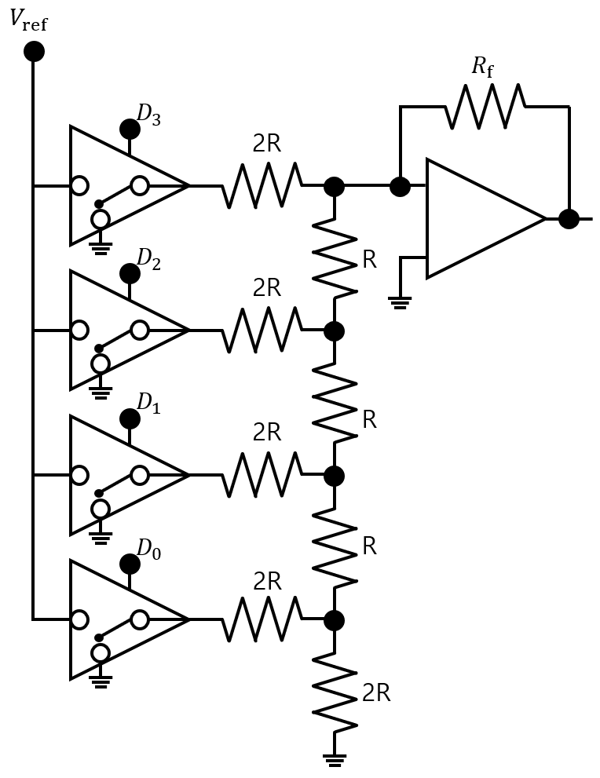

# DAC Concepts (Digital-to-Analog Converter)

## 1. 요약

해당 문서는 디지털 데이터를 아날로그 전압으로 변환하는 **DAC**의 기본 개념과 하드웨어 동작 원리를 정리한 문서이다.  
DAC의 성능을 결정하는 핵심 지표와 내부 회로 구성 방식(R-2R Ladder)을 다루며, 실습에 사용되는 **병렬 인터페이스 DAC(AD7302)** 와 **직렬 인터페이스 DAC(DAC081S101)** 의 구조적 차이점 및 특징을 비교 분석한다.

---

## 2. DAC 개념 및 성능 평가 지표

DAC는 마이크로프로세서 내부의 이산적인 디지털 데이터를 연속적인 아날로그 전압으로 변환하는 소자이다. 주요 성능 평가 요소는 다음과 같다.

- **분해능(Resolution)** : 디지털 입력의 최소 변화량에 대응하는 아날로그 출력 전압의 변화량이다. 분해능이 높을수록(bit 수가 클수록) 정밀한 아날로그 값을 출력할 수 있다.
- **변환 시간(Conversion Time)** : 디지털 데이터가 입력된 후, 출력 아날로그 전압이 목표 값의 지정된 오차 범위 내로 안정화될 때까지 소요되는 시간을 의미한다.
- **선형성(Linearity)** : 디지털 입력의 증가에 따라 아날로그 출력이 얼마나 일정한 비율로 비례하여 증가하는지를 나타내는 지표이다.

---

## 3. R-2R 사다리(Ladder) 회로의 원리

- **구조적 특징**: 저항값이 R과 2R인 단 두 종류의 저항만을 사다리 형태로 배열하여 구성한다.
- **출력 수식**: 4bit R-2R DAC의 경우, 각 bit($D_0$~$D_3$)의 논리 상태에 따른 최종 출력 전압($V_{out}$)은 다음과 같은 수식으로 결정된다.
$$ V_{out}=\frac{R_f}{R}V_{ref} \left[ \frac{D_0}{16} + \frac{D_1}{8} + \frac{D_2}{4} + \frac{D_3}{2} \right] $$

---

## 4. 인터페이스 방식에 따른 DAC 분류

마이크로컨트롤러와 데이터를 주고받는 통신 인터페이스 방식에 따라 병렬과 직렬 방식으로 나뉜다.

### 4.1 병렬 DAC

실습에 사용되는 AD7302는 두 개의 아날로그 출력 채널(`VOUTA`, `VOUTB`)을 지원하는 8bit 병렬 DAC이다.  
0~255까지의 8bit 디지털 데이터를 한 번에 입력받아 0V~5V 사이의 아날로그 신호로 변환한다.

- **주요 핀 구성**:
  - `D7-D0`: 8bit 데이터가 한 번에 인가되는 병렬 입력 버스이다.
  - `CS`(Chip Select) & `WR`(Write Enable): 데이터를 내부 버퍼에 기록하기 위한 제어 신호이다.
  - `A/B`: 두 개의 출력 포트 중 데이터를 업데이트할 채널을 지정한다.
  - `LDAC`: 내부 레지스터의 값을 실제 아날로그 출력으로 업데이트하는 역할을 수행한다.
  - `CLR`: 내부 레지스터 값을 초기화 하는 역할을 수행한다.

- **하드웨어 특성**: `WR`신호가 `Low`상태일 때는 데이터 버스의 값이 투과되다가, `WR`신호가 `High`로 전환되는 상승 에지 시점에 데이터가 내부 레지스터에 확정되는 전형적인 래치 기반 인터페이스이다.
- **장단점**: 8개의 데이터 라인을 통해 한 번에 명령을 전송하므로 제어 속도가 매우 빠르지만, MCU의 GPIO 핀을 많이 소모한다는 단점이 있다.

### 4.2 직렬 DAC

실습에 사용되는 DAC081S101은 1개의 데이터 라인을 통해 시리얼 인터페이스로 제어되는 DAC이다.  
0~255까지의 디지털 데이터를 0V~5V 아날로그 신호로 변환한다.

- **주요 핀 구성**:
  - `SYNC`: 데이터 프레임의 시작을 알리는 동기화 신호로, 통신 구간 동안 `Low`상태를 유지해야 한다.
  - `SCLK`: 데이터 입력을 동기화하기 위한 직렬 클럭 핀이다.
  - `DIN`: 클럭의 하강 에지에 맞춰 1bit씩 데이터가 들어가는 직렬 데이터 입력 핀이다.

- **하드웨어 특성**: 데이터를 한 번에 기록하는 병렬 방식과 달리, 16bit 프레임(제어 모드 bit, 8bit 데이터, 더미 bit)을 구성하여 클럭(`SCLK`)에 맞춰 내부의 시프트 레지스터로 1bit씩 직렬화하여 전송해야 한다.
- **장단점**: 단 3개의 핀(`SYNC`, `SCLK`, `DIN`)만으로 제어가 가능하여 공간과 핀 효율성이 극대화되지만, 병렬 방식에 비해 데이터를 전송하는 데 소요되는 시간이 길다.

---

## 5. 병렬 및 직렬 DAC 특성 비교 요약
|구분|병렬 DAC(AD7302)|직렬 DAC(DAC081S101)|
|----|----------------|--------------------|
|통신 속도|빠름 (한 번의 제어 사이클로 전송 완료)|느림 (클럭에 맞춰 16회 반복 전송 필요)|
|필요 핀 수|많음 (데이터 8핀 + 제어 4핀) |적음 (데이터 1핀 + 제어 2핀)|
|내부 수신 구조|래치 기반 레지스터|시프트 레지스터|
|시스템 적합성|핀 여유가 많고 고속 처리가 필요한 시스템|핀 수가 제한적인 소형 임베디드 시스템|
