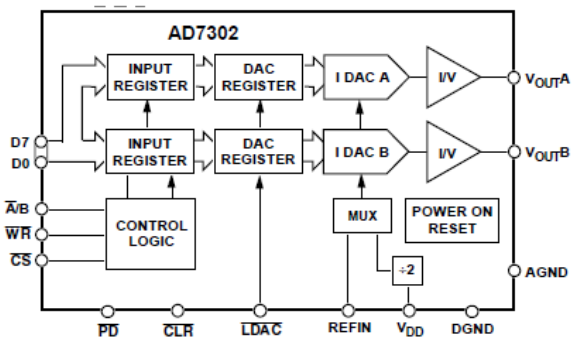
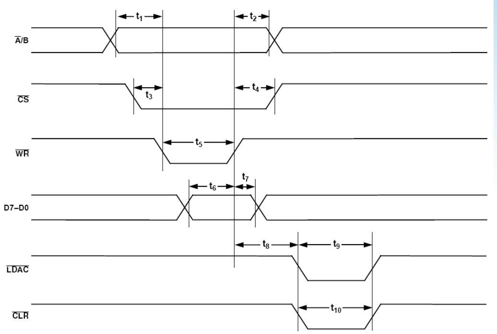
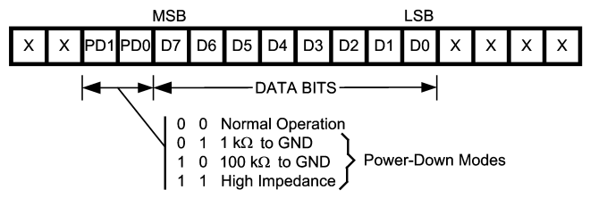
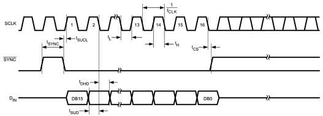

# DAC Control

## 1. 요약

해당 문서는 STM32F10x 마이크로컨트롤러를 이용하여 외부 DAC 칩을 제어하는 펌웨어 로직을 분석한 문서이다. <br>
범용 입출력 포트(GPIO)를 직접 제어(Bit-Banging)하여 외부 소자의 데이터시트 규격에 맞는 통신 타이밍을 구현하는 방법을 다룬다. <br>
실습에 사용된 **병렬 DAC(AD7302)** 와 **직렬 DAC(DAC081S101)** 의 통신 프레임 구조와 소스 코드를 1:1로 매핑하여 하드웨어 제어 원리를 설명한다.

---

## 2. 병렬 DAC 제어 분석 (AD7302)

AD7302는 8bit 데이터를 한 번에 전송받아 아날로그 전압으로 변환하는 병렬 인터페이스 기반의 소자이다.

### 2.1 하드웨어 핀 매핑

MCU와 AD7302 간의 물리적인 연결은 다음과 같이 구성된다.



- **Data Bus(8핀)** : `PA0`~`PA7`을 AD7302의 `D0`~`D7`핀에 순차적으로 연결한다.
- **Control Bus(4핀)** : `PC0`(`CS`), `PC1`(`WR`), `PC2`(`LDAC`), `PC3`(`A/B`)로 매핑하여 제어 신호를 인가한다.

### 2.2 타이밍도 및 제어 로직 분석

AD7302에 데이터를 기록(Write)하기 위한 타이밍 시퀀스는 다음과 같다.



1. **채널 선택 및 칩 활성화**: `A/B`핀으로 출력 포트를 선택한 후, `CS`핀을 `Low`로 설정하여 통신을 시작한다. ($t_1$, $t_3$)
2. **데이터 입력 개시**: `WR`핀을 `Low`로 설정하여 내부 래치의 게이트를 연다(입력 레지스터가 열려, 하드웨어가 데이터를 받아들일 준비를 함). ($t_5$)
3. **데이터 버스 안정화**: `D7~D0` 핀에 변환할 8bit 디지털 데이터를 인가하고 전압 상태가 안정화될 때까지 대기한다. ($t_6$)
4. **데이터 래치**: `WR`핀을 `High`로 설정한다. 이 상승 에지 순간에 버스의 데이터가 내부 레지스터에 확정되며, 하드웨어가 데이터를 완전히 전달받을 수 있도록 아주 짧은 시간 동안 데이터와 제어 신호를 유지한다. ($t_2$, $t_4$, $t_7$)

### 2.3 하드웨어 제어 코드 매핑

해당 시퀀스를 구현한 `DAC_vol_gen()` 함수의 코드를 타이밍도와 매핑하면 다음과 같다.

```c
void DAC_vol_gen(unsigned int selAB, unsigned char voltage) {
  /* 1. 채널 선택 (A/B 핀 제어) */
  GPIO_ResetBits(AD7302_CTRL, P_AB);
  if(selAB != OUTA)
    GPIO_SetBits(AD7302_CTRL, selAB);  
  else
    GPIO_ResetBits(AD7302_CTRL, selAB);

  /* 2. 통신 시작 및 데이터 입력 개시 */
  GPIO_ResetBits(AD7302_CTRL, P_CS); /* CS Low (Active) */
  GPIO_ResetBits(AD7302_CTRL, P_WR); /* WR Low (Active) */
  
  /* 3. 데이터 버스에 8비트 값 인가 (Setup Time 확보) */
  GPIO_ResetBits(AD7302_DATA, 0x00FF); 
  GPIO_SetBits(AD7302_DATA, voltage);    

  /* 4. 데이터 래치 및 통신 종료 (WR, CS High) */
  GPIO_SetBits(AD7302_CTRL, P_WR); /* WR High (Inactive) , 상승 에지 발생, 데이터 래치 및 출력 갱신 */
  GPIO_SetBits(AD7302_CTRL, P_CS); /* CS High (Inactive) */
}
```

---

## 3. 직렬 DAC 제어 분석 (DAC081S101)

DAC081S101은 1개의 데이터 라인을 사용하여 16bit 프레임을 전송하는 직렬 인터페이스 기반의 소자이다.

### 3.1 하드웨어 핀 매핑

공간 절약을 위해 단 3개의 제어 핀만 사용한다.


- `PC0`(`DIN`): 직렬 데이터 입력 핀
- `PC1`(`CLK`): 동기화 클럭 핀
- `PC2`(`SYNC`): 프레임 시작을 알리는 동기화 신호 핀

### 3.2 16bit 직렬 프레임 구조

직렬 통신은 한 번에 1bit씩 데이터를 전송하므로, 데이터의 의미를 규정하는 프레임 규칙이 필수적이다. 이 칩은 16bit 프레임을 요구하며 구조는 다음과 같다.



- **Bit 구조**: `[Dummy 2bit] + [Mode 2bit] + [Data 8bit] + [Dummy 4bit]`
- **Bit 시프트 연산**: 실제 8bit 디지털 데이터(`value`)를 프레임 규격에 맞게 정렬하기 위해, 코드 내부에서 `data |= value << 4;`연산을 수행한다. <br> 이를 통해 최상위 4bit(Dummy + Mode)를 `0000`으로 채우고, 중간 8bit에 실제 데이터를 위치시키며, 하위 4bit를 `0000`으로 비우는 16bit 정렬을 완성한다. (Mode `00`은 Normal Operation을 의미한다.)

### 3.3 타이밍도 및 제어 로직 분석



1. **통신 초기화 및 시작**: `SYNC`핀을 `High`로 유지하여 내부 상태를 초기화한 후($t_{SYNC}$), `Low`로 설정하여 새로운 16bit 데이터 프레임의 시작을 알린다. 첫 번째 클럭이 발생하기 전까지 안정화 시간을 확보한다($t_{SUCL}$).
2. **데이터 비트 준비**: `SCLK`를 `High`로 설정하여, 전송할 1bit의 데이터(`DIN`)를 인가하고 전기적으로 안정화될 때까지 대기한다($t_{SUD}$).
3. **데이터 래치**: `SCLK`를 `Low`로 설정하여, 이 하강 에지 순간에 `DIN`핀의 1bit 데이터가 DAC 내부 시프트 레지스터로 읽혀 들어간다($t_{DHD}$). 데이터가 안정적으로 기록되도록 하강 에지 직후에도 잠시 데이터를 유지한다($t_L$).
4. **프레임 전송 완료 및 출력 갱신**: 위 과정(2~3번)을 16회 반복하여 프레임 전송을 마친 후, `SYNC`핀을 다시 `High`로 설정하여 통신을 종료한다. 이 순간 16bit 레지스터의 값이 아날로그 전압으로 최종 출력된다($t_{CS}$).

### 3.4 하드웨어 제어 코드 매핑 (Bit-Banging)

하드웨어 SPI 모듈을 사용하지 않고, GPIO 핀을 직접 제어하여 클럭과 데이터를 생성하는 **Bit-Banging**방식을 사용한다. `Convert_sDAC()`함수는 미세 지연(Delay)을 활용하여 이 과정을 완벽하게 구현한다.

```c
void Convert_sDAC(unsigned char value) {
  unsigned int data=0, mask;
  unsigned char i;

  mask = 0x8000;      /* 16bit의 MSB를 추출하기 위한 마스크 */
  data |= value << 4; /* 8bit 데이터를 16bit 프레임 규격에 맞게 정렬 (Dummy(2bit) + Mode(2bit) + Data(8bit) + Dummy(4bit)) */
 
  /* 1. 통신 초기화 시퀀스 (SYNC 제어, t_SYNC 및 t_SUCL 확보) */
  GPIO_SetBits(S_DAC_PORT, SYNC);   asm("nop");
  GPIO_SetBits(S_DAC_PORT, CLK);    asm("nop");
  GPIO_ResetBits(S_DAC_PORT, CLK);  asm("nop");
  GPIO_ResetBits(S_DAC_PORT, SYNC); asm("nop"); /* SYNC Low로 통신 개시 */
 
  /* 2. 16bit 직렬 전송 루프 */
  for(i = 0; i < 16; i++) {
    GPIO_SetBits(S_DAC_PORT, CLK); /* SCLK High */
    asm("nop");
   
    /* 마스크와 AND 연산하여 현재 bit가 1인지 0인지 판별 후 DIN 출력 */
    if(data & mask) 
      GPIO_SetBits(S_DAC_PORT, DIN);   
    else 
      GPIO_ResetBits(S_DAC_PORT, DIN);
   
    asm("nop"); /* t_SUD (Data Setup Time) 확보를 위한 대기 */
    
    GPIO_ResetBits(S_DAC_PORT, CLK); /* SCLK Low (하강 에지 발생, 데이터 래치) */
    asm("nop"); /* t_DHD (Data Hold Time) 확보를 위한 대기 */
   
    data <<= 1; /* 다음 비트를 전송하기 위해 데이터를 좌측으로 시프트 */
  }
}
```
